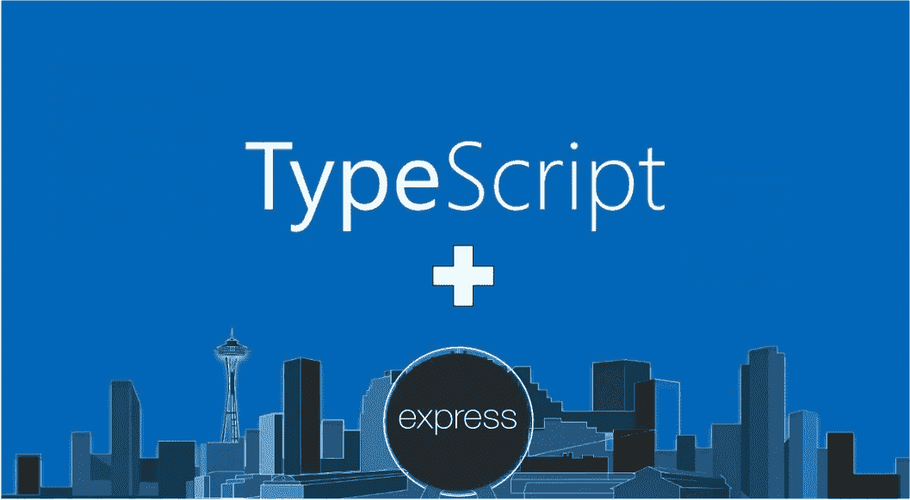

# 通过 3 个简单的步骤快速安装 TypeScript

> 原文：<https://levelup.gitconnected.com/setup-express-with-typescript-in-3-easy-steps-484772062e01>

## 以经典的面向对象方式创建 Express 服务器



用类固醇表达

您是否被使用 Express web 服务器的 NodeJS 的易用性和快速开发所吸引，但又担心大型应用程序所需的可伸缩性和类型安全？不要害怕，TypeScript 已经帮你搞定了。它仍然提供了脚本语言的优点和静态语言(如 C#或 Java)的健壮性。如果你已经知道 JavaScript，学习 TypeScript 是微不足道的，配置它只需要一点额外的设置。

> 只是指出，我知道有一些关于 Medium 的文章向您展示了如何使用 Express 和 TypeScript，但是它们要么花了很多时间讨论为什么应该使用 TypeScript，要么没有强调以面向对象的方式设置 Express。本文的重点是向您展示在开发 NodeJS/Express 时 TypeScript 的最佳和最简单的配置。

## 编辑 2019 年 6 月

如果你从零开始一个项目，有一个 npm 库可以为我们做所有这些，现在命名为*express-generator-typescript*。

[](https://www.npmjs.com/package/express-generator-typescript) [## 快速生成器类型脚本

### 生成类似于 express-generate 的新的 Express 应用程序，但是将其设置为使用 TypeScript

www.npmjs.com](https://www.npmjs.com/package/express-generator-typescript) 

本教程的所有源代码都可以在 GitHub 上找到。在阅读教程时，您应该观察相应的文件/文件夹。

[](https://github.com/seanpmaxwell/ExpressTypeScript) [## seanpmaxwell/ExpressTypeScript

### 用 TypeScript 开发和表达 JS webserver。通过创建……为 seanpmaxwell/ExpressTypeScript 开发做出贡献

github.com](https://github.com/seanpmaxwell/ExpressTypeScript) 

# 安装程序类型脚本

在开发过程中，我们可以直接从我们创建的`.ts`文件中运行我们的类型脚本代码。但是对于生产，我们应该将它们转换成 JavaScript，这样我们的服务器就可以直接从 NodeJS 运行。为了配置我们的 TypeScript 如何被编译，并为我们的代码设置样式规则，我们需要分别创建`tsconfig.json` 和`tslint.json`文件。使用 tslint 不是必需的，但是对于执行编码标准来说非常方便，并且从长远来看会产生更干净的代码。

为您的项目创建一个新文件夹，并在根目录下添加包含以下内容的`tsconfig.json`:

> 注意第 23 行的`exclude`选项，显示`/src/public/`。在本教程中，我们不打算讨论前端，但是一旦你开始添加一些前端内容，它应该就在那里了。

tsconfig.json

现在为`tslint.json`文件添加以下代码。我倾向于使用推荐的设置，并做一些调整。如果你想的话，可以随意调整这些设置。

tslint.json

为了允许我们执行一些代码，让我们创建一个启动脚本来启动我们的服务器。因为我们还没有服务器，现在就让它打印出来`"hello world"`。创建文件夹和文件`src/start.ts`,并添加以下两行:

> tslint 被禁用是因为它敦促我们不要使用`console.log()`，把它留在生产代码中也不好。

```
// tslint:disable-next-line
console.log('hello world');
```

当我们修改代码时，我们不希望不得不手动重启一切，所以让我们使用`nodemon`来观察文件中的变化，并重新执行我们的启动脚本。

太好了！我们已经得到了在 TypeScript 中开始开发所需的一切，我们只需要安装依赖项。运行`npm init`如果你还没有对你的 npm 包中的项目这样做，那么安装下面的 npm 库:

```
npm i -D ts-node nodemon typescript tslint
```

因此，我们可以轻松地开始事情，而不必在每次想要开始开发时都在控制台中输入一堆长命令，让我们向`package.json`添加一个脚本，以便使用 `ts-node`通过 nodemon 运行启动脚本。

请参见下面的第 8 行:

运行`npm run start-dev`，您应该会看到`hello world`输出到控制台。

# 快速设置

既然 TypeScript 已经设置好并运行良好，让我们创建一个简单的 ExpressJS 服务器和几个路由。我们可以直接使用 ExpressJS，但是这样我们就不能利用 TypeScript 了。用方法创建类，而不是一遍又一遍地键入`let router = express.Router(), router.get/put/post, app.use(router)`之类的东西，这将会很好。

为了更接近 MVC 模式并利用 OO 风格的编程，我推荐`OvernightJS`添加控制器和路由装饰器来表达。是的，我知道你要说什么，*“难道没有像 NestJS 和 ts-Express-decorator 这样的框架可以装饰快捷路线吗？*“是的，这是真的，但是这些都是大型框架，整个网站都致力于它们的文档。Overnight 只是一个简单的、小型的库集合，用于添加 decorators 来表达和做一些其他的事情。它不是 Express 之上的抽象层，如果你已经熟悉了 Express，你可以在 10 分钟左右学会它。

[](https://github.com/seanpmaxwell/overnight) [## seanpmaxwell/隔夜

### ExpressJS 服务器的 TypeScript decorators。通过创建帐户为 seanpmaxwell/隔夜开发做贡献…

github.com](https://github.com/seanpmaxwell/overnight) 

让我们安装快速和过夜，并启动一个网络服务器:

> *body-parser* 包是为了让我们能够以 JSON 的形式发送数据。

*   `npm i -s express body-parser @overnightjs/core @overnightjs/logger`
*   `npm i -D [@types/node](http://twitter.com/types/node) @types/express`

在`src/`下，为服务器创建一个文件(我的名字是`ExampleServer.ts`)并创建一个同名的类。然后添加另一个文件夹/文件`controllers/ExampleController.ts`。我们将首先实现控制器，然后将其导入到我们的服务器文件中。

将以下内容添加到控制器文件中:

> 请注意，我们为每条路线创建了一个方法，只是为了查看每条路线的运行情况。 *Logger* 类很方便，因为它可以被配置为打印到一个文件、控制台、完全关闭，或者根据您的服务器环境进行定制。

当你使用完控制器后，确保添加一个`index.ts`文件到`controllers/`*和`export * from ‘./ExampleController’;`行，这样以后创建的任何新的控制器文件都可以通过额外的一行代码轻松添加。*

*在服务器中，导入控制器并用隔夜的`Server`导出来扩展类。通过扩展`Server`，您将可以使用`this.app`访问 Express 实例，您可以像使用`require(‘express’)()`创建的任何普通 Express 实例一样与之交互。*

*控制器必须实例化并作为数组添加到`super.addControllers(…)`中，以激活您的路线。确保在设置中间件之后、启动服务器之前添加控制器。*

*现在我们有了服务器和控制器，我们只需要从启动脚本启动一切。导入服务器，实例化它，调用`start(portNumber)`。*

*一旦你看到`"[someTimestamp]: Example server started on port: 3000"`打印到控制台，你可以打开一个你选择的 API 调用工具(如 Postman)并向服务器发送请求。如果你完全按照我的例子做，你应该看到你的路线的`:msg`部分打印到控制台上。*

# *构建您的代码*

*既然我们已经有了一个全功能的开发服务器，我们需要做的就是为生产构建它。如果你在开发过程中删除了`.ts`文件，你应该在每次传输文件时删除`build/`文件夹，否则你会得到垃圾`.js`文件。*

*要启动生产代码，我们需要运行`build/start.js`而不是`src/start.ts`。让我们给`package.json`再添加两个脚本来构建和运行生产代码。*

> *`tsc`命令转换我们的代码。请参见下面的第 9 行:*

*一旦您的服务器启动，您的所有路由应该像以前一样工作。*

*如果你觉得这篇文章有帮助，请在 GitHub 上启动教程的 repo 和 OvernightJS repo。祝网络设计愉快:)*

*[](https://gitconnected.com/learn/typescript) [## 学习 TypeScript -最佳 TypeScript 教程(2019) | gitconnected

### 18 大 TypeScript 教程-免费学习 TypeScript。课程由开发人员提交并投票，从而实现…

gitconnected.com](https://gitconnected.com/learn/typescript)*