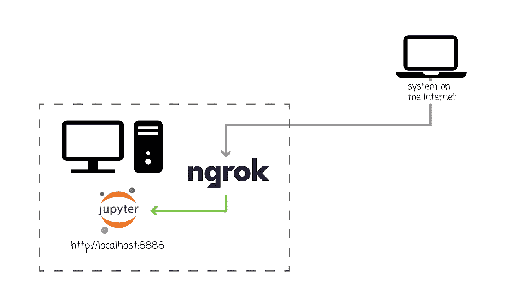
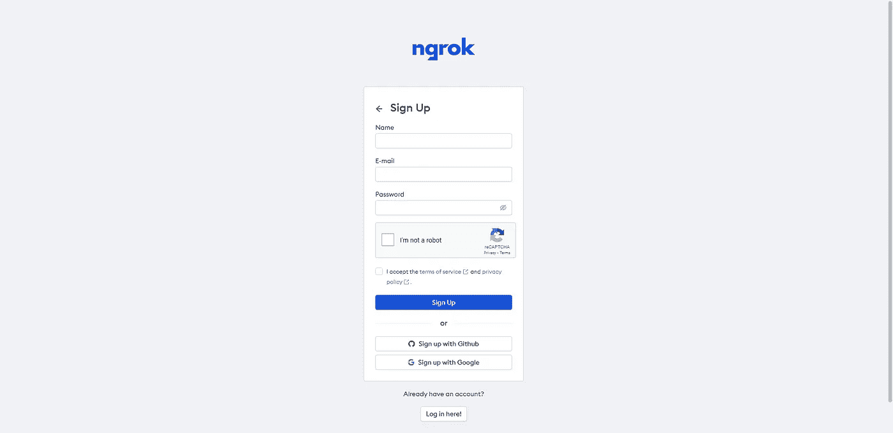
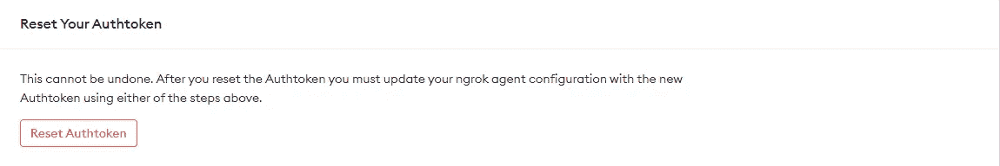
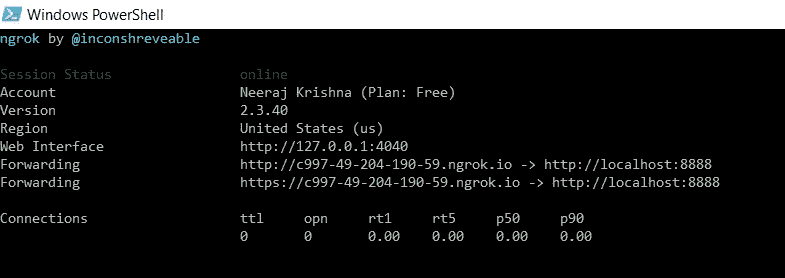
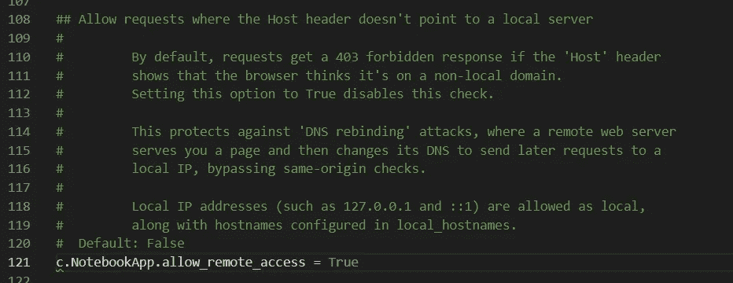
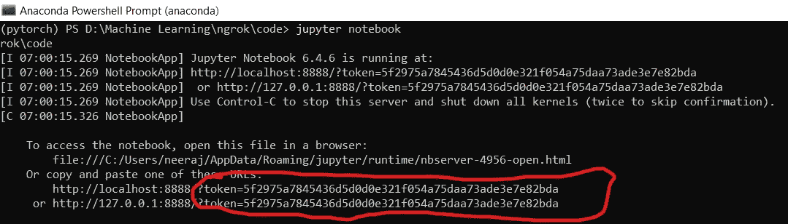
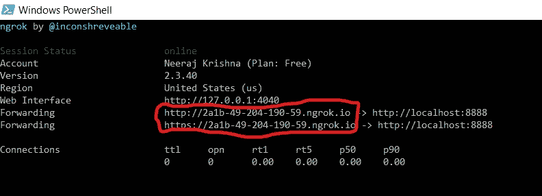
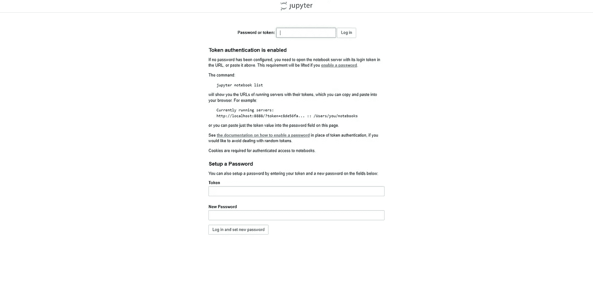
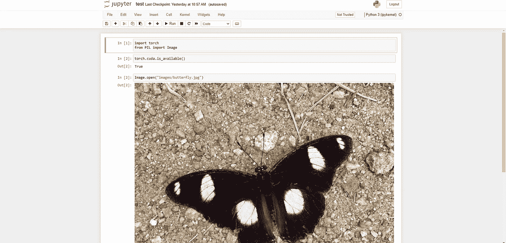

# 在您的本地机器上安装 Jupyter Notebook，并使用这个工具从任何地方使用它

> 原文：<https://levelup.gitconnected.com/setup-jupyter-notebook-on-your-local-machine-and-use-it-from-anywhere-using-this-tool-4f43e8165586>

我有两套系统，一台台式电脑和一台笔记本电脑。PC 有一个安装了 CUDA 驱动程序的 Nvidia 显卡，而笔记本电脑只有 CPU。我更喜欢在我的笔记本电脑上工作，因为它很舒服，我可以在任何地方工作，但我不能做我可以在我的 PC 上做的事情，比如在 GPU 上训练深度学习模型。那么，我如何在笔记本电脑上工作的同时利用我的 PC 来训练深度学习模型呢？

通常推荐的方法是从笔记本电脑 SSH 到 PC，但是设置起来很麻烦，尤其是在 Windows 上。

一个简单的方法，我将在本文中展示，是使用 *ngrok* 并创建一个到本地主机(在本例中是桌面 PC)的隧道。

# ngrok

ngrok 创建一个到本地主机的安全隧道。这意味着我们可以将运行在本地主机上的应用程序暴露给互联网，任何连接到互联网的机器都可以访问该应用程序。

在我们的例子中，我们的想法是在桌面 PC 上运行 Jupyter Notebook，使用 ngrok 将其暴露给互联网，并从笔记本电脑远程访问它，如下图所示:



作者图片

好吧，让我们看看如何在实践中做到这一点。

# 设置 ngrok

你可以使用你的电子邮件、谷歌账户或 GitHub 账户在 [ngrok 网站](https://ngrok.com/)上注册，免费开始。



接下来，您必须下载特定于您的操作系统的应用程序。


接下来，从“Your authtoken”页面复制提供的 Authtoken 并解压缩应用程序。


接下来，我们必须使用 authtoken 授权 ngrok，方法是从 ngrok 所在的目录运行以下命令:

```
./ngrok.exe authtoken 22g2ViHolPb5xz444xQi5i3fDbD_5gjRgPBuALFjz5WtupMVG(your token) 
```

我这里用的是 Windows 对于 Linux，该命令会略有不同。

如果您的令牌受损，您可以随时重置它。



接下来，我们将运行 ngrok 并在端口 8888 上创建一个到本地主机的隧道，这是 Jupyter Notebook 使用的端口。

```
.\ngrok.exe http 8888
```



ngrok 正在运行

好了，ngrok 正在运行，我们已经创建了一个通往 Jupyter Notebook 使用的地址的隧道。

我们还没完呢。接下来，我们必须配置 Jupyter 笔记本。

# 配置 Jupyter 笔记本

默认情况下，Jupyter Notebook 只允许来自本地主机的请求，但是由于我们将远程访问它，我们必须将其配置为允许远程访问。这可以通过以下方式完成:

## 生成 Jupyter 笔记本配置文件

我们必须先生成配置文件，然后才能配置它。假设您已经安装了 Jupyter Notebook，运行以下命令:

```
jupyter notebook --generate-configWriting default config to: C:\Users\neeraj\.jupyter\jupyter_notebook_config.py
```

它还会显示创建配置文件的位置。

## 允许远程访问

接下来，打开配置文件，将参数`c.NotebookApp.allow_remote_access`设置为 True，并取消注释，如下所示:



配置 Jupyter 笔记本

我们都准备好了！最后，我们发布了 Jupyter 笔记本应用程序。

```
jupyter notebook
```



复制令牌

一旦应用程序运行，复制令牌并将其保存在某个地方。这是身份验证所必需的。

# 远程访问 Jupyter 笔记本

复制任意一个 ngrok URLs 并粘贴到远程机器上。



您将被重定向到本地机器上运行的 Jupyter 笔记本应用程序。



会出现一个认证页面提示您。将复制的令牌粘贴到此处并登录。

就是这样！我们现在可以从任何连接到互联网的远程机器上访问本地机器上运行的 Jupyter 笔记本。

我们可以创建新的笔记本，编写代码，训练深度学习模型，甚至像平时一样访问数据。



虽然这种方法容易使用，但它有某些缺点。

# 不足之处

*   **安全性:**虽然任何拥有 ngrok URL 的人都可以访问笔记本，但他们需要令牌进行身份验证。因此，我们必须非常小心地使用令牌，即使这样，也不建议使用机密数据。
*   **延迟:**在远程使用应用程序时，我们会注意到相当大的延迟，因为请求和响应必须通过互联网传输。
*   **开发:** ngrok 主要用于测试，不用于开发。它的主要用途是测试代理或防火墙后面的应用程序。

我希望你喜欢这篇文章。我们来连线讨论一下你用的是什么技术。