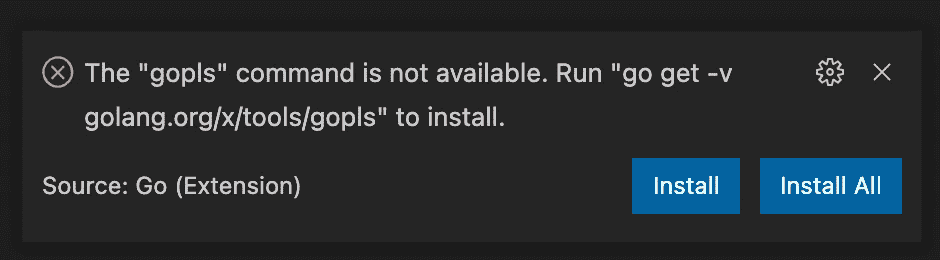

# 为 Go 开发设置 MacOs

> 原文：<https://levelup.gitconnected.com/setup-macos-for-go-development-93e45a371044>

## 如何安装 Go 并设置 Visual Studio 代码


由 [Fab Lentz](https://unsplash.com/@fossy?utm_source=unsplash&utm_medium=referral&utm_content=creditCopyText) 在 [Unsplash](https://unsplash.com/s/photos/neon-go?utm_source=unsplash&utm_medium=referral&utm_content=creditCopyText) 上拍摄的照片

前几天，我想到了一个业余爱好项目的主意，围棋非常适合这个项目。

距离我上次尝试围棋已经有一段时间了。那时候 Go 的依赖管理一片混乱。然而，自从引入 Go 模块以来，事情似乎朝着正确的方向发展，所以我觉得是时候再试一次了。

在我开始玩之前，我需要设置我的 MacBook 进行 Go 开发。本文介绍了如何做到这一点。我们将安装 Go，试验 Go 模块，并设置 Visual Studio 代码。

# 先决条件

按照这篇文章，你需要有家酿安装。你可以在[官网](https://brew.sh/)找到安装说明。

# 安装 Go

几年前，安装 go 是一次痛苦的经历，因为你必须创建一个特定的文件夹结构，以确保依赖关系管理能够正常工作。我还记得不得不摆弄像`GOPATH`这样的东西。

现在你需要做的就是执行命令:

```
brew install go
```

在编写本文时，这个命令安装 Go 版本`1.16`。之后，您可以通过`go version`来验证安装，这将产生如下响应:

```
go versiongo version go1.16.6 darwin/amd64
```

# 示例项目

安装了 Go 之后，是时候创建一个简单的示例项目了。

## 创建新项目

让我们首先为我们的项目创建一个目录:

```
mkdir example
cd example
```

Go 通过一个`go.mod`文件管理依赖关系。我们可以通过`go mod init` [命令](https://golang.org/ref/mod#go-mod-init)创建一个`go.mod`文件。这个命令需要你的模块名。通常，该名称将等于代码所在的存储库，例如`github.com/<GITHUB_USERNAME>/example`。

现在，我们将只使用`example.com/example`:

```
go mod init example.com/example
```

运行这个命令后，您应该在`example`目录中有一个`go.mod`文件。一个`go.mod`文件描述了模块的属性，包括它对其他模块的依赖性。

既然我们已经创建了文件，那么添加一个`main.go`文件到带有 hello world 示例的项目中。

如果我们运行代码，它会将`Hello, Medium!`打印到控制台。您可以通过执行以下命令来运行代码:

```
go run .
```

## 外部模块

不使用默认的`fmt.Println()`来打印我们的消息，我们可能想要使用一个真正的日志记录器。一个流行的日志包是`[logrus](https://pkg.go.dev/github.com/sirupsen/logrus)`。这个包不是标准库的一部分，所以我们将使用 Go 模块将它导入到我们的项目中。

首先将`main.go`中的代码更新为:

现在我们需要将这个模块添加到我们的`go.mod`文件中。我们可以使用`go mod tidy`来为我们工作。这个命令在你的`go.mod`文件中添加和删除模块，使其与你的模块中的源代码相匹配。它还添加了一个`go.sum`文件，用于模块认证。

```
go mod tidy
```

生成的 go.mod 文件

如果再次运行该代码，应该会显示三条日志消息。

```
go run .INFO[0000] Just an INFO log, no worries
WARN[0000] A WARN log might make us a bit nervous...
ERRO[0000] Now something is really wrong!
```

# Visual Studio 代码

说到用于 Go 开发的 IDE，无论是 JetBrains 的 [GoLand](https://www.jetbrains.com/go/) 还是微软的 [Visual Studio Code](https://code.visualstudio.com/) 都不会错。因为我不想为 GoLand 付费，因为这只是一个爱好项目，所以我选择了 Visual Studio 代码。

家酿使安装 Visual Studio 代码变得容易:

```
brew install --cask visual-studio-code
```

## 安装 Go 扩展

你需要一个扩展来充分利用像智能感知和代码导航这样的东西。

打开 Visual Studio 代码，导航到`code > preferences > extensions`并搜索 [Go for Visual Studio Code](https://marketplace.visualstudio.com/items?itemName=golang.go) 扩展。

该扩展依赖于一些额外的命令行工具。如果它们丢失了，当你第一次打开包含 Go 代码的目录或工作空间时，你会看到一个弹出窗口。点击`Install All`。



看到此弹出窗口时，单击“全部安装”。

## 启用自动保存

使用默认设置，Visual Studio 代码需要手动操作来保存您正在处理的文件。在本地测试期间，未保存的更改让我困惑了很多次。我总是为 Visual Studio 代码启用自动保存。您可以通过`File > Auto Save`启用自动保存。

# 结论

与几年前相比，安装过程简单多了。不再需要用复杂且容易出错的文件夹结构来设置工作区。

我对通过 Go 模块进行依赖管理的第一印象也是积极的。这让我有足够的信心用这门语言开始一个新的爱好项目。

正如人们所料，Visual Studio 代码的 Go 扩展似乎工作得很好。如果我将来做更多的围棋编程，我可能会转到 GoLand，因为我也使用 JetBrains IDE 进行 Java 开发。

感谢您的阅读。我希望这有所帮助。如果您有任何问题或反馈，请随时回复。