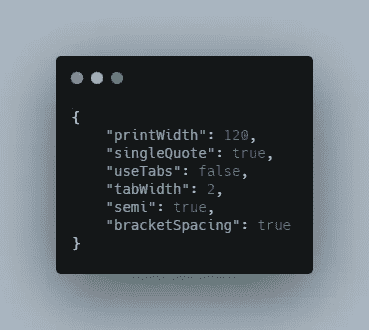
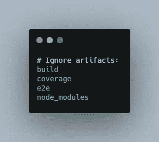
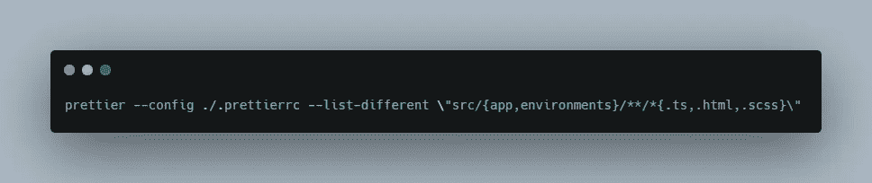
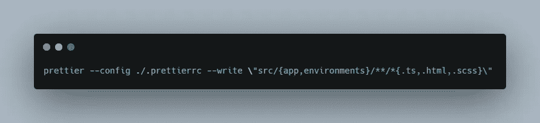
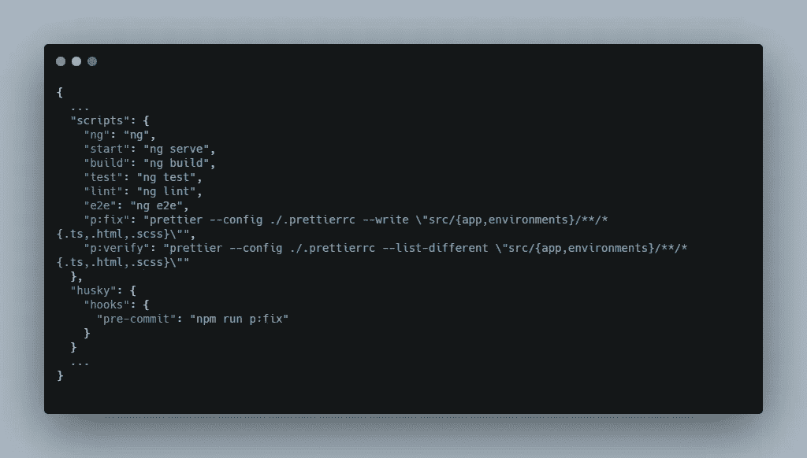

# 30 分钟后把 Angular 布置得更漂亮

> 原文：<https://levelup.gitconnected.com/setup-prettier-on-angular-in-30-minutes-12b2ed85e7b7>

## 有角的

## 指南安装更漂亮的，并将其添加到一个预提交的角度挂钩。


照片由[思想目录](https://unsplash.com/@thoughtcatalog?utm_source=unsplash&utm_medium=referral&utm_content=creditCopyText)在 [Unsplash](https://unsplash.com/s/photos/coffee?utm_source=unsplash&utm_medium=referral&utm_content=creditCopyText) 上拍摄

在这篇文章中，我想分享如何设置更漂亮的 Angular 只在特定的文件夹上运行，并保持你的代码看起来不错。

1.  什么更漂亮？
2.  安装更漂亮
3.  写剧本
4.  使用预提交挂钩自动格式化代码

*注:我写这个故事是基于我最近如何为我的新 Angular 9 项目安装更漂亮的程序。*

# 什么更漂亮？

Prettier 是一个固执己见的代码格式化程序，支持多种语言。

这是这个故事，我们将安装它的格式打字稿，HTML，SCSS。

我们必须在您的项目中拥有这个令人敬畏的库的原因是，我们可以**确保我们的代码在项目中只有一个唯一的风格指南**。

# 安装更漂亮

您可以使用来自[漂亮文件](https://prettier.io/docs/en/install.html)的命令，通过 with 命令安装库。

```
npm install --save-dev --save-exact prettier
```

并创建 **prettierrc.json** 和**。忽略**文件。

但是，在这个故事中，我将把这个库安装到 Angular 9 项目中，有点不同。

开始吧！！！！

首先，运行这个命令

```
npm i -D prettier
```

第二，创建一个. **prettierrc** 文件，让编辑器和其他工具知道你正在使用 pretty。



使用配置格式规则。漂亮的

最后，创建**。premier ignore**



忽略一些文件夹。忽略不计

*注意:您可以忽略这个文件，因为我们稍后将使用该命令来选择我想要格式化的文件夹。*

# 运行脚本

我们在项目中经常使用两个脚本:

1.  检查文件是否没有标准格式
2.  格式化文件

**检查文件是否没有标准格式**

我们将下面的脚本添加到 package.json 中，并随意命名。



更漂亮的命令来检查格式错误文件

该命令将做三件事:

*   为应用配置。 **prettierrc** 文件。
*   只检查 **app** 和**环境**文件夹中的文件。
*   检查扩展名为**的文件。ts** ，**。html** ，**。scss** 。

您只需要在这个脚本中更新想要格式化的文件的文件夹名+扩展名。

**格式化文件**



格式化代码的漂亮命令

这个脚本将做 3 件事:

*   为应用配置。 **prettierrc** 文件。
*   仅格式化 **app** 和**环境**文件夹中的文件。
*   格式化扩展名为**的文件。ts** ，**。html** ，**。scss** 。

# 使用预提交挂钩自动格式化代码

通过安装 [Husky](https://github.com/typicode/husky#readme) ，您不需要每次提交代码时都手动运行脚本。

这个库可以帮助你做很多事情，在这一节中，我将用它在提交代码之前格式化代码。

您需要做的事情:

```
npm i -D husky
```

将 Husky 添加到 package.json



在提交代码之前，将 husky 添加到 package.json 以格式化代码

我希望这篇文章对你有用！可以跟着我上[媒](https://medium.com/@transonhoang?source=post_page---------------------------)。我也在推特上。欢迎在下面的评论中留下任何问题。我很乐意帮忙！