# 编写你的博客网站——在一小时内建立一个博客(第 1 部分)

> 原文：<https://levelup.gitconnected.com/setup-project-for-blog-in-fastest-way-part-1-54e6d47e2c44>

## 你自己的博客

## 关于如何创建博客、选择好的主题并将其发布到 GitHub 资源库的指南。


布鲁克·拉克在 [Unsplash](https://unsplash.com/s/photos/coffee?utm_source=unsplash&utm_medium=referral&utm_content=creditCopyText) 拍摄的照片

这篇文章是关于编写你自己的博客的 3 部分系列的第 1 部分。在本文中，我将指导您完成项目初始化并将其发布到 GitHub 存储库中。这花了我大约 40 分钟。

本文将分为 4 个部分:

1.  要求
2.  选择正确的框架
3.  选择一个主题
4.  将您的代码提交给私有存储库

【https://betterfullstack.com 查看 [*更多类似内容*](https://betterfullstack.com)

## **下一篇文章:**

[为你的博客生成免费的 GitHub 域名—(第二部分)](/generate-free-github-domain-for-your-blog-part-2-9c284fcdc693?source=friends_link&sk=a9f828e8d8c14a149effe024967ff4da)

[使用 GitHub 页面创建自定义域—(第 3 部分)](/customize-github-domain-part-3-927c645d0ce9?source=friends_link&sk=9274ff9f3253cf367b916bd074acad31)

# 要求

这篇文章有一些构建和使用博客的依赖项。

1.  安装 [Nodejs](https://nodejs.org/en/) (版本 12.14.0 LTS)
2.  Git:一个免费的开源分布式版本控制系统，旨在快速高效地处理从小到大的项目。
3.  创建 GitHub 账户:一个开发平台，在这里你可以托管和审查代码，管理项目，并构建软件。这里我们使用 GitHub 来管理代码和托管博客。
4.  [Visual Studio 代码](https://code.visualstudio.com/):代码编辑器。
5.  我们将使用 Markdown 来写一篇文章。

# 选择正确的框架

我哥哥是大学一年级学生，他让我为他建一个简单的博客。这件事花了我一个小时。

我选择了 Hexo 作为快速开发的博客框架。

首先，你需要安装 **hexo-cli。**

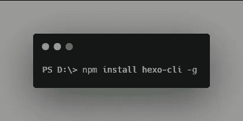

安装 hexo-cli 全局

其次，使用`init`语法创建一个项目。

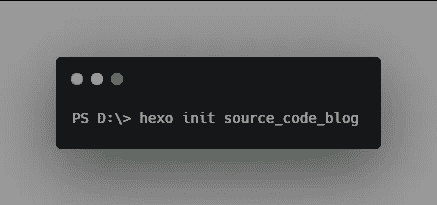

创建项目名称源代码博客

我创建了一个名为`source_code_blog`的项目，因为这个项目是你的博客源代码(我稍后会解释)。你可以把它改成你喜欢的任何名字。

这将自动为你安装库，并将所有库放在`node_modules`文件夹中。

最后，转到项目文件夹并启动它。

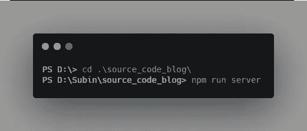

在本地主机上启动项目

这是最终的结果。

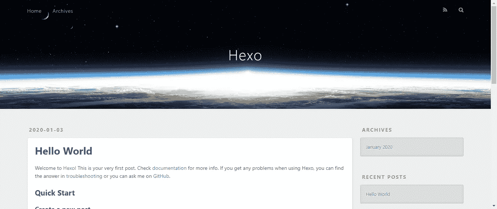

[http://localhost:4000](http://localhost:4000/)

# 选择一个主题

这里有两个解决方案来构建你的用户界面:

1.  自己造吧。然而，这需要很多时间。
2.  选择一个好的主题。

我的解决方案是从 Hexo 主题中挑选一个好的主题。

我已经为我的兄弟选择了[太阳能主题](https://github.com/tzvetkov75/solar-theme-hexo/)，并按照步骤将其安装到当前项目中。

首先，通过 CTRL + C 关闭 localhost。

第二，从 GitHub 下载源代码。我不喜欢使用 **git 克隆**，因为你以后提交代码和定制自己会有困难。

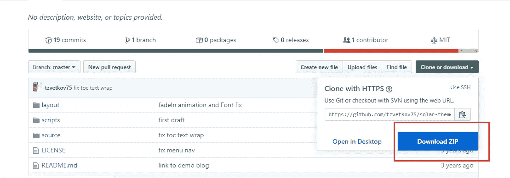

以 zip 文件形式下载模板

第三，复制主题并粘贴到项目中的`\themes`文件夹，并将文件夹名称从**solar-theme-hexo-master**更改为 **solar-theme。**

现在，为这个主题安装 hexo 分页:

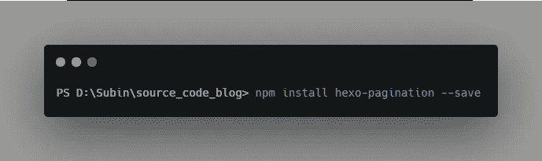

安装 hexo 分页

最后，在配置文件中更改主题名称。主题名称是**主题**文件夹中的文件夹名称。我们使用 Visual Studio 代码打开文件夹并更改配置。

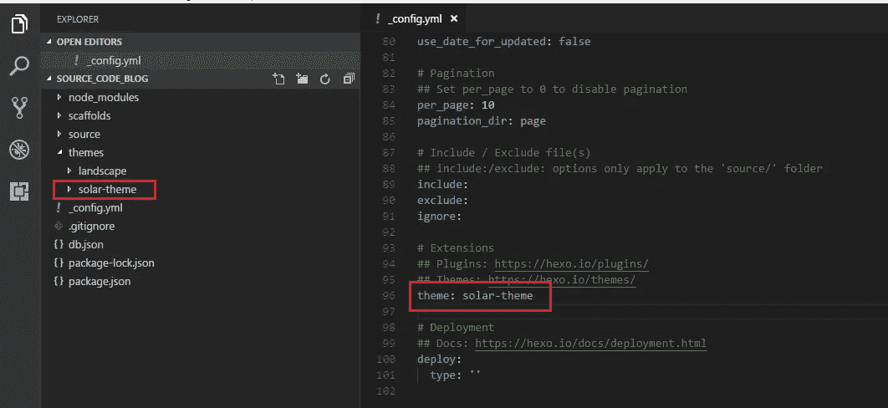

将主题名称从“风景”改为“太阳主题”

再次启动项目:

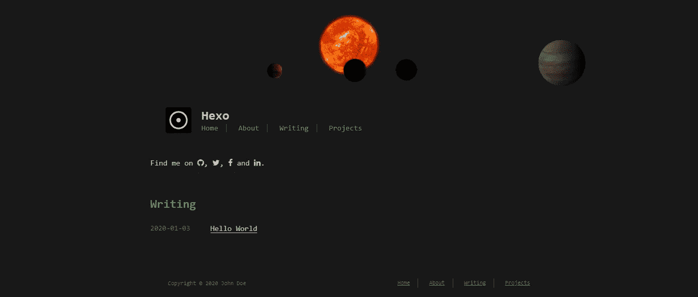

博客的新界面

万岁！页面准备好了。

# 将您的代码提交给私有存储库

为什么是私有存储库？因为这包括你的文章内容和你博客的代码定制。

为此，您需要一个 GitHub 帐户。

在主页上，点击你的头像并选择**你的仓库**

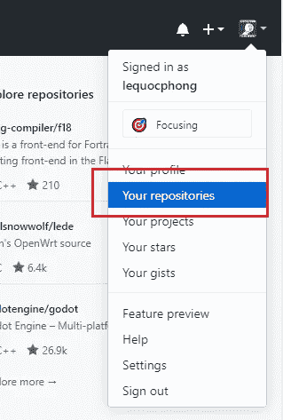

转到存储库

点击**新建**按钮。

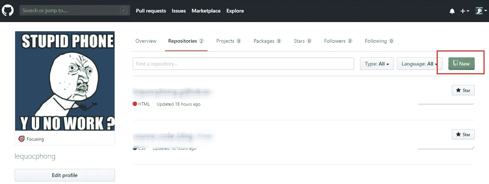

单击“新建”按钮创建新的存储库

创建新存储库时选择私有源代码

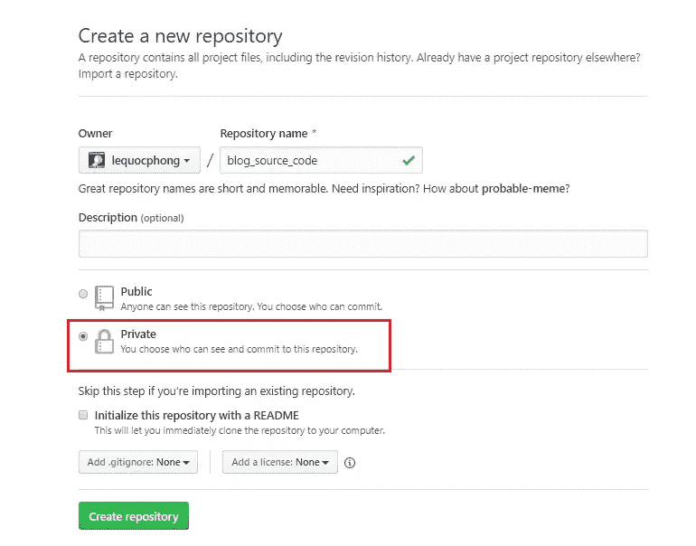

选择私有源代码

现在，在创建一个新的存储库之后，您可以按照 GitHub 的指南进行操作

```
git init
git add .
git commit -m "first commit"
git remote add origin https://github.com/lequocphong/source_code_blog.git
git push -u origin master
```

搞定了。

# 摘要

这篇文章是关于如何安装带有选定主题的 Hexo 以及如何将源代码提交给 GitHub 的指南。

我希望这篇文章对你有用！你可以在[媒体](https://medium.com/@transonhoang?source=post_page---------------------------)上关注我。我也在[推特](https://twitter.com/transonhoang)上。欢迎在下面的评论中留下任何问题。我很乐意帮忙！

[](/generate-free-github-domain-for-your-blog-part-2-9c284fcdc693) [## 为您的博客生成免费的 GitHub 域——一小时内创建一个博客(第 2 部分)

### 关于构建本地源代码的指南，部署到公共 GitHub 库，从 GitHub 获得一个免费域

levelup.gitconnected.com](/generate-free-github-domain-for-your-blog-part-2-9c284fcdc693) [](https://betterfullstack.com/stories/) [## 故事-更好的全栈

### 关于 JavaScript、Python 和 Wordpress 的有用文章，有助于开发人员减少开发时间并提高…

betterfullstack.com](https://betterfullstack.com/stories/)