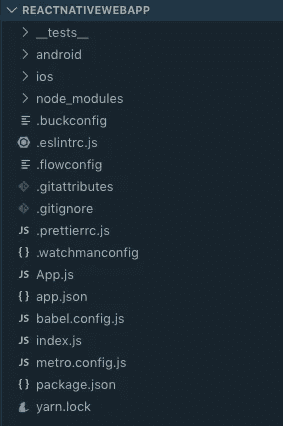
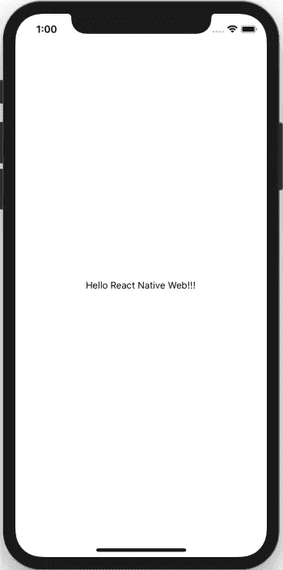
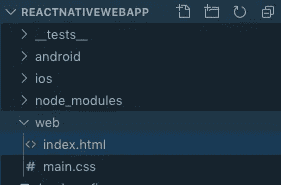
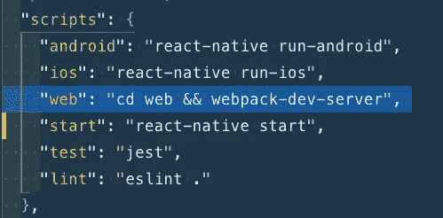
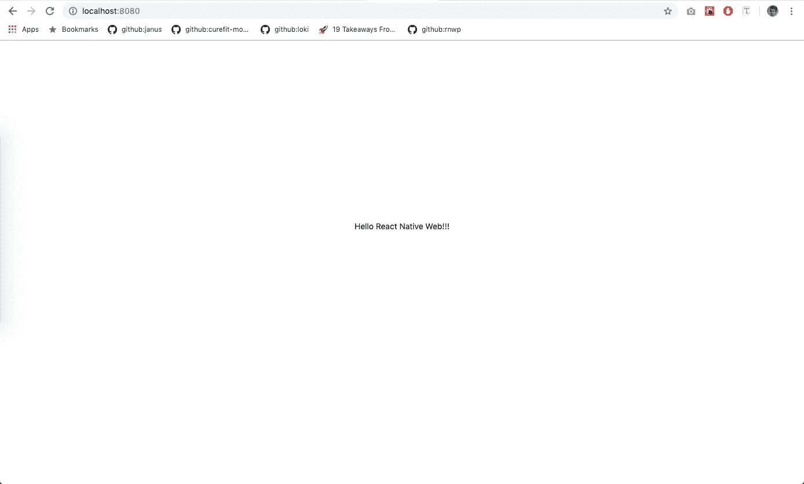
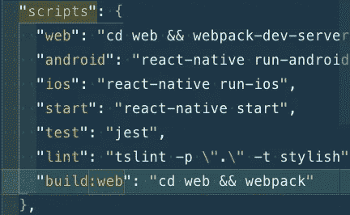
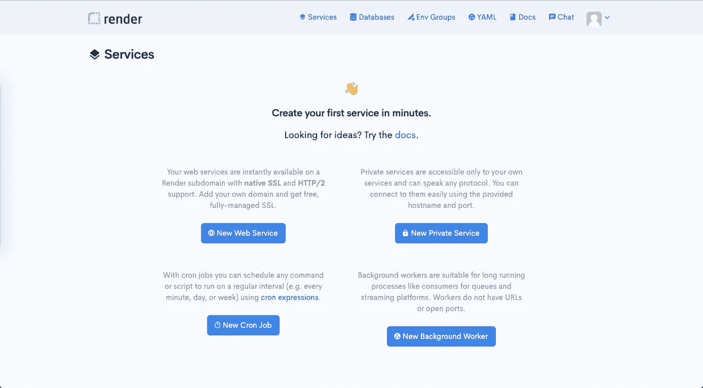
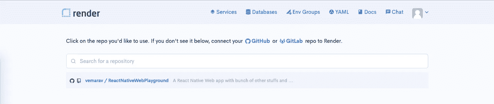
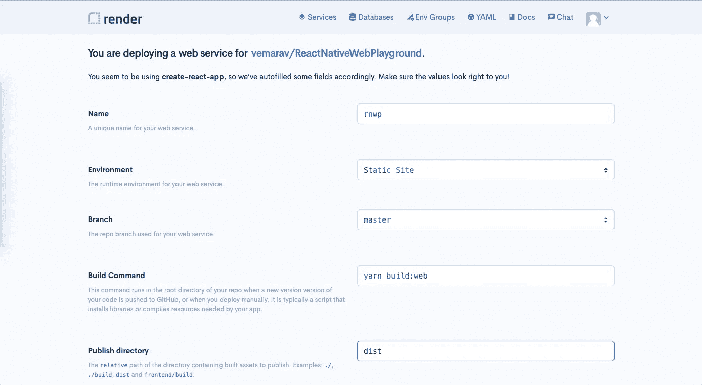
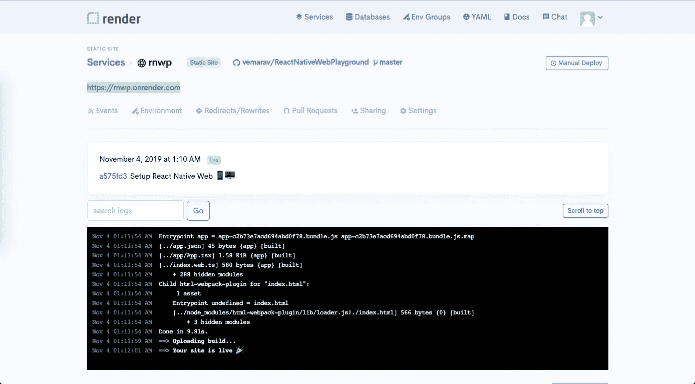

# 安装程序使用 TypeScript 和 WebPack 反应本机 Web 应用程序

> 原文：<https://levelup.gitconnected.com/setup-react-native-web-app-with-typescript-and-webpack-ff79062f53ba>

*这篇文章原本是*[](https://blog.kiprosh.com/setup-react-native-web-app-with-typescript-and-webpack/)**贴在我们* [*公司网站*](https://kiprosh.com) *上。Kiprosh 是一家来自孟买的软件开发公司。**

**

*图片来自官方 [react-native 网站](https://facebook.github.io/react-native/)*

*在本教程中，我们将在本地设置 React 本地 web 应用程序，并部署在[渲染](https://render.com)上。*

*在我们开始安装 [react-native-web](https://github.com/necolas/react-native-web) 之前，我假设您已经在您的机器上安装了 [NodeJs](https://nodejs.org/en/) 、 [yarn](https://yarnpkg.com/lang/en/) 和 [react-native-cli](https://www.npmjs.com/package/react-native-cli) 。*

## *步骤 1 ->设置用 Typescript 反应本机应用程序*

*要创建 react 本地应用程序，您需要运行以下命令*

```
*react-native init ReactNativeWebApp*
```

*该命令将创建 react 本地应用程序，您的应用程序目录将如图 1.1 所示*

**

*图 1.1:项目根*

*要将 typescript 添加到我们的应用程序中，首先我们需要安装[react-native-typescript-transformer](https://github.com/ds300/react-native-typescript-transformer#step-1-install)*

```
*yarn add --dev react-native-typescript-transformer typescript*
```

*然后在项目的根目录下创建一个名为`tsconfig.json`的新文件，并复制粘贴如代码片段 1.1 所示的 JSON*

*代码片段 1.1: tsconfig.json*

*将`tslint.json`添加到项目的根目录中，并复制粘贴代码片段 1.2 中的 JSON 内容*

*代码片段 1.2: tslint.json*

*接下来，将 App.js 重命名为 App.tsx，并添加 React 和 React Native 类型*

```
*yarn add --dev @types/react @types/react-native*
```

*App.tsx 的最终更改如代码片段 1.3 所示*

*代码片段 1.3: App.tsx*

*现在运行`yarn ios`或`yarn android`，你会看到如图 1.3 所示的屏幕*

**

*图 1.3 手机的最终快照*

## *步骤 2 ->设置 React 本机 Web 和 Webpack*

*将 [react-dom](https://www.npmjs.com/package/react-dom) 和 [react-native-web](https://www.npmjs.com/package/react-native-web) 添加到项目中*

```
*yarn add react-dom react-native-web*
```

*在项目的根目录中创建一个名为 web 的目录，并在 web 目录中添加 index.html(代码片段 1.4)。*

*辛佩特 1.4:index.html*

**

*图 1.2:添加 index.html 后*

*在 web 目录中添加 webpack 及其配置。要了解更多关于 webpack 的信息，请访问 https://webpack.js.org/[网站](https://webpack.js.org/)，要了解 webpack-dev-server，请访问 https://webpack.js.org/configuration/dev-server/*

```
*yarn add --dev webpack webpack-cli webpack-dev-server*
```

*要添加 webpack 配置，首先我们需要在`web`目录下创建一个名为`webpack.config.js`的文件，然后将代码片段 1.5 中的粘贴内容复制到`webpack.config.js`*

*代码片段 1.5 webpack.config.js*

*我们已经使用了`[html-webpack-plugin](https://webpack.js.org/plugins/html-webpack-plugin/)`、`[ts-loader](https://github.com/TypeStrong/ts-loader)`，我们需要在开始开发之前将它们添加到我们的项目中*

```
*yarn add --dev html-webpack-plugin ts-loader*
```

*现在将`index.web.ts`添加到项目的根目录，并将代码片段 1.6 中的内容复制粘贴到`index.web.ts`*

*代码片段 1.6: index.web.ts*

*现在在 package.json 中添加`web`脚本命令，如图 1.4 所示*

**

*图 1.4:纱网命令*

*运行`yarn web`命令并访问`[localhost:8080](http://localhost:8080)`。您将看到如下图所示的屏幕(图 1.5)*

**

*图 1.5:网络的最终快照*

## *步骤 3 ->部署 web 应用程序*

*将以下脚本命令添加到`package.json`并创建一个可部署的`dist`源*

```
*"build:web": "cd web && webpack"*
```

**

*图 1.6:脚本命令的差异*

*然后运行`yarn build:web`，这将创建一个名为`dist`的新文件夹，其中包含运行 web 应用程序所需的文件*

*打开。git 忽略并搜索生产，然后在生产下面添加/删除，确保它未被注释，如下所示*

```
*# production
/dist
/build*
```

*我们将在[渲染](https://render.com/)云平台上部署 web app。要设置连续部署，请执行以下步骤*

*   *创建账号(Render 仅支持 Github / GitLab)。*
*   *如果您成功创建了一个帐户，您将会看到一个如图 1.7 所示的控制面板*

**

*图 1.7:渲染仪表板*

*   *现在点击`New Web Service`按钮，连接 Github 并在 react 本地 web 应用程序库上安装 render*
*   *然后，您将在这里看到您的应用程序/存储库[https://dashboard.render.com/select-repo?type=web](https://dashboard.render.com/select-repo?type=web)*

**

*图 1.8:您的存储库*

*   *选择您的 repo 并添加以下设置，如图 1.9 所示，除了名称，为您的应用程序选择不同的唯一名称，然后单击创建 web 服务*

**

*图 1.9:渲染设置*

*   *如果一切按预期进行，那么你可以通过渲染提供的链接访问你的站点，链接在图 1.10 中高亮显示*

**

*图 1.10:你会在高亮区域看到你的链接*

*所有的源代码都可以在 https://github.com/vemarav/ReactNativeWebPlayground 的[找到](https://github.com/vemarav/ReactNativeWebPlayground)*

**如果你面临任何问题，请发表评论📝 👇提到这个问题。**

**打* ***👏*** *如果你喜欢这篇文章或者它在某些方面帮助了你。掌声激励我写更多这样的文章/教程。**