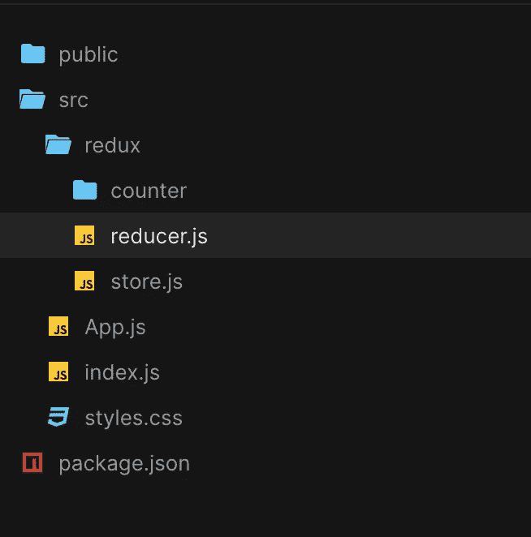
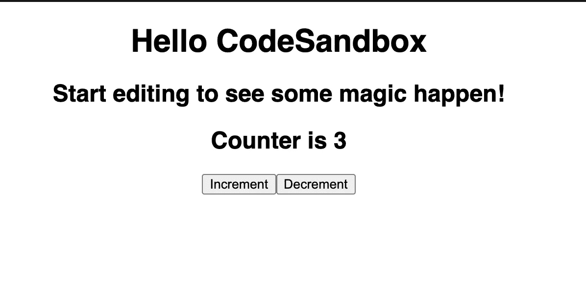

# 为大型 React 项目设置 Redux 没有眼泪

> 原文：<https://levelup.gitconnected.com/setup-redux-for-large-react-projects-without-tears-ca59e81df171>


照片由 Elevate 在 Unsplash 上拍摄

对于小型 React 项目，在 React 组件之间传递道具很酷，从北极到南极😃。随着复杂性的增加，我们传递更多的 props，并可能加入 React 上下文来管理嵌套兄弟组件之间的一些状态数据。

随着项目的增长，对适当的状态管理工具的需求变得不可避免。这是 React 项目中像 Redux 这样的工具的最佳选择。然而，设置 Redux 被认为是非常困难的，因为需要大量的样板文件。

在本帖中，我们将建立一个适合大型项目的 redux 商店，而不流眼泪。这篇文章的范围不包括为异步操作设置 Thunk 中间件或持久存储。

我们将主要关注商店创建、项目组合、实体可重用性和可管理性。在 React 项目中使用 Redux 的开发人员非常担心代码库与状态变量增加的卷积。

Redux 是什么？
快速导演剪辑给那些不熟悉 Redux 的人。Redux 是 JavaScript 应用程序的健壮状态容器。窥视横幅图像中的桶。就像他们可能在你的地窖里装酒一样，Redux 在你的 JavaScript 应用程序中为应用程序数据创建了一个盒子。

Redux 创建应用程序数据存储，并提供检索和修改存储数据的逻辑。想知道状态管理是如何在最低限度下工作的吗？我用 HTML 和 JavaScript 写了[这篇文章。](https://hackmamba.io/blog/2020/09/explaining-web-apps-state-management-like-abc/)

有了像 React-Redux 这样的配套工具，React 应用中的状态管理变得无缝。随着状态从组件提升到应用层，前端应用程序的交互性变得几乎没有限制。

# 先决条件

这篇文章需要 JavaScript 和 React.js 的知识。我们将使用来自应用程序状态的数据在 CodeSandbox 上创建一个简单的计数器应用程序。

# 创建 React 项目

使用 React starter by CodeSandBox 创建一个新的 CodeSandbox。你可以在这里找到这篇文章的最终代码。

创建的项目带有样板代码，app 入口点在`src/index.js` 中，主页在`src/App.js`中。基本的 CSS 样式是用`src/styles.css`写的。

在`App.js`中用 2 个按钮和一个计数器显示创建计数器应用程序的基本 HTML 结构。将文件修改为:

```
import React from "react";
import "./styles.css";

export default function App() {
  return (
    <div className="App">
      <h1>Hello CodeSandbox</h1>
      <h2>Start editing to see some magic happen!</h2>
      <h2>Counter is 0</h2>
      <button>Increment</button>
      <button>Decrement</button>
    </div>
  );
}
```

按钮当前处于非活动状态，并且 *h2* 中的计数器显示没有交互作用。

# 安装依赖项

我们的最低封装要求是`redux`、`react-redux`和`redux-actions`。Redux-actions 用于灵活地创建动作。

使用资源管理器的“依赖项”部分在 CodeSandbox 中添加这些依赖项。一旦安装了模块，项目就会自动重新加载。

# 设置文件结构

为大型项目设置 Redux 的很大一部分是在文件结构中。该结构应该考虑到易维护性，并考虑到在具有多个独立特性的项目中关注点的分离。

对于此设置，我们将进行以下设置考虑:

*   每个应用程序特性/部分将在一个文件夹中保存其 Redux 设置
*   每个文件夹都有自己的“功能”缩减器。
*   文件夹中的每个文件都代表一个特定的动作及其缩减器。
*   单个文件将保存应用程序的缩减器
*   一个文件将包含商店设置。

还是复杂？让我们创建文件夹来保存“计数器”功能的设置。

在`src`中，新建一个名为`redux`的文件夹。在`src/redux`中，创建两个名为`store.js`和`reducer.js`的文件。继续为`src/redux`中名为`counter.js`的特征创建一个文件夹。

最终的项目结构如下所示:



**注意**:这个文件结构的一个重要部分是可重用性。在大多数情况下，我们将利用命名导出来确保我们将函数放在同一个上下文中。

Redux 的基础在于 3 个实体——常量、动作和 Reducers。你可能以前听过这些，把它们放到显微镜下:

*   常量(类型)是每个动作的**唯一标识符，它们包含在动作对象中。**
*   动作**指定需要修改状态的哪一部分**。动作定义是将数据作为参数并返回一个对象的函数，该对象包含动作的常数和所提供的数据(有效载荷)(如果需要和定义的话)。
*   减速器定义了**状态如何被修改**。Reducers 是采用旧状态和动作，然后指定要在该状态上执行的操作的函数。

每个特征文件夹将保存特征上各种动作和缩减器的文件，所有单个缩减器合并成一个“特征缩减器”。每个文件将包含一个导出的常数、动作和缩减器。让我们开始吧！

# 创建常数、动作和缩减器

在`redux/counter`中创建三个名为`increment-counter-action.js`、`decrement-counter-action.js`和`index.js`的文件。Index.js 是特征缩减器的入口点。

> *在一个电子商务项目中，一个特征文件夹可以是“目录”，文件可以是* `*setProductList.js*` *、* `*setSearchQuery*` *、* `*setFavoriteProduct*` *。*

在`increment-counter-action.js`中，我们将使用以下内容创建常量、动作和减速器:

```
import { createAction } from "redux-actions";

// create constant
export const IncrementCounterRdxConst = "Counter/IncrementCounter";

// create action
export const IncrementCounterAction = createAction(
  IncrementCounterRdxConst,
  (payload) => payload
);

// create reducer
export const IncrementCounterReducer = (state, action) => {
  return state + 1;
};
```

我们使用`createAction`函数创建一个具有指定常量和定义有效负载的 action 对象。有效负载是一个可选参数。注意到常数和动作的分离了吗？这些文件也可以单独导出，供文件外使用。此操作的缩减器只是将当前状态值增加 1。

对 decrement-counter-action.js 文件重复类似的操作。

```
import { createAction } from "redux-actions";

export const DecrementCounterRdxConst = "Counter/DecrementCounter";

// create action
export const DecrementCounterAction = createAction(DecrementCounterRdxConst);

// Create reducer
export const DecrementCounterReducer = (state, action) => {
  return state - 1;
};
```

# 创建要素缩减器

接下来，我们需要为该特性创建一个缩减器，它在传播的操作常量上使用一个 switch 语句来返回一个特定的缩减器。

在`src/redux/counter/index.js`中，我们有:

```
import {
  DecrementCounterReducer,
  DecrementCounterRdxConst
} from "./decrement-counter-action";
import {
  IncrementCounterReducer,
  IncrementCounterRdxConst
} from "./increment-counter-action";

export const counterReducer = (state = 0, action) => {
  switch (action.type) {
    case IncrementCounterRdxConst:
      return IncrementCounterReducer(state, action);
    case DecrementCounterRdxConst:
      return DecrementCounterReducer(state, action);
    default:
      return state;
  }
};
```

我们简单地创建了一个 reducer 函数，它根据所提供的动作返回任何已创建的 reducer。注意导入常量和缩减器的灵活性吗？在新冠肺炎封锁期间，一切都像高速公路一样清晰明了！😁

向`counterReducer`传递初始状态值，在本例中为 0。你可以定义初始状态值；然而，它符合您的使用情况。

对于一个新的动作，我们只需在这里添加一个新的 case，从一个文件中导入常量和 reducer。

现在我们已经完成了特征归约器，我们需要将它和其他特征归约器一起添加到根归约器中。

# 创建一个根缩减器

在较大的项目中，有多个特性或范围状态属于应用程序的不同部分。每个都有一个文件夹和一个特征缩减器设置。在`src/redux/reducer.js`中，我们将所有的特征归约器组合成一个根归约器。使用以下工具执行此操作:

```
import { combineReducers } from "redux";
import { counterReducer } from "./counter";

export const rootReducer = combineReducers({
  counter: counterReducer
  // other feature reducers come in here
});
```

`combineReducers`功能将所有减速器合并成一个根减速器。这是您的应用程序的状态定义。即`state.counter`返回计数器状态的数据。根据您的状态数据结构，您可以有多个嵌套值并相应地访问它们。

# 创建商店

随着操作和 reducers 的设置，我们将创建商店。在`src/redux/store.js`创建一个商店，包括:

```
import { rootReducer } from "./reducer";
import { createStore } from "redux";

export const appStore = createStore(rootReducer);
```

你可能想知道为什么额外的文件只是为了创建一个商店。在较大的项目中，其他 redux 设置放在这里。这包括设置中间件和向商店添加持久存储。对于这个项目，我们将只创建商店。

`react-redux`有一个`Provider`组件，我们将用它来包装我们的根元素。这为应用程序提供了存储。将`src/index.js` 修改为:

```
import React from "react";
import ReactDOM from "react-dom";
import {Provider} from 'react-redux'
import {appStore} from './redux/store'

import App from "./App";

const rootElement = document.getElementById("root");
ReactDOM.render(
  <Provider store={appStore}>
  <React.StrictMode>
    <App />
  </React.StrictMode>
  </Provider>,
  rootElement
);
```

我们把所有的 app 都用`Provider`包装起来，传递给它进口店的道具。

# 消费状态

如果您已经做到了这一步，那么您已经安装了 redux，并且可以利用应用程序状态的数据。

`react-redux`提供了两个非常有用的钩子来存储和检索 redux 中的数据。它们是`useSelector`和`useDispatch`，分别用来检索数据和调度动作。我们将修改`src/App.js`来利用这些钩子使计数器交互。使用以下工具执行此操作:

```
import React from "react";
import "./styles.css";
import { useSelector, useDispatch } from "react-redux";
import { IncrementCounterAction } from "./redux/counter/increment-counter-action";
import { DecrementCounterAction } from "./redux/counter/decrement-counter-action";

export default function App() {
  const counter = useSelector((state) => state.counter);
  const dispatch = useDispatch();

  const _handleIncrement = () => {
    dispatch(IncrementCounterAction());
  };

  const _handleDecrement = () => {
    dispatch(DecrementCounterAction());
  };

  return (
    <div className="App">
      <h1>Hello CodeSandbox</h1>
      <h2>Start editing to see some magic happen!</h2>
      <h2>Counter is {counter}</h2>
      <button onClick={_handleIncrement}>Increment</button>
      <button onClick={_handleDecrement}>Decrement</button>
    </div>
  );
}
```

这里，我们导入了将在递增和递减时调度的动作。我们创建了两个函数来处理分派。`counter` 数据也从初始值为 0 的 redux 状态中检索。在有有效载荷的情况下，它作为参数传递给动作调用。

递增和递减函数被传递给按钮的`onClick`处理程序，以分别递增和递减计数器变量。

你可以测试一下按钮。

现在看起来是这样的:



你可以在这里找到 [CodeSandbox 演示。](https://codesandbox.io/s/redux-boilerplate-2h87u)

# 摘要

在这篇文章中，我们建立了一个包含常量、缩减器和动作的 redux 存储。存储数据在计数器应用中使用。

这篇文章的一个关键要点是 redux 商店的设置和关注点的分离。这确保了当应用程序规模增加和状态变量增多时，设置新的动作和减少器是无缝的。此外，代码库是可维护的。

为了变得更好，戴上面具，现在。😃

威廉。

本文原载于 [Hackmamba](https://hackmamba.io/blog/2020/12/setup-redux-for-large-react-projects-without-tears/) 。