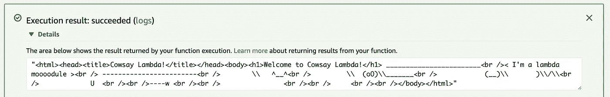

# 使用 AWS CloudFormation 设置无服务器应用程序

> 原文：<https://levelup.gitconnected.com/setup-serverless-applications-with-aws-cloudformation-6042850f64d5>

## 自动气象站云形成的开始

## 使用 AWS CloudFormation 设置无服务器应用程序的实践指南

照片由[西格蒙德](https://unsplash.com/@sigmund?utm_source=ghost&utm_medium=referral&utm_campaign=api-credit) / [Unsplash](https://unsplash.com/?utm_source=ghost&utm_medium=referral&utm_campaign=api-credit) 拍摄

让我们了解一下 CloudFormation 模板，以及如何使用它们来创建无服务器应用程序。本指南非常实用，可以让你更加熟悉如何操作云生成模板。

这是一个典型的公司/企业设置的例子。对于专业项目，开发人员通常无法访问 AWS 控制台中的所有功能，必须使用 CloudFormation 来部署基础架构更改。如果您在实践指南中遇到困难，可以在文章末尾找到完整的代码。

如果你还没有使用过无服务器应用，看看 [*使用 AWS Lambda*](https://kevinvr.medium.com/write-your-first-serverless-application-with-aws-lambda-9ff9c0f411a4) *编写你的第一个无服务器应用。那篇文章通过手动设置解释了无服务器应用的原因和方法。然而，本指南侧重于编写无服务器应用程序和 CloudFormation 模板。*

# 为什么是云形成？

CloudFormation 是 AWS 的服务，用于以代码形式创建基础设施。开发人员存储一个配置文件，描述应用程序所需的所有资源，然后 AWS 自动为您的应用程序创建这些资源。

我们为什么要那样做？首先，通过将您的基础设施作为代码，您可以享受 git 的所有优势。对基础架构的所有更改都会随时记录和备份。如果当前的基础设施中断，您可以简单地重新运行 CloudFormation 模板。对于手动设置，开发人员必须手动删除和重新创建应用程序的每个基础设施项目。

享受 Git 的优势。照片由[Yancy Min](https://unsplash.com/@yancymin?utm_source=ghost&utm_medium=referral&utm_campaign=api-credit)/[Unsplash](https://unsplash.com/?utm_source=ghost&utm_medium=referral&utm_campaign=api-credit)拍摄

# 专业环境

最后，在专业环境中，开发人员通常没有手动设置基础设施所需的权限。这就是 CloudFormation 模板派上用场的地方。它通常是这样工作的:

1.  云管理员创建一个 IAM 用户，拥有所需基础设施的所有必要权限。与云管理员一起，可以调整访问权限。
2.  开发人员创建基础设施配置文件，也称为 CloudFormation 模板。
3.  在许多情况下，开发人员使用 CICD 工具建立自动化构建和部署，将 CloudFormation 模板推送到 AWS。
4.  最后，CloudFormation 模板使用 IAM 用户的凭证在 AWS 上运行，IAM 用户是由云管理员创建的。

我们将以类似的方式工作，在本指南中，我们将着重于熟悉云形成模板的操作。我们将定义我们的基础设施，用 CloudFormation 模板编写它，并部署它。我们走吧！

# 创建我们的无服务器应用

首先，我们需要一个我们想要部署的无服务器应用程序。让我们创建一个有趣的应用程序，在屏幕上画出会说话的奶牛！为此，我们将使用[考赛 NPM 套件](https://www.npmjs.com/package/cowsay)。

使用 cowsay 的依赖项创建 package.json。别忘了跑`npm install`

Cowsay package.json

让我们创建应用程序的`index.js`文件，我们希望在其中运行 cowsay 包。

考赛指数

最后，让我们使用下面的命令在本地运行这个 lambda。确保您的机器上安装了 [*AWS SAM CLI*](https://docs.aws.amazon.com/serverless-application-model/latest/developerguide/serverless-sam-cli-install.html) 。如果这对你来说是新的，看看我们以前的文章， [*编写你的第一个无服务器应用*](https://kevinvr.medium.com/write-your-first-serverless-application-with-aws-lambda-9ff9c0f411a4) 。

在我们可以在命令行中运行它之前，我们还需要定义`template.yaml`文件，来解释我们的 lambda 方法正在使用哪个运行时引擎。

Cowsay 模板. yaml

最后，我们可以运行`sam local invoke`命令在本地运行 lambda。

本地运行 Lambda

我们可以在输出中看到我们的牛！然而，这是 HTML，所以在控制台上看起来不太好。一旦我们让它在我们的 lambda 上运行，我们就能看到我们的奶牛了！

# 手动云形成模板

## 设置 AWS Lambda 函数

在本指南中，我们将主要关注手动云形成设置，这样你就可以了解幕后发生了什么。如果我们立即自动化，这将是不可理解的。我们的下一个指南将解释如何用 CICD 自动设置。

转到 [AWS 控制台](https://console.aws.amazon.com/)，选择 CloudFormation。我们将为我们的应用程序创建一个新的堆栈。堆栈是运行应用程序或应用程序的一部分所需的一组服务。选择*带新资源(标准)*选项。

然后，我们将选择使用设计器创建一个新的 CloudFormation 模板。一旦你掌握了云形成模板，你也可以开始手工制作它们。

你会发现下面的屏幕出现。它看起来令人生畏，因为亚马逊有大量的服务可供选择。坚持你知道你将需要的服务，这将是好的。我们还注意到，在底部，提供了一个 JSON 输出。这将是你最终的云层模板。

让我们把 AWS Lambda 资源拖到右边。在 Lambda 下，找到 Function 并将其拖到编辑器上。现在，您会注意到，一旦您按下 Lambda，就会创建一个配置。

然而，这个 AWS Lambda 的属性似乎是一个空对象`{}`。要知道要填写什么，让我们去查看一下 [AWS Lambda 文档](https://docs.aws.amazon.com/AWSCloudFormation/latest/UserGuide/aws-resource-lambda-function.html)。文档指定了哪些属性是必需的，以及它们的作用。向下滚动文档时，您还可以找到有用的示例。让我们复制他们例子的一部分。

CloudFormation 模板非常冗长，所以请耐心等待一会儿。你会发现你用这些东西越多，它们看起来就越不吓人。

AWS 提供的示例配置[:](https://docs.aws.amazon.com/AWSCloudFormation/latest/UserGuide/aws-resource-lambda-function.html)

首先，我们把我们的 lambda 的名字，改成`cowsayLambda`。然后我们将需要`Code`属性，在这里我们指定 AWS 可以在哪里找到我们的 Lambda 应用程序的代码。让我们将`S3Bucket`的值设置为`cowsaybucket`。我们还必须在 CloudFormation 文件中生成这个 s3 bucket。可以将`S3Key`设置为`cowsay.zip`，它将包含我们的应用程序代码。我们还将复制`Runtime`值，因为我们想要定义要在 nodejs 中运行的代码，将其设置为`nodejs`。最后，将`Handler`设置为`index.handler`。这意味着 lambda 将运行`index.js`文件中的`handler`方法。

我们现在应该有一个类似下面的配置，这是 Lambda 的一个好的开始。

*专业提示:如果你想美化你的 JSON 模板，按下 YAML 按钮，回到 JSON 视图。亚马逊会自动美化。如果您喜欢以 YAML 格式编写配置，也可以反过来使用。*

考赛拉姆达配置

# 为 Lambda 创建 IAM 角色

Lambda 需要定义一个 IAM 执行角色。lambda 将在运行时承担此角色，并将拥有相关的权限。对于我们的 lambda，我们不需要任何特定的权限。让我们设置一个默认的 IAM 角色，然后我们可以在 Lambda 配置中引用它。将 IAM:Role 项拖到可视编辑器上，并将其更新为以下模板。

来自 [AWS](https://docs.aws.amazon.com/AWSCloudFormation/latest/UserGuide/quickref-lambda.html) 的 IAM 角色示例

该模板来自 AWS 文档中的一个示例。它创建 Lambda 可以承担的 IAM 角色，并授予对日志的访问权限，以防 Lambda 创建日志。

现在我们需要更新 Lambda 上的角色，以使用这个新的 IAM 角色。将以下配置添加到 Lambda 函数的属性中。

将该属性添加到我们之前创建的 Lambda 函数中。

# S3 水桶的创作

我们在 Lambda 配置中指定了一个名为`cowsaybucket`的 S3 桶。让我们将一个 S3 桶拖到我们的可视化编辑器中。打开`S3`并将一个`Bucket`拖到编辑器上。点击它，编辑属性将其重命名为`cowsaybucket`。在可视化编辑器中的 Lambda 函数上找到一个粉红色的圆圈。将它拖向存储桶以创建一个依赖项。Lambda 不能在没有 Bucket 的情况下运行，因为 Bucket 将包含代码。请注意，当您将箭头拖向桶时，桶必须亮起粉红色，以创建依赖关系链接。

现在，我们可以设置 S3 存储桶属性，单击存储桶，让我们前往[亚马逊 S3 云信息文档页面](https://docs.aws.amazon.com/AWSCloudFormation/latest/UserGuide/aws-properties-s3-bucket.html)。我们可以再找一个用法的例子。

来自 [AWS 文件](https://docs.aws.amazon.com/AWSCloudFormation/latest/UserGuide/aws-properties-s3-bucket.html)的 S3 铲斗配置示例:

我们不需要那个特定的删除策略，但是其余的可以保持不变。我们将不得不添加`BucketName`属性。设置为`cowsaybucket`。

考赛 S3 铲斗配置

# 授予 S3 访问权限

我们有自己的 Lambda 和 bucket，但是 Lambda 还不能访问 Bucket 上的文件。让我们更新我们的 S3 桶的策略，允许 lambda 从桶中检索应用程序代码。[AWS 文档](https://docs.aws.amazon.com/serverless-application-model/latest/developerguide/serverless-sam-template-publishing-applications.html)对此有一个示例政策描述。

兰达斯和 S3 的 BucketPolicy 示例

我们将需要一个类似的政策为我们的水桶。让我们将一个 S3 BucketPolicy 拖到我们的可视化编辑器中。我们最终的`BucketPolicy`看起来类似于下面的。如果调用资源的标识符 ARN 和 Lambda 是同一个 ARN，我们就定义了对`cowsaybucket`资源的访问。可视化编辑器中会自动出现一个与存储桶相关的箭头。

考赛 S3 存储桶策略配置

# 重构云信息模板

在这一点上，我们完整的 CloudFormation 模板看起来非常好！然而，还有一个问题。我们的 Lambda 正在等待一个 S3 桶，检查。这个 Lambda 期望在 S3 桶中有一个名为 cowsay.zip 的文件。以下是失败的原因。它将试图找到 lambda 的源代码并创建一个错误。

问题是，在为 Lambda 的属性检索源代码之前，源代码不存在于 S3 存储桶中。我们可以通过首先创建 S3 桶，然后上传源代码，最后运行第二个 CloudFormation 堆栈来创建 Lambda 来解决这个问题。我们可以将此视为一个 3 步流程。

1.  运行云形成堆栈以创建 S3 桶
2.  把我们 Lambda 的源代码上传到 S3 桶
3.  运行第二个 CloudFormation 堆栈来创建 Lambda

同样有趣的是，我们可以在可视化编辑器底部的`template`选项卡上找到完整的云信息模板。这是一个包含我们定义的所有资源的模板。

# 创建 S3 桶堆栈

让我们首先创建一个名为`cowsay-bucket`的新堆栈。在这个堆栈中，我们将只定义 S3 存储桶。将以前的 S3 存储桶属性复制到其中。

考赛 S3 铲斗配置

在可视编辑器中，点击创建堆栈。然后，继续直到它被创建。它会提示输入一个栈名，姑且称之为`cowsay-bucket`。

在堆栈事件中，您将能够找到堆栈创建的状态。应该是`CREATE_COMPLETE`。

我们的 S3 存储桶应该已经创建好并可以使用了！

# 部署 Lambda 应用程序源代码

我们已经有了之前开发的 cowsay 应用程序的源代码。让我们将这段代码部署到 S3 桶中。AWS SAM CLI 提供了一些命令来自动压缩源代码并将其上传到 S3 存储桶。这一次，让我们手动操作，这样您就可以了解幕后发生了什么。

压缩源文件夹中的所有文件。(!)确保不要压缩包含源代码的文件夹，因为这将不起作用。对于我们当前的配置，AWS 希望 index.js 文件位于源代码包的根目录下。调用压缩文件`cowsay.zip`，如我们的 Lambda `S3Key`属性中所定义的。

让我们使用 AWS 控制台前往 S3 桶。将 cowsay.zip 文件上传到您的 cowsay S3 存储桶的根目录。

将 cowsay.zip 上传到 cowsay S3 桶

# 创建λ函数堆栈

我们的代码是可用的，并准备好为我们的 Lambda 运行！让我们为 Lambda 创建一个新的 CloudFormation 堆栈。前往 CloudFormation 堆栈设计器。将 S3:BucketPolicy、Lambda:Function 和 IAM:Role 对象拖到编辑器上。

如前所述，按下 Create stack 按钮并按照步骤操作，直到创建好为止。调用堆栈`cowsay-lambda`。

我们现在可以转到 AWS 控制台中的 Lambda，找到 cowsay Lambda 并进行测试调用。这应该会像预期的那样工作。

那看起来确实很棒！但是我们的 Lambda 的 URL 在哪里呢？默认情况下，Lambdas 没有 URL。相反，我们需要在 AWS 上设置一个 API 网关，它将路由到我们的 Lambda 函数。我们的下一个指南将是关于 API 网关的实践，如何手动设置它们，以及如何使用 CloudFormation。

# 摘要

CloudFormation 模板是用文本而不是手动配置基础设施的非常冗长的方式。这使得自动化基础架构或创建多个相似的基础架构变得更加容易。接下来，可以将模板提交给 Git，以享受版本控制系统的优势。

开发人员通常无法在专业环境中手动创建基础设施，这正是 CloudFormation 派上用场的地方。它甚至可以用于为 CICD 构建和部署计划创建自动化管道。

要设置 CloudFormation 模板，AWS 文档页面很有用，它解释了需要哪些属性以及如何配置它们。

# 完整的应用程序代码

如果你在操作指南中遇到困难，你可以在下面找到完整的应用程序代码。

## 应用代码

**。/package.json**

**。/index.js**

## S3 桶形烟囱

## λ堆栈

# 资源

*   [编写你的第一个无服务器应用](https://itnext.io/write-your-first-serverless-application-with-aws-lambda-9ff9c0f411a4)
*   [云形成文件](https://docs.aws.amazon.com/AWSCloudFormation/latest/UserGuide/Welcome.html)
*   [S3:铲斗文件](https://docs.aws.amazon.com/AWSCloudFormation/latest/UserGuide/aws-properties-s3-bucket.html)
*   [S3:桶政策文件](https://docs.aws.amazon.com/AWSCloudFormation/latest/UserGuide/aws-properties-s3-policy.html)
*   [λ:函数文档](https://docs.aws.amazon.com/AWSCloudFormation/latest/UserGuide/aws-resource-lambda-function.html)
*   [IAM:角色文档](https://docs.aws.amazon.com/AWSCloudFormation/latest/UserGuide/aws-resource-iam-role.html)

[订阅我的媒体](https://kevinvr.medium.com/membership)到**解锁** **所有** **文章**。通过使用我的链接订阅，你是支持我的工作，没有额外的费用。你会得到我永远的感激。