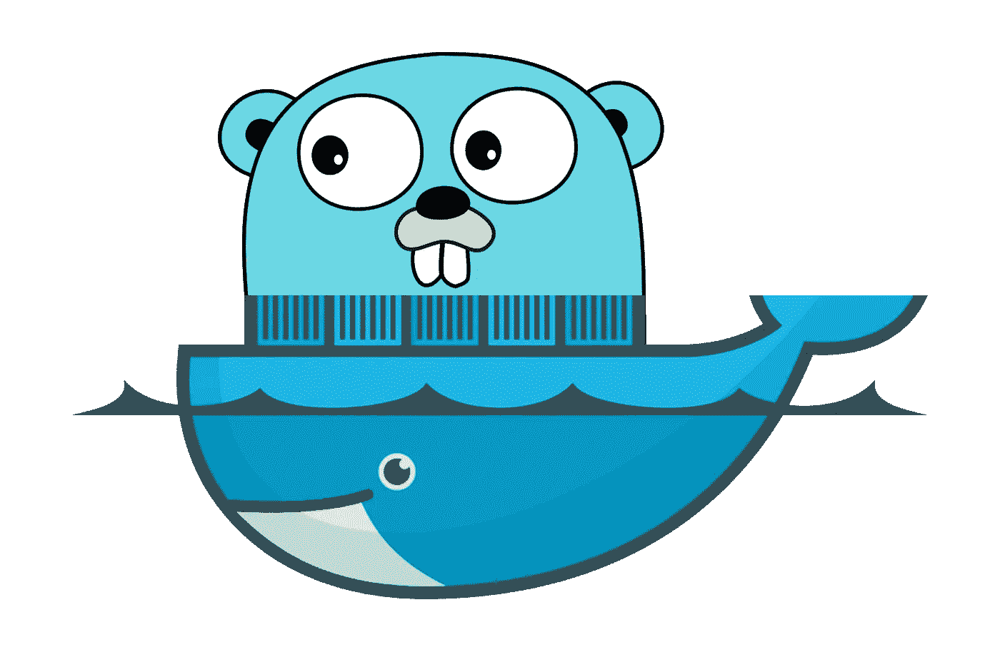

# 用 Docker 建立一个简单的 Go 开发环境

> 原文：<https://levelup.gitconnected.com/setup-simple-go-development-environment-with-docker-b8b9c0d4e0a8>



## 去休息吧

# 史诗

用 Docker 建立一个健壮的本地开发环境。

*   实施单个启动脚本来启动环境。
*   记录开发人员应该如何启动环境并运行一些特定命令(例如，启动/停止应用程序)。
*   不应该有任何依赖，开发人员必须安装到他们的本地机器(除了 Docker 和编辑器)。
*   开发人员可以将源代码从他们的本地机器安装到环境中，这样他们就可以使用他们喜欢的编辑器编写代码，并让他们的代码自动同步到环境中。
*   记录开发人员如何将源代码从他们的本地机器挂载到环境中。
*   至少有一个工具可以调试应用程序。该工具应该是健壮且易于使用的。
*   记录开发人员在开发过程中应该如何调试应用程序。

更多详情，请参考此票证。

# 范围

在本文中，我将从一个简单的脚本开始，启动一个 Docker 开发环境，该环境可以执行 Go 代码并将源代码装载到环境中，这样开发人员就可以直接在本地机器上使用自己喜欢的编辑器编写代码。

# 履行

## 基础图像

有了这些简单的需求，就没有必要定义新的 Docker 映像。我是直接用官方的`golang`图。

```
docker run --rm -it --name go-restful golang
```

这将在交互模式下从`golang`启动一个容器，以便我稍后可以执行每个`go`命令。

```
go version *-> go version go1.13 linux/amd64*
```

## 挂载源代码

接下来，我将存储库的源代码安装到容器中，以便我可以在容器化的开发环境中测试它。

```
docker run --rm -it --name go-restful \
  -v $PWD:/go/src/github.com/the-evengers/go-restful golang
```

`-v`或`--volume`选项允许我从本地机器`$PWD`(工作目录)挂载一个目录到容器`/go/src/github.com/the-evengers/go-restful`中的一个目录。

虽然目录位置有点长，但我现在必须这么做，因为这是 Go 所需的工作区结构。

## 试验

现在让我们从本地机器写一些样本代码并测试它。

然后运行(在容器的交互模式下):

```
go run main.go
*-> Hello World!*
```

现在，进行一些更改(从本地机器):

然后，再次运行:

```
go run main.go
*-> Hello World inside Docker!*
```

耶！我们准备好了。

## 进入剧本

最后，让我们把所有东西都移到一个脚本文件`scripts/start-devcontainer.sh`中，隐藏所有的魔法。

我在这里做了一些改进:

*   从脚本本身找到库的绝对位置，而不是使用`$PWD`,这样开发人员可以从任何地方执行脚本，挂载路径总是正确的。
*   为了可读性，很好地声明一些变量。

## 完成了。让我们想想智能感知和调试功能！

我现在能够使用我最喜欢的编辑器编写代码，并让它们在容器化的开发环境中运行。然而，我不能使用我的编辑器最酷的功能，如智能感知，运行或调试等。让我们在下一篇文章中讨论这个问题，回头见！

这篇文章的全部来源发表在[这里](https://github.com/the-evengers/go-restful/tree/a3324427c052e2d30587788ff71b79367a22b978)。