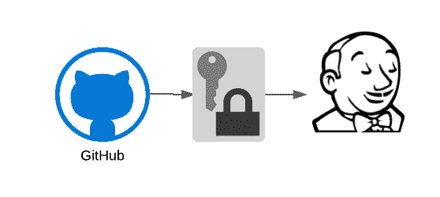
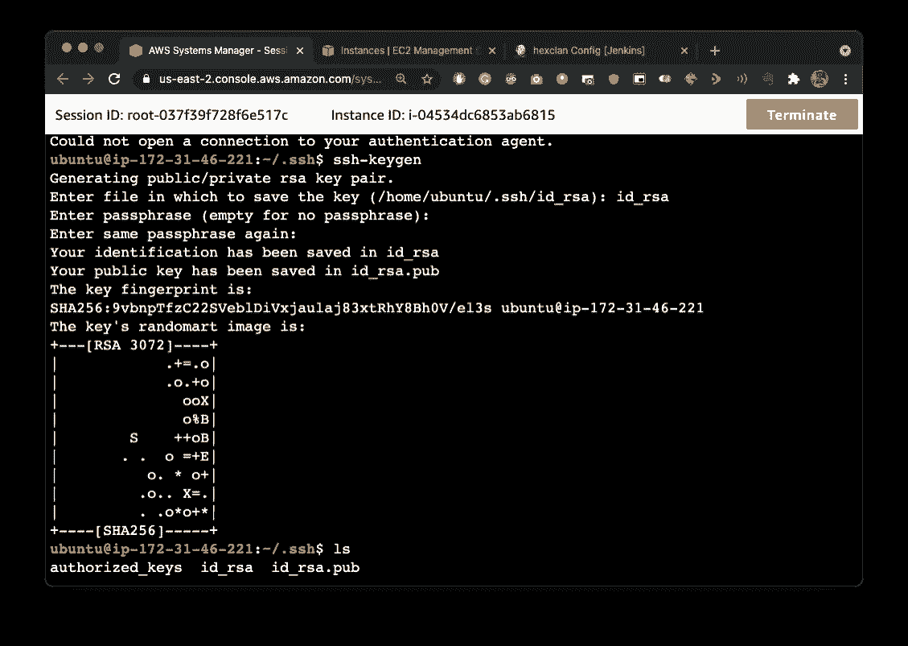
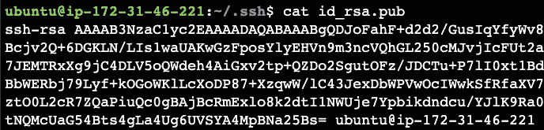
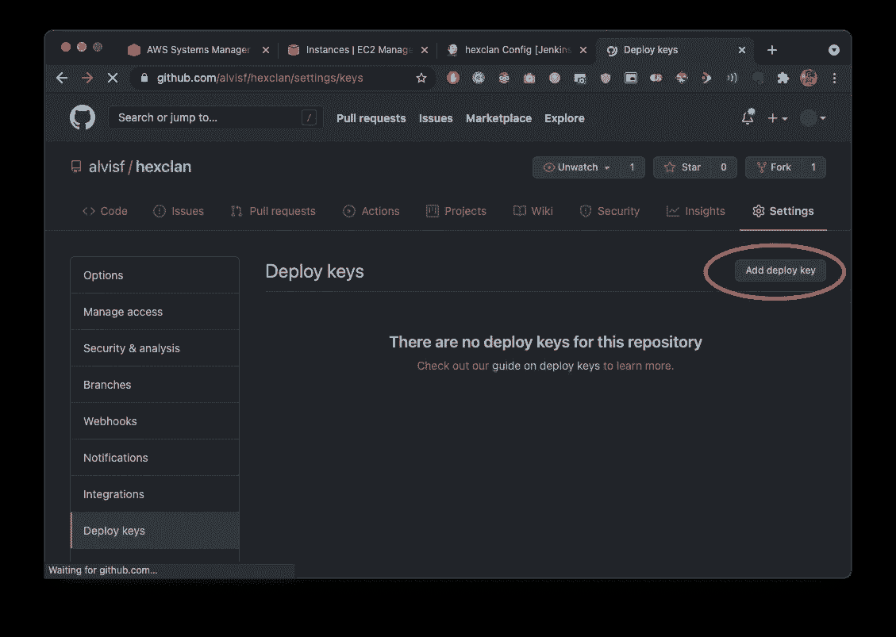
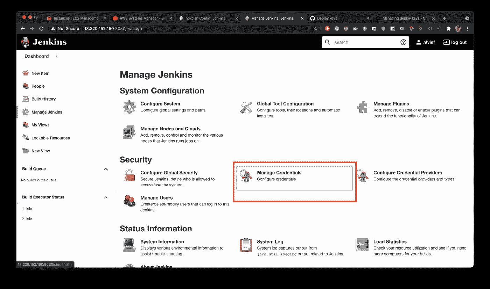
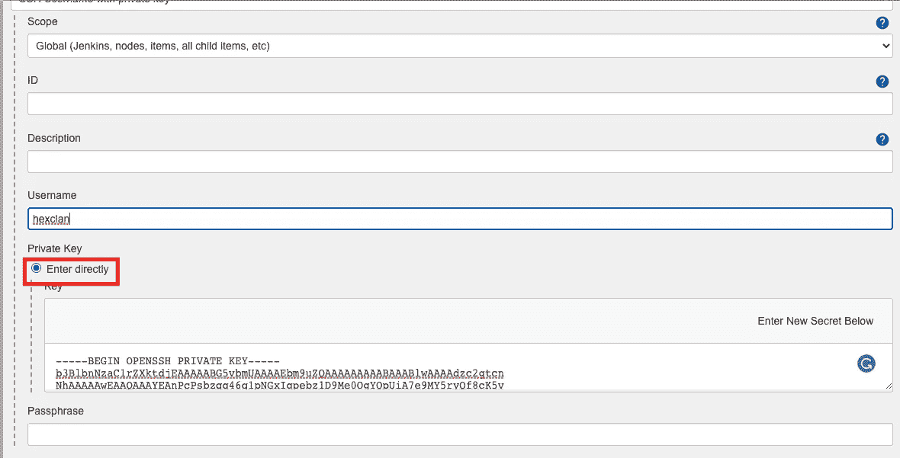
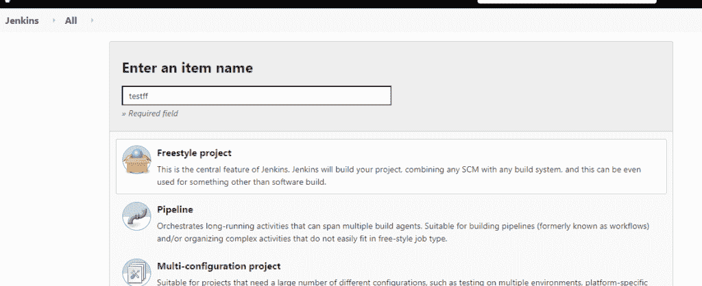
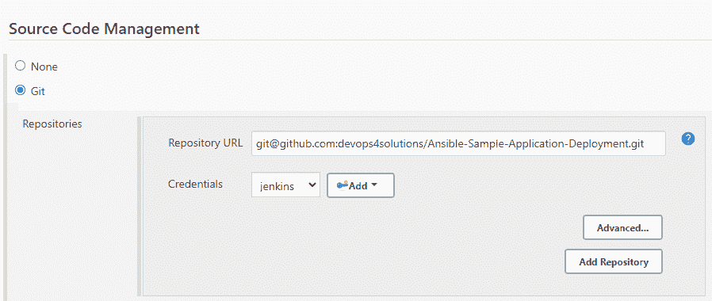

# 在 Jenkins 和 Github 之间设置 SSH

> 原文：<https://levelup.gitconnected.com/setup-ssh-between-jenkins-and-github-e4d7d226b271>



在这个故事中，你将学习如何在[詹金斯](https://www.jenkins.io/)和 [Github](https://github.com/) 之间设置 SSH。使用这种方法，您不需要提供您的凭证来配置 Jenkins 作业中的 git repo，并且您将实现无密码连接

最近，出于安全原因，其他方法已被弃用，这是新标准。

# 步伐

1.  生成 SSH 密钥
2.  复制 Github 中的公钥
3.  在 Jenkins 凭据中配置
4.  使用 SSH 连接在 Jenkins 中配置一个示例作业

# 配置 Jenkins 用户

生成 ssh 密钥并确保 ssh 代理正在运行

```
ssh-keygen
sudo eval $(sudo ssh-agent -s)
ssh-add ~/.ssh/id_rsa
```



成功生成了一个 SSH 密钥，并允许您在 Jenkins 和 Github 之间实现无密码连接

使用下面的命令复制公钥(或任何时候你的)。ssh '文件夹并复制密钥)

`cat /home/ubuntu/.ssh/id_rsa.pub`



# Github 配置

进入 GitHub 仓库->设置->添加部署密钥



# 配置 Jenkins 凭据

现在我们将在 Jenkins 配置中配置`jenkins`用户的私钥

# 在 Jenkins 内部添加 SSH 密钥

*   登录 Jenkins
*   现在，从 Jenkins 控制台的左侧面板转到“管理 Jenkins ”,然后单击“管理凭证”:



之后，选择“添加凭据”。这将为我们打开一个新的形式。在下拉列表中，选择“带私钥的 SSH 用户名”，然后为其命名。

从 Jenkins 服务器复制私钥。



现在，您可以在这个 Jenkins 实例中克隆任何 git repo。在 Jenkins 中配置作业时，您不需要提供凭据。

配置 Jenkins 作业

*   在詹金斯创建一个自由式工作
*   配置 git repo 的 SSH URL



# 结论:

我们已经成功地在 Jenkins 和 Github 之间建立了 SSH，实现了无密码连接。使用这种方法，您不需要提供您的凭证来配置 Jenkins 作业中的 git repo。