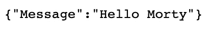

# 设置 Go Lambda 并使用 Terraform 进行部署

> 原文：<https://levelup.gitconnected.com/setup-your-go-lambda-and-deploy-with-terraform-9105bda2bd18>

## 从构建 Lambda 的项目结构到在 AWS 中部署


照片由[保罗·花冈](https://unsplash.com/@plhnk?utm_source=medium&utm_medium=referral)在 [Unsplash](https://unsplash.com?utm_source=medium&utm_medium=referral) 上拍摄

最近我一直在和围棋高手合作。从 Javascript 开始，为了用 Go 编码，改变思维模式是一段旅程。我不打算谈论将 Go 与 Lambdas 一起使用或作为一种编程语言的利弊。我想说的是，如果你想尝试一些新的东西，Go 是一种非常容易学习的编程语言，并且 Lambda 函数内部的性能令人难以置信。

*同样如果你的项目依赖* [*线程*](https://en.wikipedia.org/wiki/Thread_(computing)) *Go 已经把你* [*覆盖了*](https://tour.golang.org/concurrency/1) *。*

假设您对 Go 有一些基本的了解，让我们深入了解如何使用 Terraform 将 Go Lambda 函数部署到 AWS 中。如果你还没有安装 Go，你可以遵循他们的官方文档。

*顺便说一下，围棋入门教程* [*入门围棋*](https://golang.org/doc/tutorial/getting-started) *和* [*创建围棋模块*](https://golang.org/doc/tutorial/create-module) *是设置和掌握围棋环境的绝佳资源。如果你是新手，我建议你先做这些。*

## 1.项目结构

我们将从我们的文件结构开始。这是我个人的偏好，所以你可以随意调整，最终结果应该是一样的。

我喜欢创建一个`source`文件夹，在那里我所有潜在的 Lambda 函数都将被写入。在我们的例子中，我们创建了一个`hello`函数，因此我们创建了一个同名的文件夹，并在其中创建了一个名为`main.go`的文件。你可以随意命名这个文件，但是为了找到我们代码的入口点，这个包需要被命名为`main`。

因为我们使用 Lambdas，所以我们总是创建我们的`handler`来执行我们的代码。为此，我喜欢用这个名字创建一个文件夹，里面有几个文件:`handler.go`、`handler_factory.go`和`config.go`。我这样做的原因是因为我希望我的`main`包尽可能简单，这样可以使测试更简单。

`config.go`将包含我们用 Terraform 设置的任何环境变量。`handler_factory.go`将初始化 SDK 中的任何 AWS 模块，如 DynamoDB 或 Kinesis。`handler.go`是我们应用程序的逻辑编写的地方。

现在我们需要用命令`go mod init [name of package]`初始化我们的 Go 模块。我喜欢根据我的 Github 库名和 Lambda 函数的文件路径来命名模块，例如 `github.com/jagonzalr/go-lambda-terraform-setup/source/hello`。这相当于`npm init`。文件结构应该如下所示:

```
source
|- hello
|------|- go.mod
|------|- go.sum
|------|- main.go
|------|- handler
|------|--------|- handler.go
|------|--------|- handler_factory.go
|------|--------|- config.go
```

如果你想检查 Lambda 函数的代码，你可以去 [Github repo](https://github.com/jagonzalr/go-lambda-terraform-setup) 。

*在 Go 和 Node.js 之间需要注意的一点是，当使用 Go 时，你需要给 AWS 一个包含你的代码和任何 Go 包的可执行文件(类似于* `*node_modules*` *)。当使用 Node.js 时，你通常分别给 AWS 你的代码和* `*node_modules*` *。*

## 2.构建 Lambda

要用 Go 制作一个可执行文件，我们需要调用[构建](https://golang.org/pkg/go/build/)包。确保您位于 Go 模块目录中，例如`source/hello`。在那里，您执行以下命令:

```
env GOOS=linux GOARCH=amd64 go build -o ../../bin/hello
```

首先，我们将 Go 操作系统(GOOS)设置为`linux`，将 Go 架构(GOARCH)设置为`amd64`，这样 AWS 就可以正确地执行我们的代码。然后我们调用命令`build`并指定二进制文件的输出位置。

## 3.部署 Lambda

为了部署我们的 Go Lambda 函数，我们将使用 Terraform，代码也可以在 [Github repo](https://github.com/jagonzalr/go-lambda-terraform-setup) 上获得。

需要注意的重要一点是，我们需要给 AWS 一个 Go 代码的 zip 文件。在 Terraform 中，您可以这样做:

```
data "archive_file" "lambda_zip" {
    type        = "zip"
    source_file = "../../bin/hello"
    output_path = "bin/hello.zip"
}
```

[Github repo](https://github.com/jagonzalr/go-lambda-terraform-setup) 中的其余代码是关于如何用 API Gateway 设置 Lambda 函数(不管[运行时](https://docs.aws.amazon.com/lambda/latest/dg/lambda-runtimes.html))的样板代码。

部署解决方案后，您可以在浏览器中使用如下 URL 调用 API:

```
https://[unique-id].execute-api.[aws-region].amazonaws.com/dev/hello
```

响应应该类似于:



来自 Go Lambda API 的消息

希望你喜欢这篇文章，它激起了你尝试围棋的兴趣🎉

[](https://blog.jagonzalr.com/membership) [## 加入我的介绍链接媒体-何塞安东尼奥冈萨雷斯罗德里格斯

### 作为一个媒体会员，你的会员费的一部分会给你阅读的作家，你可以完全接触到每一个故事…

blog.jagonzalr.com](https://blog.jagonzalr.com/membership)