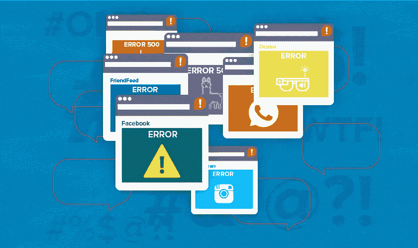

# 脸书倒下了！

> 原文：<https://levelup.gitconnected.com/sev-1-facebook-is-down-d4960e2cdf8a>

## 一个关于我，一个局外人和一个软件开发伙伴，对它的感受的个人描述

昨天，脸书和它的应用程序家族——insta gram、WhatsApp 和 Messenger 完全从雷达上消失了 6 个小时，就好像有人去了服务器农场并拔掉了它们的电缆。这是脸书历史上规模最大的一次停电，据估计，整个六个小时的平台停电给全球经济造成的损失超过 10 亿美元。

而昨天的停电对在脸书工作的人来说一定是一场噩梦(我为那些随叫随到的家伙感到难过！)，了解到底是哪里出了问题并欣赏我们今天使用的互联网是很有趣的，数十亿人的日常任务、工作和娱乐都依赖于它，它是建立在一个由一百万个系统和谐工作的非常复杂的网络上的。

虽然中断肯定不可取，但正是这种时候重新点燃了我对计算机科学每天带来的无形魔力的孩童般的好奇。我记得在我三年级的时候，爸爸第一次给家里买了一台电脑。这是一台台式机，配有一个笨重的 CRT 显示器，安装了 Windows 95，并配备了英特尔奔腾处理器。坐在发出温暖蓝光的桌面屏幕前，我想知道“接下来会发生什么？”(答案是无限的 MS Paint😄)

同样，今天早上我发现自己在阅读关于一个拥有数千名最聪明的工程师的组织中可能出现的问题，以至于花了几个小时来修复它。这是一个温和的提醒，即使是有这么多层审批、安全检查和端到端测试的大公司，也只需改变一个配置，就能减少近 30 亿活跃用户。

我想知道当不仅脸书系列应用程序停机，而且他们的内部通信和安全系统、办公室访问钥匙卡停止工作时，员工们经历了怎样的恐惧，这使他们无法在最需要的时候与同事有效地通信、远程登录或实际访问办公室！值得庆幸的是，在我在亚马逊的待命期间，我从来没有遇到过影响 30 亿人的严重后果。所以，是的，在我下一次不眠不休的值班期间，这是值得感激的事情:)

虽然这是一次性的(希望如此),最优秀的人才已经在努力不让它再次重复，但我想知道，如果事情更加分散，如果我们需要转向一个原则上更有弹性和更安全的网络 Web 3，这种情况是否会发生。当涉及到一个在一些发展中国家相当于互联网的组织时，人们感觉有太多的权力和责任被赋予了一个单一的真相来源——也许区块链**是**要走的路。

总的来说，我真的很兴奋地看到这个旅程将我们带到哪里，也许脸书本身会出现一些真正酷的东西，更具容错性，并给内容消费者更多的权力。Twitter 已经通过项目[蓝天](https://blueskyweb.org/)走上了去中心化社交媒体平台的道路。所以，也许，那一天并不遥远。

*这里有一篇由 CloudFare* *撰写的* [*博客，深入探讨了停电的技术细节。*](https://href.li/?https://blog.cloudflare.com/october-2021-facebook-outage/)

*如果你想联系，请点击*[*LinkedIn*](https://www.linkedin.com/in/sushmita01/)*联系我！*