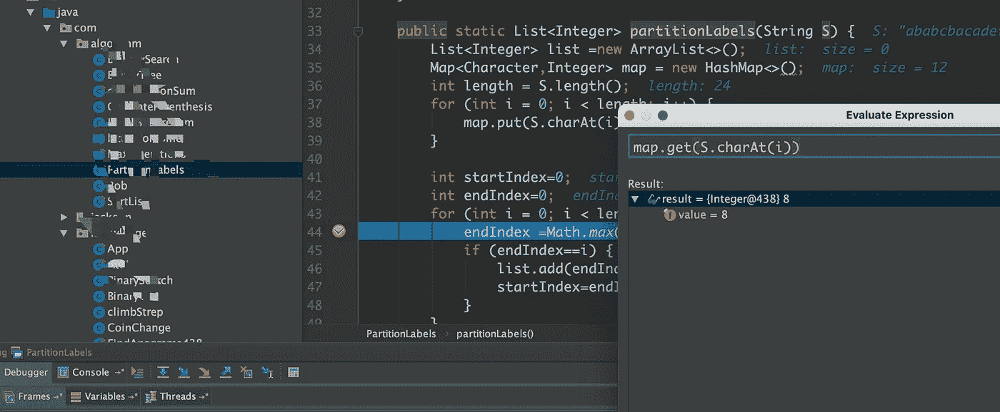
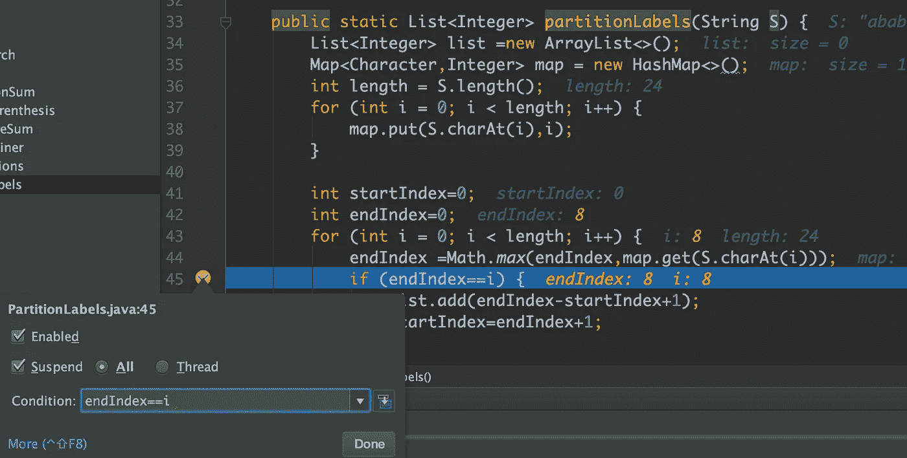
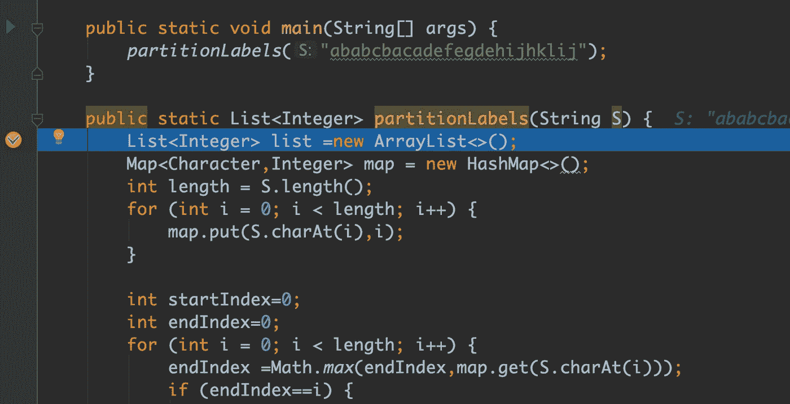
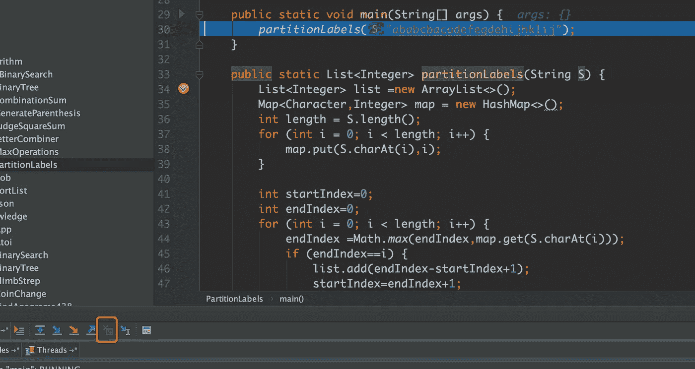
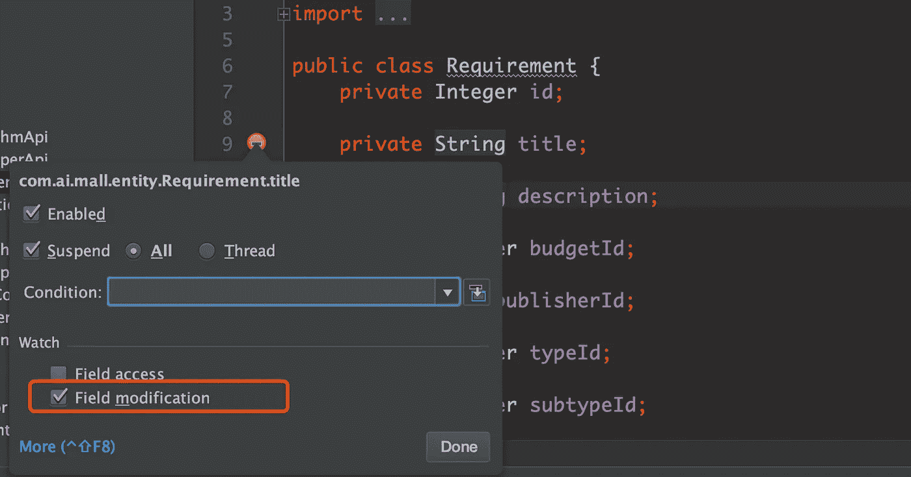
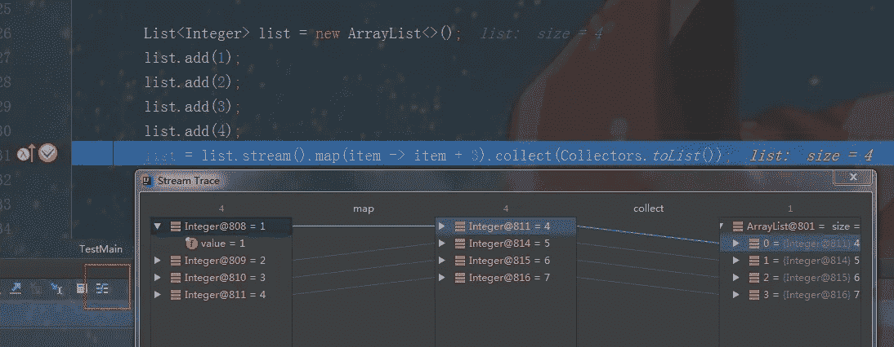
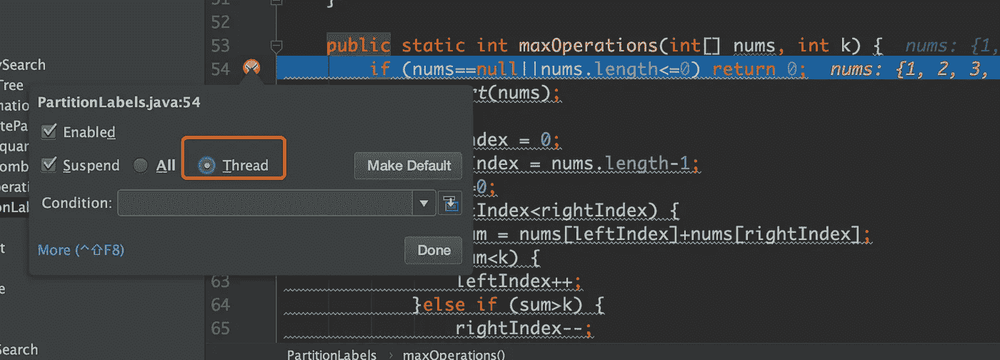

# 每个 Java 开发人员都必须知道的七个 Intellij 调试技巧

> 原文：<https://levelup.gitconnected.com/seven-intellij-debug-tricks-that-every-java-developer-must-know-de26aaac736a>

你知道这些把戏吗？这些一定会提高你的开发效率。

调试代码是 java 工程师日常工作的重要组成部分。调试代码有两个目的。一个是检查代码逻辑是否有问题，从而检查代码逻辑，发现隐藏的 bugs 另一个是当系统出现 bug 时，可以快速定位问题修复这些 bug。但不管出于什么目的，高效的代码调试无疑会提高我们代码的效率，提高定位和解决问题的效率，从而实现白盒代码自观察。本文主要列举了 10 种常用的调试技术，可以帮助我们快速找到代码 bug。

## 表达式计算结果评估

在调试过程中，有些变量的当前值会默认显示在代码的右侧，但有些表达式的值默认不会显示。有时候我们在计算过程中需要注意表达式的数据是否正确。此时，您可以复制要选择的表达式，然后使用快捷键或单击下面的图标来查看表达式的计算结果。

## 调试条件

在某些循环条件下，代码片段需要通过条件判断后才能执行。但是在调试的时候，我们希望快速找到符合条件的对象，而不是把时间浪费在我们不关心调试的对象上。这时候我们就可以利用调试过滤条件快速筛选出我们需要的对象，大大提高我们调试的效率。

## 下拉框架

在代码调试的过程中，有时候因为点击下一步非常快，可能会在命中之前命中的一个断点后直接跳转到一个方法的内部，也有朋友可能会直接退出重新执行调试。这时可以使用“丢帧”功能返回上一步，快速定位到上一个代码运行位置。我们都知道 JVM 是通过栈帧来保存方法调用地址的，所以实际上这部分功能可以理解为放弃当前调用栈，返回到原来的调用。

## 调试字段

当我们需要知道一个类中的字段值何时被修改时，从头调试太麻烦了，因为有时候我们可能不知道字段值赋值的起点在哪里，尤其是在读框架源代码的时候。此时，您可以尝试在类的字段中设置断点。检查字段访问或字段修改是否会运行到发生字段修改或字段被访问的位置。这样会大大提高找到修改字段的地方再修改的效率。

## 流调试

Java 8 后来引入了 lambda 表达式的特性。虽然功能很好用，但是调试很麻烦。主要是不方便查看流内部值的运行状态。这时候就需要使用 Java 流调试器插件，这样我们在调试流的时候就可以看到内部值的执行过程和最终结果，方便我们定位问题。

## 强制返回

有时当我们调试一些耗时的代码时，我们可能只是想确认业务逻辑是否有问题，并不是真的想执行这些代码。在这种情况下，我们可以使用强制返回函数来指定返回值，以继续后续的业务逻辑调试，而无需执行方法背后的代码。

## 多线程调试

在 Idea 的默认调试模式下，所有线程都将被阻塞。只有当前调试线程完成了它的逻辑，才能进入其他线程。如果我想在多线程场景中调试代码逻辑，我该怎么做？其实在设置断点的时候，我们可以通过右击断点来选择线程调试模式。

好了，已经讨论了七种调试技术。希望这篇文章能提高你的 IntelliJ 调试能力。最后，感谢您的阅读。

 [## 5 个有用的 IntelliJ IDEA 插件来提高你的编码效率

### 一旦使用了这些插件，就离不开了。

medium.com](https://medium.com/javarevisited/5-useful-intellij-idea-plugins-to-improve-your-coding-efficiency-36bc75440477)  [## 程序员应该知道的基本 SQL 优化建议

### 当我们谈到系统性能优化时，除了代码级的各种有针对性的优化…

levelup.gitconnected.com](/basic-sql-optimization-suggestions-that-programmers-should-know-94de09fd131)  [## 99%的 Java 开发人员会犯的 5 个错误

### 你遇到过这些诡异的问题吗？

medium.com](https://medium.com/javarevisited/5-mistakes-99-java-developers-makes-2bc4b0e49ace)