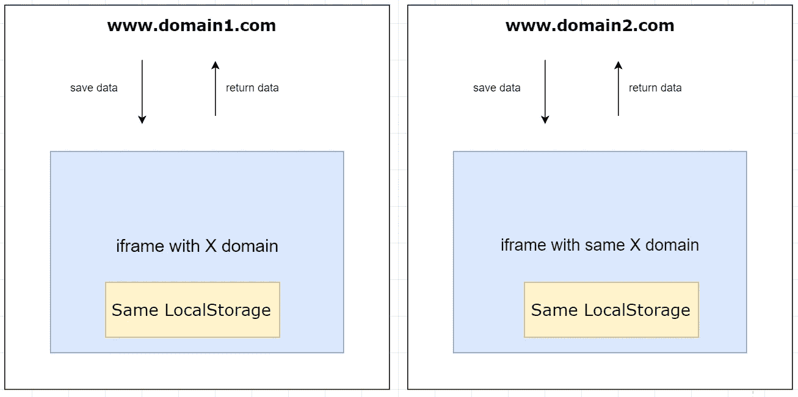

# 在不同的域之间共享本地存储/会话存储

> 原文：<https://levelup.gitconnected.com/share-localstorage-sessionstorage-between-different-domains-eb07581e9384>

在多个域之间共享数据(例如一个 auth 令牌)可能有些困难，因为我们都知道所有浏览器端数据存储 API(local storage、cookies 等。)与一个特定的领域相关。

# **解决方案:**

使用 iframe 将数据保存在 localStorage 中，然后其他域向 iframe 请求我们已经保存的数据。

父窗口和 iframe 之间的这种通信可以通过 postMessage API([https://developer . Mozilla . org/en-US/docs/Web/API/Window/postMessage](https://developer.mozilla.org/en-US/docs/Web/API/Window/postMessage))来实现



**实现:**

1-在 iframe 中创建一个侦听器，它保存在 localStorage 中传递的数据

2-在 iframe 中创建一个监听器，将数据发送回去

3-使用 postMessage，我们从父节点调用 iframe 的保存功能

4-在任何其他域中，我们从 iframe 请求数据(使用 postMessage 并监听响应)。

# **Iframe 代码**

侦听消息事件，检查操作类型(保存或获取)。如果保存，则向 LocalStorage 添加一个项目，如果获取:使用 postMessage 返回数据

```
const domains = [
  "https://www.domain1.com",
  "https://www.domaine2.com"
]window.addEventListener("message", messageHandler, false);function messageHandler(event) {
  if (!domains.includes(event.origin))
    return; const { action, key, value } = event.data
  if (action == 'save'){
    window.localStorage.setItem(key, JSON.stringify(value))
  } else if (action == 'get') {
    event.source.postMessage({
      action: 'returnData',
      key,
      JSON.parse(window.localStorage.getItem(key))
    }, '*')
  }
}
```

# 另一个窗口代码将保存一个数据

使用 postMessage 向 iframe 发送消息事件。

```
const data = doSomeThingToGetData()
const iframe = iframe = document.getElementById('iframe-id')
iframe.contentWindow.postMessage({
  action: 'save',
  key: 'keyForData',
  value: data
})
```

# 现在，只要有一个窗口想要获取这些数据

发送一个消息事件，并监听 iframe 将发回的消息事件。

```
const iframe = iframe = document.getElementById('iframe-id')
iframe.contentWindow.postMessage({
  action: 'get',
  key: 'keyForData'
})window.addEventListener("message", messageHandler, false);function messageHandler(event) {
  const { action, key, value } = event.data
  if (action == 'returnData'){
    useData(key, value)
  }
}
```