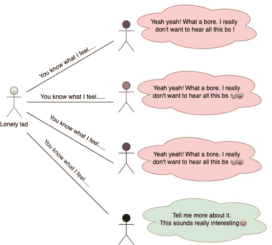
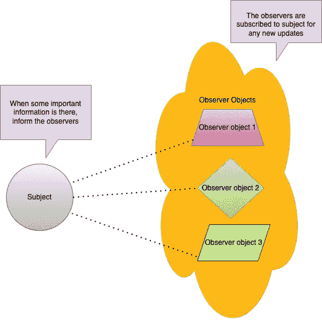
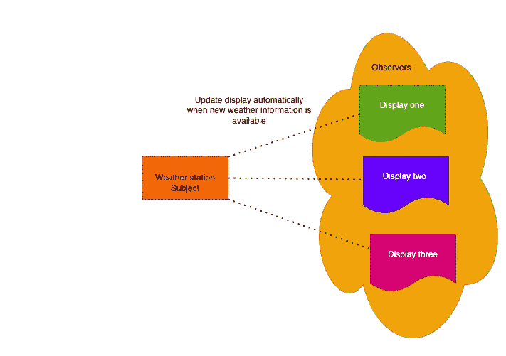
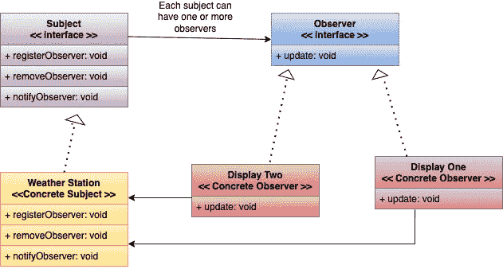
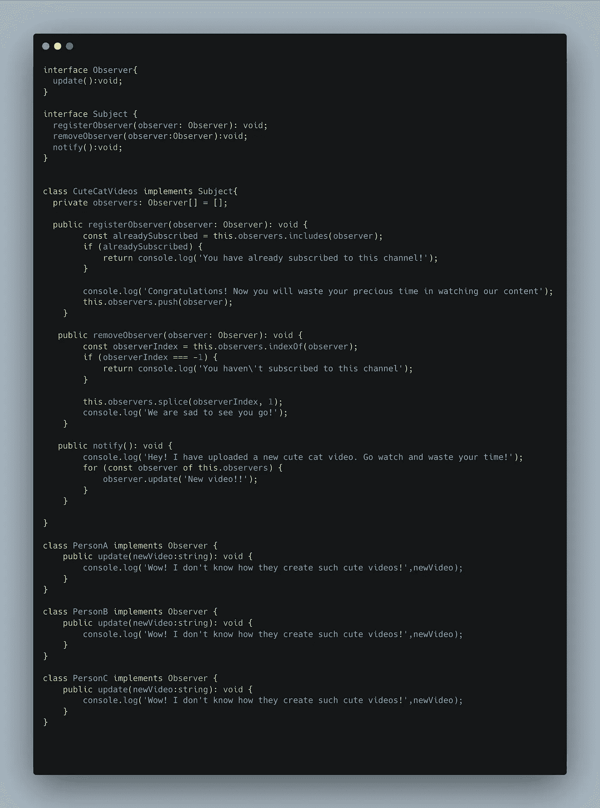
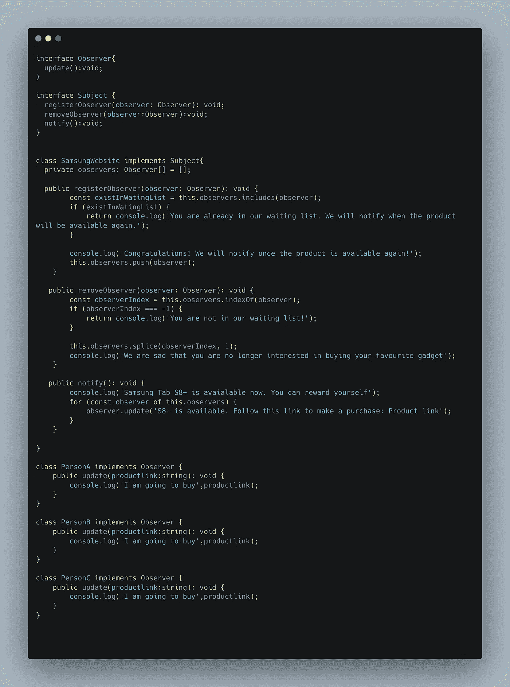
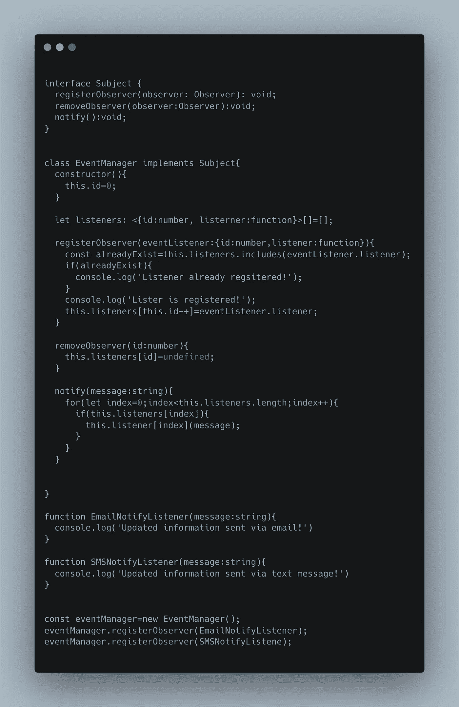

# 与关心的人分享

> 原文：<https://levelup.gitconnected.com/share-with-those-who-care-37008fbf5a18>

## 我不喜欢一遍又一遍地问，如果你有什么有趣的事情让我知道！

丹尼尔·勒曼在 [Unsplash](https://unsplash.com?utm_source=medium&utm_medium=referral) 上的照片

这是软件设计模式系列的第二篇博客。在之前的博客中，我们看到了生活中的有效策略。在这一次，我们将继续加强我们的学习，并深入到另一种模式。再次博客的目标将是回答下面的'***doublouuu 的*** *'*

W ***它解决什么问题？***

W ***图案到底是什么？***

有哪些现实生活中的例子？

作为一名程序员，给人留下深刻印象的奇特定义是什么？

**我们来谈谈这个问题**

> 你是否曾经有过这样的情况，你认为你和别人分享了太多的东西？

然后你意识到，

我分享一切是多么愚蠢。人们根本不在乎。当然，我们是人类。我们希望被倾听，被赞美，被理解。

> 但是我们需要明白，我们应该只与那些真正感兴趣的人分享，那些不断询问的人，那些真正关心❤️的人

等一下。我们真的在谈论设计模式吗？

是的，我们正在谈论一种设计模式，它教给我们一个非常重要的人生课程，那就是“明智地把你的精力花在人们身上”。只和那些真正关心你的人分享你的知识。

现在让我们改变类比。从现在起，我们将称我们孤独的小伙子为**主题**他正在浪费精力与不感兴趣的人分享。他应该只与那些真正能为讨论增加价值的人分享，那些真正能从知识中获益的人。

我们的**主题**很快意识到他的错误，现在他能够识别真假观众。

但是他太谦虚了。他不喜欢有人来找他，询问他想分享的任何有趣的事情。他告诉他们，“*我知道你们感兴趣，我尊重这一点，但我不想这么麻烦你们。如果我有值得分享的东西，我会亲自通知你。* ❤️

现在让我们把感兴趣的人称为观察者。到现在为止，您可能已经猜到了我们正在谈论的是哪种模式。我们正在讨论一种最常用的模式，即观察者模式。

但不知道为什么叫观察者模式。我认为这更多的是关于主题，而不是观察者🥺

> O 观察者来来去去，主题留在❤️

我们试图解决通知**观察者**任何相关变化的问题，而不让他们重复询问**主题**。

现在让我们直接从《头脑第一书》中拿出一个例子。假设我们正在制作一个收集不同天气信息的天气应用程序，这些信息显示在不同类型的显示器上。为了简单起见，我们将忽略关于如何填充这些信息的部分。目标是以某种方式更新最新天气状况的不同类型的显示(观察者)。

让我们了解情况以及我们想要实现的目标:

*   有一些观察家对了解新的天气状况感兴趣。
*   他们已经订阅了该主题的任何种类的更新信息。
*   主体的职责是在有新的天气信息时自动更新观测者。

现在，让我们看看类图，理解观察者模式在这里是如何发挥作用的。

现在浏览每个组件，了解其用途:

**Subject 接口:**有观察者自己注册/订阅的常用契约。任何具体的主体都将实现三个方法' registerObserver '，' removeObserver '和' notifyObserver '。

**观察者接口:**它有一个普通的契约，这个契约只有一个方法，就是“更新”。任何观察者都可以有自己的更新实现，但是契约保持不变。

***但是为什么需要这么多接口。我就不能用他们的更新方法有一个简单的具体类和具体的观察者吗？***

如果你注意到了，拥有一个公共契约/接口的想法是为了强调面向对象的设计原则之一

> P [***编程到一个接口而没有实现！***](https://dmitripavlutin.com/interface-vs-implementation/)

当我们对一个接口编程时，我们得到了以下好处:

*   当我们使用接口时，我们可以将自己与任何特定的实现分离。
*   在运行时选择不同的实现变得很容易。

**😒**

现在我们来看一些你可能已经知道的真实例子。但是从现在开始，你将开始以不同的方式看待这些场景😎

**例 1** :你是像我一样在 youtube 上浪费时间还是你很正常？就我个人而言，我喜欢视频内容。每天查看我喜欢的频道是很麻烦的，因为大多数时候都不会有新的视频。

*如果我(观察者)可以在有新内容观看时收到我喜欢的频道(主题)的通知怎么办？那会很酷，对吧？*

让我们做一些编码来理解如何使用观察者 pattern🥷来解决这个问题

我们最喜欢的“可爱视频”频道是这里的主题，然后有人(观察员)订阅了这个频道。现在观察者不必去检查频道是否上传了新的东西。相反，当有新的东西可用时，他们会得到通知。

**例子 2:** 现在我们再举一个很常见的例子。每个人都喜欢购物，对吗？是的，我记得在策略模式博客中用过同样的购物网站例子。但是这一次我们将看另一个场景。

假设我们想要三星网站上最近推出的最新款三星 S8+平板电脑。你一直在关注他们的活动和广告，一旦产品上市，你就决定购买。但是当你去下订单的时候。您会看到一个类似的弹出窗口😒

现在让我们来看看这种场景的代码。同样，我不会深入实施细节，因为这不是这篇博客的动机。

**例 3:** 事件无处不在。现在我们将考虑一个事件监听器的例子。事件监听器独立于后端和前端。在前端，可以使用事件侦听器来通知 UI 更改 API 响应。在后端，只要数据库表中有新条目，就可以使用事件侦听器来运行一些进程。现在让我们构建一个非常通用的事件监听器，它将在调用 notify 时触发电子邮件通知或 SMS 通知。

我想现在我们已经理解了这种模式的用处。从上面的例子中我们可以看到，观察者模式可以用在这样的场景中，其中有些实体依赖于其他实体来获取某种信息。

> 那么这个模式的官方定义是什么？

根据 GOF 的书，“*定义对象之间一对多的依赖关系，这样当一个对象改变状态时，它所有的依赖关系都会得到通知并自动更新”*

*一对多*简单讲讲主体(一)和观察者(多)的关系。一个主题可以有许多观察者。

就是这样。我们已经成功地介绍了观察者模式。再次请通过参考更好的理解，请不要恨我，如果你发现任何错误或 incomplete🥺。我在努力做得更好，❤️

参考资料:

*   [https://www . journal dev . com/1739/observer-design-pattern-in-Java](https://www.journaldev.com/1739/observer-design-pattern-in-java)
*   https://dmitripavlutin.com/interface-vs-implementation/
*   [https://www . VO gella . com/tutorials/DesignPatternObserver/article . html](https://www.vogella.com/tutorials/DesignPatternObserver/article.html)
*   [https://refactoring . guru/design-patterns/observer/typescript/example](https://refactoring.guru/design-patterns/observer/typescript/example)
*   [https://examples . javacodegeeks . com/core-Java/Java-observer-design-pattern-example/](https://examples.javacodegeeks.com/core-java/java-observer-design-pattern-example/)
*   [https://www . oreilly . com/library/view/head-first-design/0596007124/ch02 . html](https://www.oreilly.com/library/view/head-first-design/0596007124/ch02.html)