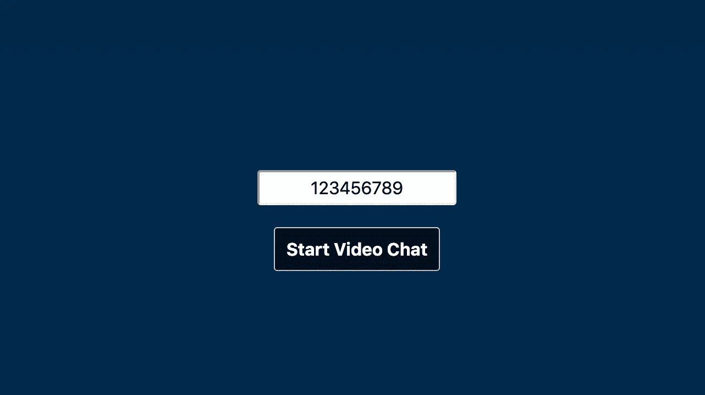

# 与 WebRTC 共享您的屏幕:与 WebRTC 进行视频通话步骤 5

> 原文：<https://levelup.gitconnected.com/share-your-screen-with-webrtc-video-call-with-webrtc-step-5-b3d7890c8747>


亚历克斯·利特温在 [Unsplash](https://unsplash.com/s/photos/presentation?utm_source=unsplash&utm_medium=referral&utm_content=creditCopyText) 上的照片

WebRTC (Web Real Time Connection)是一个开源项目，带有 JavaScript API，允许您在浏览器之间创建对等连接。尽管它可以用于不同类型的数据传输，但它的主要应用是视频通话。在之前的文章中，我们从浏览器访问了麦克风和摄像头数据流，通过 WebSocket 在用户之间建立了一个连接，然后用于信令流程，并且我们允许用户使用共享代码与给定的联系人建立连接。您可以在以下链接中找到这些文章:

*   [第一步:来自网络摄像头和麦克风的数据流](/data-stream-from-your-webcam-and-microphone-videochat-with-javascript-step-1-29895b70808b)
*   [第二步:通过 WebSocket 建立连接](/set-up-a-connection-over-websocket-videochat-with-javascript-step-2-f78c307c4fd3)
*   [第三步:建立 WebRTC 连接](/establishing-the-webrtc-connection-videochat-with-javascript-step-3-48d4ae0e9ea4)
*   [第四步:找到你的联系人](/find-your-contact-videochat-with-javascript-step-4-4d527576b8cf)

在上一篇文章的结尾，我们可以通过 WebRTC 创建一个与联系人的视频通话。同伴可以看到和听到彼此，但我们现在还希望他们能够共享他们的屏幕。这里假设您已经可以在对等体之间建立 WebRTC 连接。如果没有，可以按照[第三篇](/establishing-the-webrtc-connection-videochat-with-javascript-step-3-48d4ae0e9ea4)的步骤。

访问用户的屏幕非常简单。在第一篇文章中，我们通过调用 [MediaDevices](https://developer.mozilla.org/en-US/docs/Web/API/MediaDevices) 接口的 *getUserMedia* 函数来请求访问用户的摄像头。

```
const stream = await window.navigator.mediaDevices.getUserMedia(
  {
    video: true,
    audio: true,
  },
);
```

有一个类似的功能来访问用户的屏幕: *getDisplayMedia*

```
const stream = await navigator.mediaDevices.getDisplayMedia();
```

为了使用户能够共享他们的屏幕，我们必须用显示媒体流的视频轨道替换 RTCPeerConnection 对象的视频轨道。我们不会替换整个流，因为我们仍然希望用户能够听到彼此的声音。但首先让我们在视频上显示一个工具栏和一个共享屏幕的按钮:

# HTML 和 CSS

像以前一样，用户首先看到的是起始页，其中要求她输入一个代码。



一旦她输入了她的代码，她就可以点击开始按钮。浏览器请求允许访问麦克风和摄像头，一旦用户接受，她就进入聊天室。如果第二个用户使用相同的代码执行相同的过程，双方将能够看到和听到对方:


这里的新奇之处在于底部的这个工具栏，里面有一个“眼睛”图标。默认情况下，此工具栏不显示，仅在悬停时可见。

点击这个按钮，用户应该分享她的屏幕。

# 共享您的屏幕

自从上一篇文章以来，我重新编写了这个迷你项目的 JavaScript 部分，但是一个重要的变化是新的变量 *senders* 。RTCPeerConnection 对象的 [*addTrack*](https://developer.mozilla.org/en-US/docs/Web/API/RTCPeerConnection/addTrack) 方法返回一个 [RTCRtpSender](https://developer.mozilla.org/en-US/docs/Web/API/RTCRtpSender) 对象，让我们控制发送给对等体的轨道。我们希望用屏幕视频轨道替换视频轨道，所以我们希望将发送者保存在一个变量中，以便以后访问他们。

在点击按钮时，我们首先请求访问用户的显示媒体流(他的屏幕视频流)。我们不想每次用户打开和关闭屏幕共享时都要询问，所以我们将流保存在变量 *displayMediaStream 中。*如果已经有了流，就不要再问了。

然后，我们在 *senders* 数组中找到视频轨道的发送者，并用我们的新轨道替换它的轨道(在显示媒体流中只有一个轨道，所以我们只取第一个)。

最后，我们调整视图:首先，我们在用户的迷你 self 视频中显示屏幕，以便她可以看到她的同伴正在看到的内容，我们隐藏 share 按钮以显示“停止共享”按钮。

# 停止共享您的屏幕

停止共享并没有什么不同。

在发送者中，我们找到带有视频轨道的那个，并用用户媒体流的视频轨道替换它的轨道(因此轨道来自用户的摄像机)。我们更新了迷你自拍视频，并再次更改了按钮。用户现在可以再次看到彼此。

你可以在这里找到完整的 JavaScript 代码。

用户现在可以与他们的联系人共享他们的屏幕。在下一篇文章中，我们将看到用户如何使用 WebRTC 来交换文件。