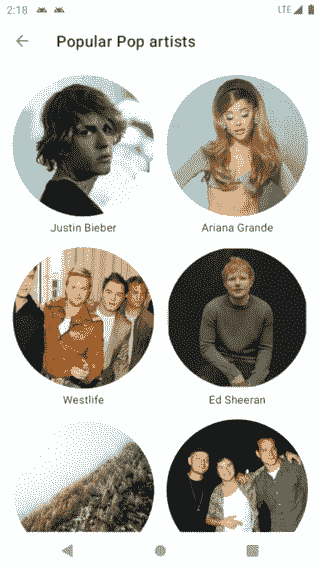
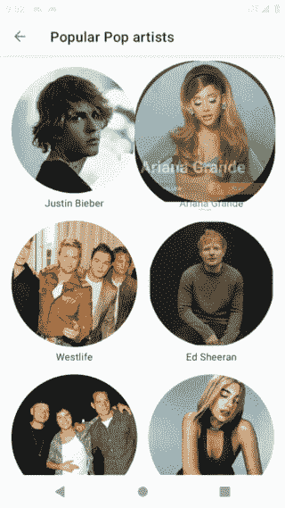

# Android 中使用 MaterialContainerTransform 的共享元素

> 原文：<https://levelup.gitconnected.com/shared-element-using-materialcontainertransform-in-android-6d420e74b122>

## 如何建立 MaterialContainerTransform 转换并解决随之而来的问题


# 介绍

材料设计就是创造一种无处不在的直观的用户体验*。【Android 的 Material motion 系统是一套过渡模式，可以帮助用户理解和导航应用程序。*

四种主要的材料转换模式如下:

*   容器转换。
*   共享轴。
*   逐渐消失。
*   褪色。

请看看 https://material.io/develop/android/theming/motion[](https://material.io/develop/android/theming/motion)***的详细方针和原则。***

***什么是 MaterialContainerTransform？***

*容器转换类似于将一个容器转换成另一个容器的共享元素，例如将 CardView 转换成一个细节容器。这种转换的强大之处在于，它可以在从一种布局转换到另一种布局的过程中吸引用户的注意力。*

***什么问题？***

> *“如果我有一个小时来解决一个问题，我会花 55 分钟思考问题，花 5 分钟思考解决方案。”——阿尔伯特·爱因斯坦*

*[根据 Android 文档](https://developer.android.com/reference/com/google/android/material/transition/MaterialContainerTransform):*

> **该转换捕获开始和结束视图，用于创建一个* [*可绘制的*](https://developer.android.com/reference/android/graphics/drawable/Drawable) *，该视图将被添加到视图层次结构中。drawable 将作为覆盖图添加到视图层次结构中，并处理在起始视图的形状和结束视图的形状之间变形的遮罩的绘制。**

*那么过渡结束后会发生什么呢？好吧，让我们来看看`MaterialContainerTransform`的源代码:*

*用于从一个容器变形到另一个容器的`drawingView`将被移除。此时，将显示目的地集装箱。转换大约需要 300 毫秒，所以理想情况下，目标容器应该在覆盖图被移除之前完成视图的加载。如果没有及时加载，将会出现如下情况:*

**

# *编码部分*

*我将编码部分分为 4 个步骤，如下所示:*

*   *[项目设置。](#7442)*
*   *[开始片段。](#7afb)*
*   *[目的地片段。](#8215)*
*   *[滑行——调试。](#f2bb)*

# *步骤 1:项目设置*

*首先请查看 [Material components android 网站](https://github.com/material-components/material-components-android)获取最新版本的 MaterialContainerTransform。然后将以下内容添加到您的应用程序的`build.gradle.kts`:*

```
*dependencies {
    implementation('com.google.android.material:material:1.4.0')
}*
```

*容器转换可以被配置为在许多 Android 结构之间转换，包括片段、活动和视图。在这个例子中，我们使用艺术家列表片段和艺术家细节片段之间的过渡。*

# *第二步:开始片段*

## *a.设置转换名称*

*`MaterialContainerTransform`作为共享元素转换操作，当标记有**转换名称**时，它拾取不同布局中的两个视图。首先添加一个 transitionName，它在我们的开始视图中是唯一的。我使用 BE 返回的 id 作为一个 transitionName 并将其添加到`onBindViewHolder()`中:*

```
*override fun onBindViewHolder(holder: ArtistViewHolder, position: Int) {
    ...
    holder.binding.imgv.*transitionName* = getItem(position).id
}*
```

## *b.定义一个形状*

*下一步，我们必须为开始视图定义一个形状。要实现一个圆形，让我们首先尝试使用 Glide 中的`CircleCrop()`来加载一个圆形图像:*

```
*requestManager
    .load(url)
    .placeholder(R.drawable.*image_placeholder*)
    .transform(CircleCrop())
    .into(this)*
```

**

*正如我们所看到的，`CircleCrop()`只是圆形裁剪了一个图像，包含它的视图仍然具有方形形状。*

*有两种解决方法:*

*   *在 XML 文件中使用`app:shapeAppearance`。*

```
*<com.google.android.material.imageview.ShapeableImageView
    ...
    app:shapeAppearance="?attr/shapeAppearanceCircleComponent"/>*
```

*通过使用这种方式，我们在加载图像时不必使用`CenterCrop()`。*

*   *如果我们需要使用`CenterCrop()`，我们必须通过使用`MaterialContainerTransform`类中提供的`[setStartShapeAppearanceModel](https://developer.android.com/reference/com/google/android/material/transition/MaterialContainerTransform#setStartShapeAppearanceModel(com.google.android.material.shape.ShapeAppearanceModel))()`来手动设置形状外观。*

*尝试重新运行该应用程序。变形形状变得更好。不错！让我们不断改进动画。*

**

*在 XML 文件中使用`app:shapeAppearance`*

## *c.配置转换*

```
*val targetFrag = ArtistDetailFragment.newInstance(it.artist, it.view.transitionName, it.view.width, it.view.height, it.imageUrl).*apply* **{** *sharedElementEnterTransition* = MaterialContainerTransform()
**}** supportFragmentManager.commit(true) **{** addSharedElement(it.view, it.view.transitionName)
    replace(R.id.*content*, targetFrag)
    addToBackStack(null)
**}***
```

*请注意以下事项:*

*   *`targetFrag`:是目的片段。*
*   *`transitionName`、`width`、`height`、`imageUrl`:与滑动缓存键相关。*
*   *`addSharedElement()`:我们提供一个来自起始片段的`view`，用于映射到来自目的片段的视图，以及一个`transitionName`。*

## *d.滑动缓存键*

*[根据文档](https://bumptech.github.io/glide/doc/caching.html)，缓存键由多个元素组成。在本例中，我们使用了 3 个元素:*

*   *全球资源定位器(Uniform Resource Locator)*
*   *宽度*
*   *高度*

*这就是为什么我将包含 url、宽度和高度的 artist 对象传递给目的片段。通过这样做，我们可以生成相同的缓存键，目的片段可以从内存缓存中获取位图，以便快速加载。*

## *e.回归转型*

*默认情况下，如果没有设置返回过渡，过渡系统将在向后导航时自动反转 enter 过渡。但是，请注意，按 back 不会将艺术家的详细信息折叠回艺术家列表中。*

**

*因为当我们返回时，开始片段还没有膨胀，所以没有共享元素的映射视图来创建返回转换。我们必须等到开始片段展开。*

*在这种情况下，过渡系统提供了两种方法来帮助我们:*

*   *`[postponeEnterTransition](https://developer.android.com/reference/android/app/Activity#postponeEnterTransition())` **:** 推迟进入的片段过渡，直到调用了 startPostponedEnterTransition()为止。*
*   *`[startPostponedEnterTransition](https://developer.android.com/reference/android/app/Activity#startPostponedEnterTransition())` **:** 开始延期过渡。*

*将下面两行添加到`onViewCreated`方法中，并尝试重新运行应用程序:*

```
*postponeEnterTransition()
view.doOnPreDraw { startPostponedEnterTransition() }*
```

*当视图树将要被绘制时，我们开始转换，这意味着视图已经布局好了。不错！🥰*

# *步骤 3:目的片段*

*我们希望将起始片段中的视图转换为目的片段中的完整视图，因此在`onCreateView()`方法中将`transitionName`从参数设置为视图根:*

```
*override fun onCreateView(inflater: LayoutInflater, container: ViewGroup?, savedInstanceState: Bundle?): View? {
    viewBinding = FragmentArtistDetailBinding.inflate(inflater, container, false)
    return viewBinding.root.apply {
        transitionName = this@ArtistDetailFragment.transitionName
    }
}*
```

*从参数中获取密钥并加载到`thumbnail()`方法中。此方法最适合用于加载较小的缩略图资源，加载速度比全尺寸资源快。我们应该将该负载的优先级设置为`IMMEDIATE`，当一次有多个负载排队时，将首先启动优先级较高的负载:*

```
*Glide.with(this@ArtistDetailFragment)
    .asBitmap() .thumbnail(Glide.with(this).asBitmap().load(imageUrl).priority(Priority.*IMMEDIATE*).override(widthImage, heightImage))
    .load(artist.model.pictureBig)
    .placeholder(R.drawable.*image_placeholder*)
    .into(viewBinding.artistImageView)*
```

# *第四步:滑动——调试*

*到目前为止，一切都好！但是我们需要确定是否有**意外的缓存未命中，**为什么你在一个地方的内存中的图像没有在另一个地方被使用…*

*首先，在您的终端中使用 adb 启用引擎标签记录:*

```
**adb shell setprop log.tag.Engine VERBOSE**
```

*它用于查看 logcat 中的缓存键，如下所示:*

```
*V/Engine: Loaded resource from active resources in 0.009458ms, key: EngineKey{model=https://cdns-images.dzcdn.net/images/artist/7e2efcc3fdbfaaed13b07d8c87929615/250x250-000000-80-0-0.jpg, width=477, height=477, resourceClass=class java.lang.Object, transcodeClass=class android.graphics.drawable.Drawable, signature=EmptySignature, hashCode=-807288796, transformations={}, options=Options{values={}}}*
```

*其次，通过添加下面的类来启用滑动标记:*

```
*@GlideModule
class MyGlideModule : AppGlideModule() {
    override fun applyOptions(context: Context, builder: GlideBuilder) {
        builder.setLogLevel(Log.*VERBOSE*)
    }
}*
```

*它用于检查来自远程、磁盘还是内存的图像:*

```
*D/Glide: Finished loading BitmapDrawable from MEMORY_CACHE for [https://cdns-images.dzcdn.net/images/artist/7e2efcc3fdbfaaed13b07d8c87929615/250x250-000000-80-0-0.jpg](https://cdns-images.dzcdn.net/images/artist/7e2efcc3fdbfaaed13b07d8c87929615/250x250-000000-80-0-0.jpg) with size [477x477] in 0.051165999999999996 ms*
```

*注意 Glide 标签通知我们它*完成了从 MEMORY_CACHE 为*加载 BitmapDrawable 这是我们想要的东西。如果没有，尝试再次检查引擎日志标记中的缓存键，并找出它们之间的不同之处。*

*对于在开始和结束片段中生成相同的缓存键，我的建议是 ImageView 的`scaleType`应该是`center`。让我们看看 Glide 中`RequestBuilder()`的源代码:*

*当我们使用`scaleType`而不是`center`或`matrix`时，Glide 会自动生成一个变换。转换涉及到缓存键的生成，如果我们消除它，缓存键将变得更容易控制。*

*但是如果`scaleType`是居中，它只是将图像在视图中居中，但是不执行缩放。我们必须向`override`方法()提供宽度和高度，使其满足视图:*

```
**doOnLayout* {
    requestManager
        .load(url)
        .placeholder(R.drawable.*image_placeholder*)
        .override(it.*width*, it.*height*)
        .into(this)
}*
```

*仅此而已！如果您在执行代码片段时发现问题，请查看 GitHub repo 获取帮助:*

*[](https://github.com/PhongHuynh93/DeezerKMP) [## PhongHuynh93/DeezerKMP

### 在 GitHub 上创建一个帐户，为 PhongHuynh93/DeezerKMP 的开发做出贡献。

github.com](https://github.com/PhongHuynh93/DeezerKMP)* 

*非常感谢你阅读我的文章。*如果你喜欢这个故事，请* ***点击*** 👏 ***按钮，分享*** *它来帮助别人！*关注我[中](https://mr-umbrella.medium.com/)获取更多牛逼安卓小技巧。你也可以在 [LinkedIn](https://www.linkedin.com/in/huynh-phong-3649a7131/) 上找到我。祝您愉快！😄*

# *继续读 Android 的东西*

*[如何在 Android 中创建 like 按钮动画](/how-to-create-like-button-animation-in-android-part-1-f99e2792143d)*

*[安卓按钮变形动画](/android-button-morphing-animation-bc3bed740501)*

*[运动布局——折叠工具栏](/motionlayout-collapsing-toolbar-d0ce8dd874b6)*

# *Jetpack 撰写*

*[在 Jetpack Compose 中实现 snack bar](/implement-android-snackbar-in-jetpack-compose-d83df5ff5b47)*

*[在 Jetpack Compose 中实现 tab layout](/implement-android-tablayout-in-jetpack-compose-e61c113add79)*

*[在 Jetpack Compose 中用 ViewPager 实现 TabLayout】](/implement-tablayout-with-viewpager-in-android-jetpack-compose-d509fc6e2d8e)*

*[在 Jetpack Compose 中创建一个带有变形和 ken burns 效果的自动滚动 viewparager](/create-an-auto-scroll-viewpager-with-transformation-and-ken-burns-effect-in-android-jetpack-compose-efdf46f2e8ed)*