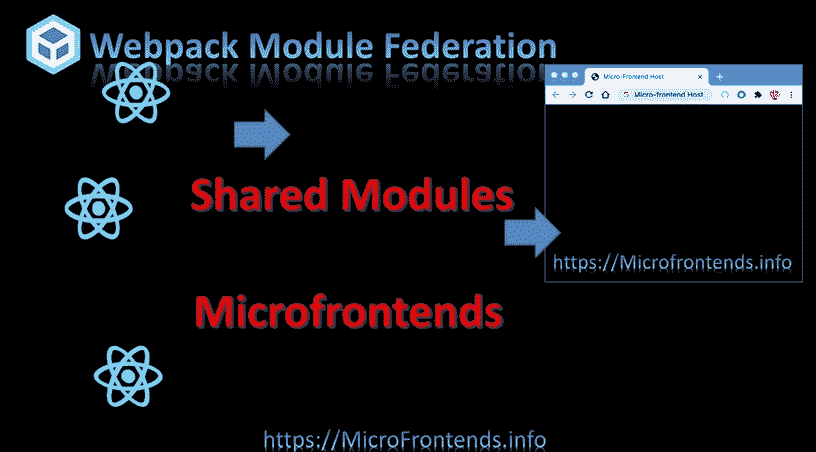
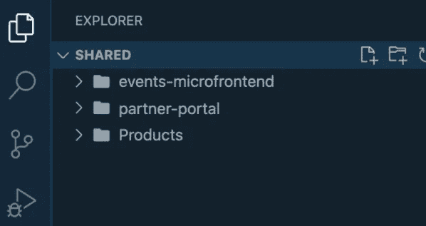
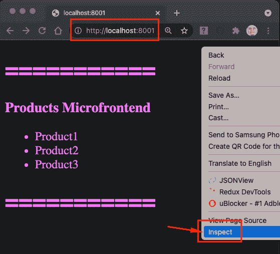
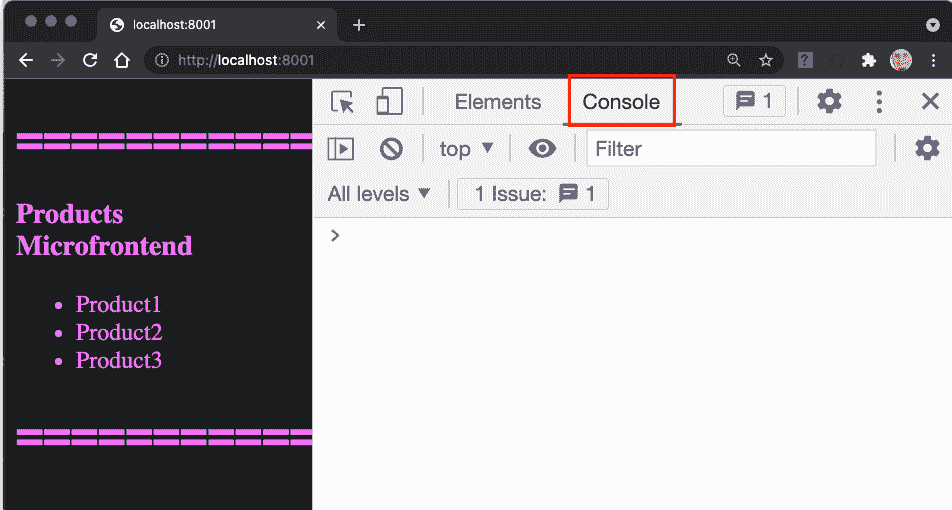
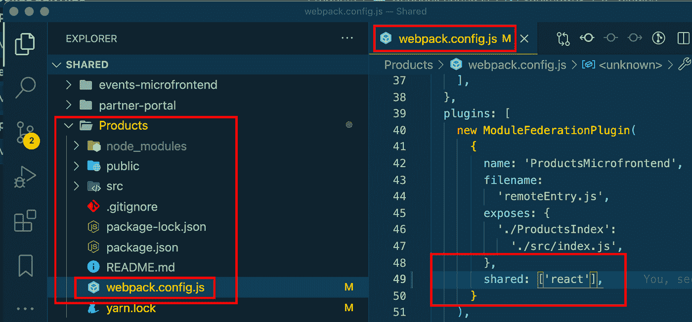
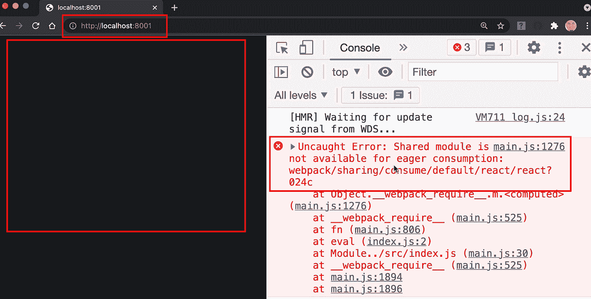
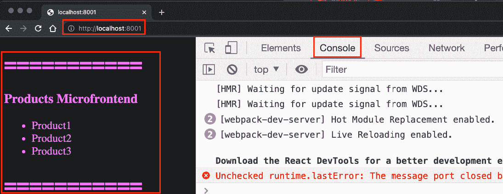

# 模块联合微前端中的共享模块

> 原文：<https://levelup.gitconnected.com/shared-modules-in-module-federation-microfrontends-a547f77e7b54>



本文将解释如何在不同的联邦微前端模块之间共享模块和库

在前两篇文章中，我们创建了一个承载两个微前端的门户:产品和事件微前端。我使用不同的回购协议和不同的命名来模拟不同的团队构建它们。

[](/microfrontends-hands-on-project-with-module-federation-part-1-c4eda1ffcf10) [## 具有模块联合的微前端实践项目—第 1 部分

### 本文将介绍架构、设计、实现和部署现实生活中的微前端项目。

levelup.gitconnected.com](/microfrontends-hands-on-project-with-module-federation-part-1-c4eda1ffcf10) [](/microfrontends-hands-on-project-with-module-federation-events-microfrontend-ce8a7f8a16ad) [## 具有模块联合的动手项目—事件

### 在本文中，我们将创建事件 Mmicrofrontend 并将其添加到门户中

levelup.gitconnected.com](/microfrontends-hands-on-project-with-module-federation-events-microfrontend-ce8a7f8a16ad) 

然而，我们没有一起展示两个微前端，因为我们没有解释如何共享模块，尤其是 React。让我们在这篇文章中这样做。

================================

克隆起始项目

按照下面的文章克隆我们将在本次实践中使用的起始项目

[](https://www.linkedin.com/pulse/microfrontends-module-federation-project-setup-elhousieny-phd%25E1%25B4%25AC%25E1%25B4%25AE%25E1%25B4%25B0) [## 用于共享模块的带有模块联合项目设置的微前端

### 步骤可以在下面的视频中找到:让我们克隆并设置项目，以了解如何共享模块和…

www.linkedin.com](https://www.linkedin.com/pulse/microfrontends-module-federation-project-setup-elhousieny-phd%25E1%25B4%25AC%25E1%25B4%25AE%25E1%25B4%25B0) 

克隆项目后，您将能够在 Visual Studio 代码中看到如下三个文件夹:



==============

你会有产品和其他微前端。让我们确保开发人员工具运行在产品的微前端



========

# 分享反应

让我们将 react 添加到产品微前端，如下所示

1.  用 ctrl + c 停止项目
2.  将 react 作为共享模块添加到 shared/Products/web pacl . config . js 中



```
shard: ['react]
```

现在让我们重新开始这个项目。

```
yarn run start
```



当您刷新 [http://localhost:8001，](http://localhost:8001,)时，您将在开发工具控制台中看到如上所示的错误。此外，您会注意到它无法呈现内容。这是加载 index.js 的常见错误，立即(急切)。请阅读下面的文章，了解完整的解决方案。

[](https://www.linkedin.com/pulse/uncaught-error-shared-module-available-eager-rany-elhousieny-phd%E1%B4%AC%E1%B4%AE%E1%B4%B0/) [## 未捕获的错误:共享模块不可用于急切消费

### 如果您试图在模块联邦微前端之间共享模块，您可能会面临以下奇怪的…

www.linkedin.com](https://www.linkedin.com/pulse/uncaught-error-shared-module-available-eager-rany-elhousieny-phd%E1%B4%AC%E1%B4%AE%E1%B4%B0/) 

==============

解决问题并添加引导程序后，您将能够正确呈现产品的微前端，如下所示:



让我们为 events-microfrontend 重复相同的步骤，通过添加 React 作为共享模块，将 index.js 重命名为 bootstrap.js，并用一行代码`import ('./bootstrap.js');`创建 index.js

以下视频中的细节