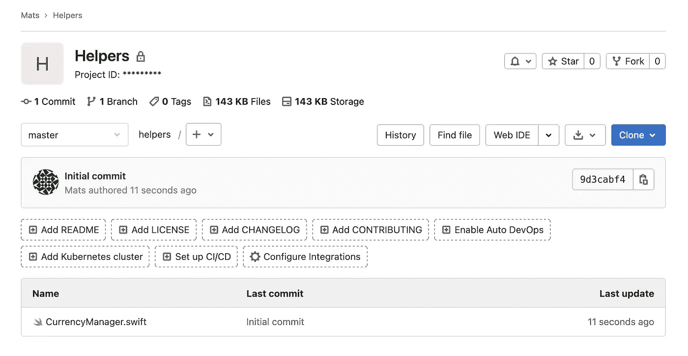
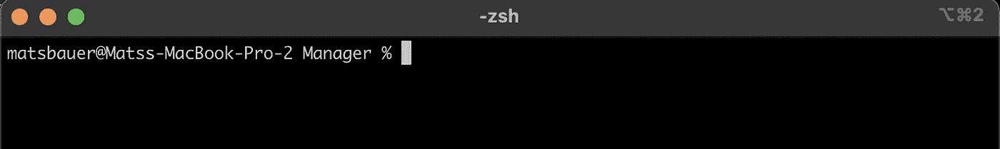

# 跨不同 XCode 项目共享和维护代码

> 原文：<https://levelup.gitconnected.com/sharing-and-maintaining-code-across-different-xcode-projects-5b618bb4848d>

## 使用 Git 子模块在多个 XCode 项目中维护代码


照片由来自[佩克斯](https://www.pexels.com/photo/photo-of-pathway-surrounded-by-fir-trees-1578750/?utm_content=attributionCopyText&utm_medium=referral&utm_source=pexels)的[詹姆斯·惠勒](https://www.pexels.com/@souvenirpixels?utm_content=attributionCopyText&utm_medium=referral&utm_source=pexels)拍摄

在许多用例中，我们希望在不同的 XCode 项目之间共享代码。在之前的一篇文章中，我写了助手集合的强大功能，以及为什么应该使用 git 子模块来共享它们。本文将关注在现有 git 存储库中维护 git 代码的技术方法。

## 首先:为您的助手函数创建一个 Git 存储库

首先，您需要一个包含一些助手函数的 git repo。这可能是这样的:



助手存储库

## 第二:在终端中导航到现有的 git 项目

现在，我们需要导航到您现有的项目，这应该是这个助手存储库的子模块。



终端窗口在我们想要子模块我们的助手的位置

## 第三:子模块 go go

现在，为了添加我们的助手存储库，我们运行以下命令:

```
**git submodule add** [*git@gitlab.com*](mailto:git@gitlab.com)*:xxxxxxxx/helpers.git*
```

你所需要做的就是用你自己的链接替换它。

## 第四:为成就感到自豪

现在，您已经将助手函数集成到了 Xcode 项目中。如果您在 XCode 项目树中看不到 helpers 文件夹，请将该文件夹拖到树中(它在 Finder 结构中的位置)，取消勾选“如果需要，拷贝项目”并选择“创建群组”。