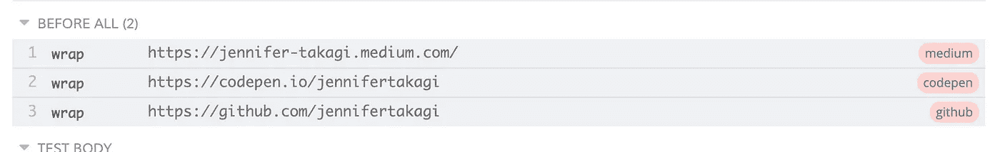

# 用 Cypress 在 3 个步骤中共享测试之间的上下文

> 原文：<https://levelup.gitconnected.com/sharing-context-between-tests-with-cypress-in-3-steps-15f1a8c3dc4b>

今天我想写一篇简短的帖子，讲述如何使用 *Cypress —* 在三个步骤中**共享测试间的上下文🤩**。如果你从未听说过这个工具，根据[官方网站](https://www.cypress.io/):***Cypress 是为现代 web*** 打造的下一代前端测试工具。它在前端被大量使用，因为它是一个非常清晰和简单的工具。它使用了*柴*断言库以及 *Sinon* 和 *jQuery* 扩展，但锦上添花的是 *Cypress* 使我们能够编写端到端(E2E)、集成和单元测试。🤯

也许你想知道"*嘿 Jenni，我们不能在测试之间共享数据，它们必须是独立的…* 🤭".是的，这是非常正确的，但有时我们会在同一个文件中多次使用一些静态数据。*规格)。* 在这篇文章中，我们将使用这个场景:**分享一些个人网站的信息(名称和链接)，并且能够在我们想要的任何时候使用它们**。

# 第一步——在钩住☝️之前

首先，所有的测试组都被一个`describe` 块包装起来，在其中，我们使用`it` *块*来声明每个测试。还有 ***挂钩*** 我们可以用在测试上:`before()`、`beforeEach()`、`after()`和`afterEach()`。在我们的例子中，我们必须使用`before` 钩子，因为它使我们能够在所有测试之前运行代码块，并确保数据在全局上下文中是可访问的。

要测试的基本结构。

# 步骤 2-给🗣加别名

现在我们有了对象`pesonalWebsites`，它包含网站名称作为键，网站链接作为值。为了使数据在 *Cypress* 中可访问，我们需要**使用** `**cy.as()**`将其分配给一个别名。

> 在幕后，别名基本对象和原语利用了 Mocha 的共享上下文对象:也就是说，别名作为`this` **可用。** 此外，这些别名和属性会在每次测试后自动清除。

假冒网站的数据。

在上面的代码中，在`cy.wap(websiteLink).as(websiteName)` 行中，我们创建了一个别名，将网站名称作为键，将网站链接作为值。命令`cy.wrap()` 只是产生一些… ***"cy.as()"* 不在链中就不起作用**。

因此，当我们运行测试时，别名将如下图所示:

Cypress run 上的别名。

# 步骤 3—传统函数表达式🌝

别名可以通过使用`@aliasName`来访问，但是在**共享上下文场景中，我们只能使用关键字** `**this**` *来访问它。*你一定知道**箭头函数并不绑定自己的** `**this**` **，所以我们需要在我们的测试块里面使用传统的函数表达式**。

使用这个和传统的函数表达式访问全局上下文。

> 你有它！长话短说:我们需要在 before hook 上别名化我们想要共享的数据，将 arrow 函数替换为传统的函数表达式，并使用`this`这个可爱的小东西访问全局上下文！

我希望你喜欢这篇文章！所以，如果对你有所帮助，请鼓掌 50 次左右；)再见，注意安全！🤟👩🏻‍💻