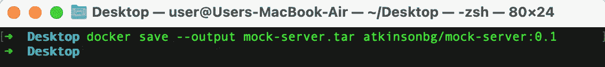
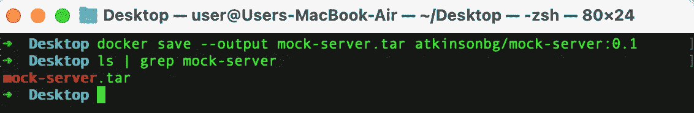
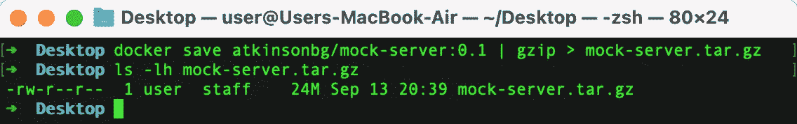
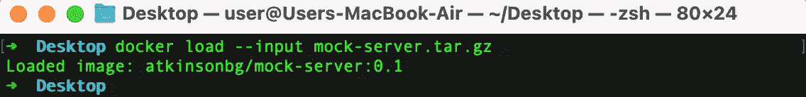

# 在没有 Docker Hub 的情况下共享 Docker 图像

> 原文：<https://levelup.gitconnected.com/sharing-docker-images-without-dockerhub-6ac3908bee41>


DockerHub 不是为我工作的！

最近我在做一个兼职项目，需要换到另一台笔记本电脑上工作。我的项目需要一个 Docker 图像，不幸的是，笔记本#2 还没有。我去做了一个简单的码头拉，得到了可怕的:

```
Error response from daemon: Get [https://registry-1.docker.io/v2/:](https://registry-1.docker.io/v2/:) EOF
```

我尝试了几件事:

*   重启 Docker 桌面
*   检查了我的互联网
*   重启对接机
*   已登录 Docker Hub

似乎什么都不管用。就在挫败感达到最高点之前，我做了一个快速搜索，看看我是否有任何选择可以完全绕过 Docker Hub。我在另一台机器上有这个图像，如果我可以把它上传到别的地方，然后下载到笔记本电脑#2 上，会怎么样呢？事实证明这是非常容易做到的。感谢 Sanket Meghani 和[他伟大的帖子](https://medium.com/@sanketmeghani/docker-transferring-docker-images-without-registry-2ed50726495f)让我继续下去。

# 码头工人拯救救援

为了避开 Docker Hub，我的计划是将图像保存为某种格式，这样我就可以将它上传到 GitHub，*将文件大小限制在 25MB* 。幸运的是`docker save`在紧要关头出现了。我需要移动的图像是我自己的 repo 中的一个[，一个简单的模拟服务器，用于本地开发或在我的 CI/CD 管道中与](https://github.com/atkinsonbg/simple-mock-server) [TestContainers](https://www.testcontainers.org/) 一起使用。

在 Docker Save documentation 页面中，Save 命令允许您“将一个或多个图像保存到 tar 归档文件(默认情况下，流传输到 STDOUT)”。这听起来很完美，因为我可以毫无问题地上传一个 TAR 到 GitHub。运行该命令非常简单。

```
docker save --output mock-server.tar atkinsonbg/mock-server:0.1
```

我在我的桌面上运行了这个命令，如果一切顺利，您应该会得到一个命令提示符。



docker 保存命令

现在我们可以运行一个简单的带有`grep`的`ls`命令来确保文件被创建。



这太完美了！我的 Docker 图像现在是一个 TAR，我可以在没有 Docker Hub 的情况下将它移动到任何地方。让我们快速检查一下尺寸…


呸，63MB！这在 GitHub 上是行不通的，我们需要把这个拉上拉链。幸运的是，使用以下命令很容易做到这一点:

```
docker save atkinsonbg/mock-server:0.1 | gzip > mock-server.tar.gz
```

我们简单地运行没有`--output`标志的相同命令，并将结果通过管道发送给`gzip`。现在我们可以再次检查尺寸:



用 gzip 保存命令

对，24MB！我们不仅可以上传到 GitHub，还可以通过 Gmail 发送邮件！

# **“码头装卸”包装完毕**

现在我们已经压缩了我们的图像，我们可以将它移动到我们需要发送它的任何地方。一旦它到达目的地，我们可以运行一个`docker load`命令来导入它:

```
docker load --input mock-server.tar.gz
```

如果一切顺利，我们会收到一条确认消息:



Docker 图像已加载

# 包扎

这篇文章有几个要点。首先，我的图像并没有那么大，所以即使进行了压缩，你可能仍然无法将你的图像上传到 GitHub。然而，Google Drive 也是一个不错的选择。随着 Docker 的未来悬而未决，为了以防万一，也许值得把你特别热爱的任何东西都存起来。

## 参考资料:

*   [https://docs.docker.com/engine/reference/commandline/save/](https://docs.docker.com/engine/reference/commandline/save/)
*   【https://docs.docker.com/engine/reference/commandline/load/ 号
*   [https://medium . com/@ sanketmeghani/docker-transfering-docker-images-without-registry-2ed 50726495 f](https://medium.com/@sanketmeghani/docker-transferring-docker-images-without-registry-2ed50726495f)