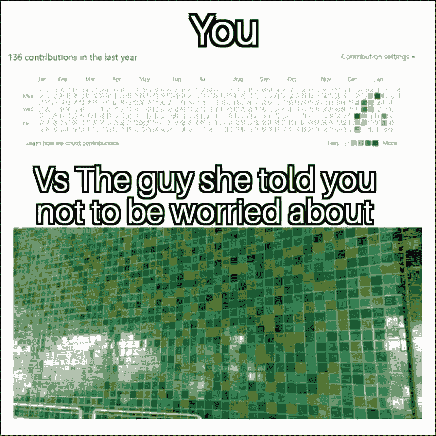

# 分享我建立个人品牌的经验和我新书的写作过程！

> 原文：<https://levelup.gitconnected.com/sharing-the-experience-of-building-my-personal-brand-and-the-writing-process-of-my-new-book-77d293ea6c56>

我的新书《**游戏开发用合一作。NET 开发者:用 Unity 和微软游戏栈**创作游戏的终极指南》刚刚由 Packt 在亚马逊和 PacktPub 上发布！

 [## 游戏开发与统一。NET 开发者:用 Unity 创建游戏的终极指南…

### 游戏开发与统一。NET 开发者:用 Unity 和微软游戏制作游戏的终极指南…

www.amazon.com](https://www.amazon.com/Game-Development-Unity-NET-Developers/dp/1801078076)  [## 游戏开发与统一。NET 开发人员| Packt

### 无论你是独立游戏开发者，还是在一个公司的团队中工作，你都需要做两件事…

www.packtpub.com](https://www.packtpub.com/product/game_development/9781801078078) 

在这篇博文中，我不会涉及这本书的内容，但会分享我是如何建立我的个人品牌并获得写这本书的机会，以及写作过程。

让我们继续前进！

# 打造你的个人品牌

Packt 作者访谈中有一个问题我觉得很有意思，问题是“ ***你是如何成为 Packt 的作者的？*** ”。对我来说，简短的回答是“*Packt 通过 LinkedIn 联系了我。我决定写这本书，因为这是一个很好的机会来表达我在这方面的知识。*”

当然，我知道肯定有更详细的答案，就是我想分享的话题——打造自己的个人品牌。

接下来我就说说自己的经历。

## 写科技博客第一名

我想分享的第一点是写科技博客。

就你感兴趣的话题开一个科技博客是个好主意，但是不要强迫自己写。作者，也就是你自己，是你博客文章的第一个读者，只有你认为你自己的内容有趣，别人才会觉得你的文章读起来有趣。

而你**不一定要成为该领域的专家**才能写博客，你只需要**了解**这方面的一些东西**分享**它！一篇博文也不一定要很复杂，也许只是记录下你日常工作中解决一个小问题的过程，也能有所帮助。只要长期坚持做下去，你就会逐渐成为该领域的专家！

## # 2 个人网站

你不必建立自己的博客平台，如你所见，我在**媒体上写博客。**但是作为一名程序员，你最好有自己的个人网站。

很多人也喜欢把博客和个人网站结合起来，但又不完全一样。简而言之，你的个人网站应该集中反映你的传记、作品集和成就。

[https://jiadongchen.com/](https://jiadongchen.com/)

为你的个人网站选择一个可以识别你的域名是个好主意。例如，我的个人网站是:

 [## 陈家东

### Kia ora，我是一名高级软件开发人员@ Company-X，使用微软 Azure 云计算服务和 Unity 构建…

jiadongchen.com](https://jiadongchen.com/) 

你可以找到我的传记，与我的数字双胞胎互动，探索我的 3D 房间。看看吧！

## 第三大社交媒体

社交媒体也是建立个人品牌的重要组成部分。最近有很多关于社交媒体的讨论，在这里我只是分享我个人的经历。

我不是 facebook 的粉丝，所以让我们从一个**开发者的**角度来谈谈 **LinkedIn** 。

我的经验是:

❌ **不要**专注于**营销**和分享个人成就。

✔️ **做**分享**你和你的观众感兴趣的**知识。

我知道这有点不寻常，但我确实发现在这个职场社交媒体上分享知识而不是营销确实对我和我的观众都有帮助。

在 LinkedIn 上分享知识

## #4 GitHub(或其他开源软件社区)

在 **GitHub** (或者其他开源软件社区)上保持活跃是个好主意。

你在 GitHub 上的项目不一定是一个大项目，它可以是一个特定小问题的解决方案，或者只是你博文中的演示代码，甚至是博文本身！

和写博客类似，你也要长期维护自己的开源项目，也许只是玩具项目，但它们能体现你对某个领域的兴趣甚至专业程度。

[https://github.com/chenjd](https://github.com/chenjd)

我从 2013 年开始使用 GitHub，专注于 Unity 游戏引擎和微软 Azure 云，目前拥有 1.1k 关注者和 3k 明星。

 [## chenjd -概述

### 陈家东是国际上公认的 3000 名微软最有价值职业(MVP)获奖者之一

github.com](https://github.com/chenjd) 

以上四点是我自己创建个人品牌的经验，想和大家分享一下。当然，除此之外，在聚会上组织/演讲，制作教程视频等也是很好的方式，但这四点是我最想分享的。

# 我新书的写作过程！

让我们回到本文开头的问题:“ ***你是如何成为 Packt 的作者的？***

Packt 通过 **LinkedIn、**联系了我，我决定写这本书，因为这是一个很好的机会来表达我对 unity 和微软 Azure 云的了解。游戏引擎和云的结合听起来也很独特，至少在图书市场是这样。

而那成为了我 10 个月旅程的起点，从 2021 年 7 月到 2022 年 4 月。为了不使整个过程的描述显得过于枯燥，我决定将旅程按顺序分解成以下几个阶段。

## 阶段#1 创建大纲

这是我写作过程的第一步。

在这个阶段，我们需要确定这本书的目标读者，主要内容，每章的标题。

比如我的新书，就是给中级的开发者看的。NET 和 C#编程经验有兴趣用 Unity 学习游戏开发的。在本书中，我们将探讨如何使用 Unity 游戏引擎和微软游戏开发工具(包括微软 Azure 云和微软 Azure PlayFab 服务)来创建游戏。

## 第二阶段规划

一旦你确定了你的目标读者和你的书将要讨论的内容，你就可以开始估算每章的大概页数，通常是每章 30 到 35 页。然后根据页数估计写每章需要多少时间。

然后和编辑一起确定每章的交付日期，通常编辑会给你发一份所有草稿交付日期的清单让你确认。

## 第三阶段写初稿

现在是你需要打开微软 Word，使用编辑器提供的模板开始写作的时候了。

我大概花了 3 周时间写了一章。但有时在平衡生活、工作和写作方面会有问题，所以延迟有时似乎是不可避免的。如果你现在正在写自己的书，不要给自己太大压力，慢慢来。

每章完成后，编辑会检查草稿的质量，有时你可能需要根据编辑的意见修改这一章。

## 第 4 阶段技术评审

当你的草稿被编辑接受后，它们会被发送给技术审阅者，有时是几个，有时只有一个。

他们将从技术角度审查章节，并提出建议，以帮助您提高图书的质量。

## 第五阶段决赛前

在这个阶段，你将浏览所有的章节，并让编辑知道它们是否准备好了。

您可以对任何更改留下评论，编辑器将为您做出这些更改。你还需要提供书的序言等。

一个小提示，截图的时候不要用黑暗模式，否则这个阶段你就需要更换很多截图了。:)

## 第 6 阶段最后阶段

你的书将会被送去印刷，你的空闲时间也正式回来了。你所需要做的就是等待你的书在亚马逊上印刷出版！

关于如何建立个人品牌，以及我写新书的过程，我想和大家分享的就这些。还有，我想分享一个关于心理健康的经验。写书的过程会有压力，我的经验是，缓解精神压力的方法就是和别人倾诉。

# 我的新书！

嘿，朋友们，我非常兴奋地宣布，我的新书已经可以在亚马逊上预购了！

 [## 游戏开发与统一。NET 开发者:用 Unity 创建游戏的终极指南…

### 游戏开发与统一。NET 开发者:用 Unity 和微软游戏制作游戏的终极指南…

www.amazon.com](https://www.amazon.com/Game-Development-Unity-NET-Developers-dp-1801078076/dp/1801078076) 

在本书中，我们将探索如何使用 **Unity 游戏引擎**和**微软游戏开发**，包括**微软 Azure 云**和**微软 Azure PlayFab** 服务，来创建游戏。

跟上我:

 [## 陈家东——高级软件开发人员——X 公司| LinkedIn

### 陈家东是国际上公认的 3000 名微软最有价值职业(MVP)获奖者之一

www.linkedin.com](https://www.linkedin.com/in/chenjd/)