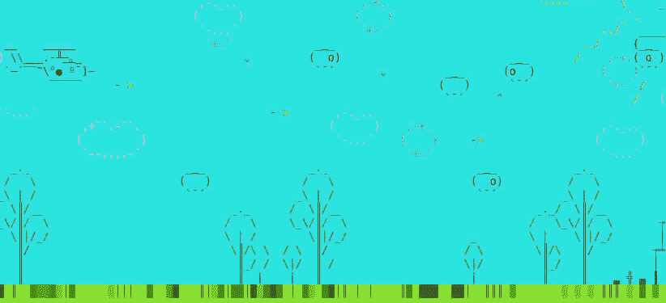

# Shell Quest

> 原文：<https://levelup.gitconnected.com/shell-quest-70bce7039a4e>


## 问题 1 —外壳历史 101

欢迎来到 Shell Quest 的第一期！

在 Shell Quest 中，通过所有计算机上都有的用户界面——Shell，探索了从计算历史到现代软件工程的广泛主题

Shell Quest 旨在像一本 80 年代的计算机杂志一样阅读，这些杂志附带了包含杂志中讨论的软件的盒式磁带或软盘。这很有趣，因为你可以立即尝试你正在阅读的内容。同样，每期 Shell Quest 都附带一个 Docker 映像，其中捆绑了该期的所有软件，已经安装并准备运行。

这也是一件非常 80 年代的事情:每期 Shell Quest 都包含一些小的代码片段，你可以在 Shell 中键入(当然也可以复制，但那样你会错过通过做魔术✨学习的机会)
虽然享受 Shell Quest 并不要求你在 shell 中工作或者知道如何编程。如果您以前从未使用过 shell，请不要担心，所有步骤都解释得很清楚。

在《Shell Quest》中，读者被置于 Typealot 博士的位置，他是一位好奇而富有冒险精神的计算机研究人员。作为 Typealot 博士，你可以在一个安全的 Docker 环境中试验和破坏东西。每当你陷入困境，只要重新启动环境。

如果你已经知道如何使用命令行，并且已经在你的电脑上安装了 Docker [和](https://docs.docker.com/get-docker/)，跳到下面的第一部分。

如果你没有安装 Docker(例如因为你在平板电脑上阅读这篇文章)，不用担心！您也可以在浏览器中运行 Shell Quest 容器，要了解其工作原理，请参阅下面的第 2 部分。

## 1.用 Docker 运行 Shell Quest

确保 Docker 已经在你的电脑上安装了。接下来，打开终端并键入:

```
$ docker run -it robvanderleek/sq-i1
```

这将下载 Docker 容器的所有部分(层)，然后启动它。一旦容器启动，您将看到 Shell Quest 欢迎屏幕:


欢迎来到 Shell Quest 第 1 期！

## 2.在浏览器中运行 Shell Quest

1.  进入[https://labs.play-with-docker.com/](https://labs.play-with-docker.com/)并点击“登录”按钮
2.  如果这是你的第一次访问，创建一个 Docker 帐户
3.  登录后，单击“添加新实例”按钮
4.  通过按[alt + enter]使终端全屏显示，然后键入:

```
$ docker run -it robvanderleek/sq-i1
```

这将下载 Docker 容器的所有部分(层)，然后启动它。一旦容器启动，您将看到 Shell Quest 欢迎屏幕:


欢迎来到 Shell Quest 第 1 期！

此时，您应该已经启动并运行了 Shell Quest 容器。

都准备好了吗？

太好了！

在第一期中，我们将探索不同的 Unix shells，让旅程开始吧...

# 1.这一切的开始:汤普森外壳

启动 Shell Quest 会将您放入汤普森 Shell 中。这个 shell 在 1971 年与第一个 Unix 版本一起发布，并以其创建者 Ken Thompson 的名字命名。你现在使用的 shell 的源代码被修改了一点，所以它可以在现代的 Linux 系统上运行，但是你基本上可以获得和 70 年代贝尔实验室的工程师们一样的体验。

`%`表示 shell 正在等待您的命令:

```
%
```


70 年代的 VT100 终端，用于许多用户共享一台 Unix 计算机

让我们键入第一个命令来打印“Hello world”:

```
% **echo "Hello world"** Hello world
```

Thompson shell 非常简单，几乎不提供内置功能。您告诉它执行的每个命令都必须是文件系统中的二进制文件。您可以使用`which`命令来检查这一点:

```
% **which echo** /usr/bin/echo
% **which cat** /usr/bin/cat
% **which which**
/usr/bin/which
```

尽管 shell 本身没有很多特性，但它确实实现了 Unix 哲学的一个非常重要的方面:重定向和管道。

重定向允许您将程序的输出存储到文件中(`>`)，并将文件的内容输入到程序中(`<`):

```
% **echo "Hello world" > t.txt** % **ls** bashcrawl  lsh piu-piu-SH  t.txt  tash
**% cat t.txt** Hello world% **cut -c 1-5 < t.txt**
Hello
```

管道(`|`)将两个程序连接在一起，不使用中间文件:

```
% **echo "Hello world" | cut -c 1-5** Hello
```

管道、重定向和小程序(执行特定任务)使得直接从命令行组合新功能成为可能:

```
% **echo "Hello world" | cut -c 1-5 | figlet**
 _   _      _ _
| | | | ___| | | ___
| |_| |/ _ \ | |/ _ \
|  _  |  __/ | | (_) |
|_| |_|\___|_|_|\___/
```

最初的 Unix shell 非常简单，只有 1000 多行 C 代码。你可以在网上或者你的 Shell Quest 环境中的目录`tash`中找到源代码[(注意这个 Shell 不理解`cd`命令，用`chdir`代替)。
你可以通过键入`make`来编译代码，但是对 C 文件进行修改是有挑战性的，因为像`nano`或`vim`这样的编辑器在这个 shell 中不能正常运行。](https://github.com/begeekmyfriend/tash)

让我们逃离 70 年代，看看 sh 已经成长为什么样子。按下[ctrl + d]键，你会发现自己置身于当代的汤普森 shell: Bash 中

# 2.无处不在的那个:巴什

终止 Thompson shell 会让您陷入 Bash:

```
% **^D** [typealot@shell-quest ~]$ **echo $SHELL** /bin/bash
```


[贝壳的历史](https://www.slideserve.com/farrah-head/shell-scripting)

Bash 不是 Thompson shell 的直接后代，而是 Bourne shell 的开源重建版本。Bourne shell 是作为 Thompson shell 的继任者在贝尔实验室开发的。《谍影重重》的作者史蒂文·伯恩写的手稿实际上是一本很好的读物。Bash 是 Bourne-again shell 的缩写。

您可以在许多 Linux 发行版中找到 Bash 作为默认 shell。您将在网上找到的大多数 shell 脚本都依赖于这个 shell 的内在特性。

## 使用 Bashcrawl 像文本冒险一样探索 shell

玩 [Bashcrawl](https://gitlab.com/slackermedia/bashcrawl) 是学习如何使用贝壳的一种有趣且有创意的方式。Bashcrawl 不需要预先了解 shell 命令，因此非常适合初学者。但是经验丰富的命令行爱好者也会喜欢在 Bashcrawl 的地下墓穴中四处闲逛。

要开始游戏，请进入`bashcrawl`目录，故事将从那里展开:

```
[typealot@shell-quest ~]$ **cd bashcrawl/**
[typealot@shell-quest ~/bashcrawl]$ **ls**
LICENSE  README.md  entrance
[typealot@shell-quest ~/bashcrawl]$ **cd entrance/**
[typealot@shell-quest ~/bashcrawl/entrance]$ **ls**
cellar  scroll
[typealot@shell-quest ~/bashcrawl/entrance]$ **cat scroll**It is pitch black in these catacombs.
You have a magical spell that lists all items in a room.To see in the dark, type:     ls
To move around, type:         cd <directory>Try looking around this room.
Then move into one of the next rooms.EXAMPLE:$ ls
$ cd cellarRemember to cast ``ls`` when you get into the next room!
```

## 不到 20 行 shell 代码中的水平滚动条

为了感受 Bash shell 的多功能性，让我们编写一个简单的 shell 脚本，在终端中显示一个水平文本滚动条。打开一个文本编辑器(安装了`nano`和`vim`),键入(或者复制，但是记住，只有键入才会产生神奇的✨)下面这段代码:

这段代码的作用:

*   第 1 行:一个所谓的 [shebang](https://en.wikipedia.org/wiki/Shebang_(Unix)) 行，指示在执行脚本时将使用什么解释器
*   第 2 行:设置`IFS`为空值允许换行符存储在变量中
*   第 3 行:将完整的横幅保存在一个名为`banner`的变量中
*   第 4 行:获取终端中的列数
*   第 5 行:创建一个`spacer`变量，将横幅移动到终端的最右边
*   第 6 行:将隔板放在横幅前面
*   第 7 行:获取横幅的总长度
*   第 8 行:初始化`start_index`变量
*   第 9 行和第 10 行:无限 while 循环代码块的开始
*   第 11-14 行:清空屏幕并打印部分横幅(`start_index`至`end_index`)，之后将`start_index`加 1。一遍又一遍地这样做，创造出动画的错觉
*   第 15–17 行:滚动完整的横幅时重置
*   第 18 行:短时间睡眠
*   第 19 行:while 循环代码块的结尾

将文件另存为`scroller.sh`并使其可执行:

```
$ **chmod 755 scroller.sh**
```

接下来，通过将文本字符串输入滚动条来运行它:

```
$ **echo "Hello from the Bash shell!" | ./scroller.sh**
```


您可以通过按[ctrl + c]退出滚动条

## shell 脚本中的一个水平滚动条游戏:Piu Piu

众所周知，游戏会挑战硬件和软件的极限，shell 脚本游戏也不例外。惊讶于《Piu Piu》，[用不到 1500 行 Bash shell 脚本代码](https://github.com/vaniacer/piu-piu-SH)编写的横版游戏。你会在`piu-piu-SH`目录中找到这个游戏:

```
$ **cd ~/piu-piu-SH**
$ **./piu-piu**
```



# 3.鲜为人知的一个:tcsh

C shell 是在 70 年代后期由加州大学伯克利分校开发的。顾名思义，shell 的语法类似于 C 编程语言。

您的 Shell Quest 环境包含一个名为`tsch`的 C Shell 兼容 Shell，从 Bash 启动它，如下所示:

```
[typealot@shell-quest ~]$ **tcsh**
[typealot@shell-quest ~]$ **echo $shell**
/bin/tcsh
[typealot@shell-quest ~]$
```

尽管 C shell 是 BSD 派生的 Unix 系统的默认版本，但它的流行程度已经不如 Bourne shell 派生版本(如 Bash)。为 C shell 编写 shell 脚本对[来说是一个挑战](https://www.grymoire.com/unix/CshTop10.txt)。

## 不到 20 行 shell 代码中的水平滚动条

为了比较 C Shell 和 Bourne Shell 的语法，让我们修改水平 scroller 代码，使其在`tcsh`中运行。复制(或者更好，键入✨)下面的列表，当然您也可以从 Bash 版本开始并对其进行修改。

将文件另存为`scroller.csh`，并使其可执行:

```
$ **chmod 755 scroller.csh**
```

接下来，通过将文本字符串输入滚动条来运行它:

```
$ **echo "Hello from the Tcsh shell!" | ./scroller.csh**
```


下面你可以看到 Bash 和 Tcsh 版本的水平滚动条的不同之处。抛开语法差异不谈，这两个脚本之间有两个有趣的区别:

1.  Tcsh 不保留 shell 变量中的所有空白，因此需要一个临时文件
2.  Tcsh 支持基本的数学表达式，因此不需要外部程序(`bc`)


水平外壳滚动条，左边是 Bash 版本，右边是 Tcsh 版本

# 4.友好的:鱼

Fish 代表友好的交互式 shell，是为用户编写的 Shell，而不是为脚本编写的。与上面的贝壳相比，鱼是一个相对年轻的贝壳，因为它是在 2005 年首次发布的。

通过键入`fish`从 Bash 或 Tcsh 启动 Fish shell:

```
[typealot@shell-quest ~]$ **fish**
Welcome to fish, the friendly interactive shell
Type `help` for instructions on how to use fish
[typealot@shell-quest /home/typealot] $
```

通过许多不同的包管理器，Fish 可用于许多操作系统。

鱼最大的优点之一是它内置的自我暗示功能。因为 Fish 会自动解析已安装的手册页，所以它可以帮助您处理难以记忆的命令行程序。
例如，copy ( `cp`)命令有一个递归复制目录的标志，但是有时你会弄不清这个标志是`-r`还是`-R`

使用 Fish，您可以开始输入:

```
[typealot@shell-quest /home/typealot] $ **cp -**
```

然后按下[tab]。然后 Fish 会给你一个简短的选项列表:

```
[typealot@shell-quest /home/typealot] $ cp -a
-a  --archive        (Same as -dpR)
-b  --backup         (Make backup of each existing destination file)
-d                   (Same as --no-dereference --preserve=link)
-f  --force          (Do not prompt before overwriting)
...and 24 more rows
```

再次按下[tab]键会给你一个更长的选项列表。
按[ctrl + s]打开搜索栏，过滤选项列表。例如，您可以在那里键入`recur`:

```
[typealot@shell-quest /home/typealot] $ cp -R
search: **recur**
-R  -r  --recursive               (Copy directories recursively)
--copy-contents  (Copy contents of special files when recursive)
```

使用[向上箭头]和[向下箭头]可以遍历过滤选项列表。

上面演示的功能只是冰山一角，花点时间和 Fish 一起，在[https://fishshell.com/](https://fishshell.com/)上读一点关于它的特性。

# 5.强大的那个:zsh

Z Shell 是一款正在迅速普及的现代 Shell。苹果把它作为 macOS Catalina 的默认登录 shell，所以如果你在 Macbook 上阅读这篇文章，它可能已经是你日常使用的 shell 了。

这个 shell 在高级用户中非常受欢迎，因为它有一个插件架构，允许为许多终端任务定制它。也许在读完这一期的 Shell Quest 后，你会想把 Z shell 也作为你的默认 Shell，但是让我们先试一试吧。

通过键入`zsh`启动 Z shell:

```
[typealot@shell-quest /home/typealot] $ **zsh**
[typealot@shell-quest ~]$
```

起初，提示符和 shell 的工作方式看起来和感觉上非常类似于 Bash，但是请记住，Z shell 是关于插件的。为 Z shell 编写插件取得了如此大的进步，以至于 GitHub 上最受欢迎的插件项目，名为“[哦，我的 ZSH！](https://ohmyz.sh/)”，有超过 1800 个投稿人，超过 133k 星(！)

您可以使用以下命令安装 oh-my-zsh 软件包:

```
[typealot@shell-quest ~]$ **sh -c "$(curl -fsSL** [**https://raw.github.com/ohmyzsh/ohmyzsh/master/tools/install.sh**](https://raw.github.com/ohmyzsh/ohmyzsh/master/tools/install.sh)**)"**
```

安装过程将自动开始:

```
Cloning Oh My Zsh...
Cloning into '/home/typealot/.oh-my-zsh'...
remote: Enumerating objects: 1238, done.
remote: Counting objects: 100% (1238/1238), done.
remote: Compressing objects: 100% (1198/1198), done.
remote: Total 1238 (delta 21), reused 1221 (delta 21), pack-reused 0
Receiving objects: 100% (1238/1238), 862.23 KiB | 2.36 MiB/s, done.
Resolving deltas: 100% (21/21), done.Looking for an existing zsh config...
Found ~/.zshrc. Backing up to /home/typealot/.zshrc.pre-oh-my-zsh
Using the Oh My Zsh template file and adding it to ~/.zshrc.Time to change your default shell to zsh:
Do you want to change your default shell to zsh? [Y/n] **Y**
Changing the shell...
Password: **joshua**
Shell successfully changed to '/usr/bin/zsh'.__                                     __
  ____  / /_     ____ ___  __  __   ____  _____/ /_
 / __ \/ __ \   / __ `__ \/ / / /  /_  / / ___/ __ \
/ /_/ / / / /  / / / / / / /_/ /    / /_(__  ) / / /
\____/_/ /_/  /_/ /_/ /_/\__, /    /___/____/_/ /_/
                        /____/                       ....is now installed!Before you scream Oh My Zsh! please look over the ~/.zshrc file to select plugins, themes, and options.• Follow us on Twitter: [https://twitter.com/ohmyzsh](https://twitter.com/ohmyzsh)
• Join our Discord server: [https://discord.gg/ohmyzsh](https://discord.gg/ohmyzsh)
• Get stickers, shirts, coffee mugs and other swag: [https://shop.planetargon.com/collections/oh-my-zsh](https://shop.planetargon.com/collections/oh-my-zsh)➜  ~
```

当安装完成后，你会注意到你的提示已经改变。
默认情况下, [oh-my-zsh Git 插件](https://github.com/ohmyzsh/ohmyzsh/tree/master/plugins/git)被激活，当使用 Git 库时，它给你的 shell 提供了方便的别名和有用的反馈。要了解这是如何工作的，进入`tash`目录并尝试几个 git 命令[别名](https://github.com/ohmyzsh/ohmyzsh/tree/master/plugins/git#readme):

```
➜  ~ **cd tash**
➜  tash git:(master) **gcb my-branch**
Switched to a new branch 'my-branch'
➜  tash git:(my-branch) **echo "Hello world" > t.txt**
➜  tash git:(my-branch) ✗ **gts** On branch my-branch
Untracked files:
  (use "git add <file>..." to include in what will be committed)
 t.txtnothing added to commit but untracked files present (use "git add" to track)
```

oh-my-zsh 包[带有超过 275 个可以被激活的插件](https://github.com/ohmyzsh/ohmyzsh/tree/master/plugins)。通过将它们添加到`~/.zshrc`中的列表来尝试一些，然后启动一个新的`zsh`实例。

```
Which plugins would you like to load?
# Standard plugins can be found in $ZSH/plugins/
# Custom plugins may be added to $ZSH_CUSTOM/plugins/
# Example format: plugins=(rails git textmate ruby lighthouse)
# Add wisely, as too many plugins slow down shell startup.
plugins=(git)
```

# 6.独一无二的:你自己的壳

至此，您已经探索了这么多不同的 shellss，您可能想编写自己的 shell。
尽管上面讨论的一些 shell 功能非常丰富，但是 shell 的本质可以归结为 3 个简单的步骤:

1.  读取输入
2.  解析输入
3.  执行命令

斯蒂芬·布伦南的这篇简短教程中讨论了一个不到 300 行 C 代码的工作外壳，它实现了这些步骤。

您可以在`lsh`目录中找到代码，并像这样编译单个源文件:

```
[typealot@shell-quest ~]$ **cd lsh/**
[typealot@shell-quest ~/lsh]$ **gcc -o lsh src/main.c**
[typealot@shell-quest ~/lsh]$ **ls**
README.md UNLICENSE lsh src
[typealot@shell-quest ~/lsh]$ **./lsh** > **echo "Hello from my own shell!"**
"Hello from my own shell!"
```

如果你懂一点 C，并且想尝试一个疯狂的 shell 新特性:快乐编码！

# 直到下次泰佩洛特医生！

这就是第一期 Shell Quest 的内容。

如果你不喜欢这一期的(部分)，请在下面留下评论。我会回复所有的评论、批评、问题等。

如果您喜欢阅读这一期，请点击👏另外，如果你喜欢交互式 Docker 容器，请让⭐️主演 GitHub repo:

[](https://github.com/robvanderleek/shell-quest) [## GitHub-robvanderleek/shell-quest

### Permalink 无法加载最新的提交信息。没有提供描述、网站或主题。你不能表演那个…

github.com](https://github.com/robvanderleek/shell-quest) 

如果您对下一期 Shell Quest 主题有任何建议，请在下面留下您的评论。当前暂定的主题列表:API(在 shell 中使用它们)、编辑器、版本控制系统、脚本语言、游戏。