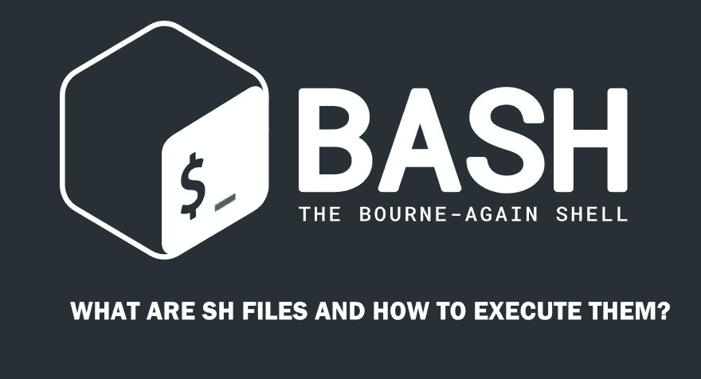
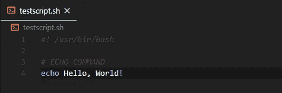

# Shell 脚本快速入门指南

> 原文：<https://levelup.gitconnected.com/shell-scripting-quick-beginners-guide-d973f3389e22>



来源:[https://appuals . com/what-are-sh-files-and-how-to-execute-them/](https://appuals.com/what-are-sh-files-and-how-to-execute-them/)

Shell 脚本是一个设计用于在 Unix/Linux shell 中运行的**程序。我们可以将一组特定的命令编写成脚本，并运行它来执行一些任务。**

我们可以使用 Bash (Bash 是命令行解释器或 shell)在 Windows、Mac 上运行 Unix/Linux 命令，如 Git Bash 或任何其他程序。我们可以`ls`列出目录中的内容，`touch`创建文件。


所以，让我们用。sh 扩展来编写一些脚本，并用您喜欢的文本编辑器打开它。此外，如果您使用的是 windows，请打开终端或 Git Bash。

首先，我们必须使我们的脚本可执行。除非如果我们运行它，我们会得到*权限被拒绝*错误。在终端中运行`chmod +x testscript.sh`命令。通过这个命令，我们将模式更改为可执行(我们给予执行的许可)。

要运行该脚本，请在终端中运行命令`./testscript.sh`。它不会给你任何输出，因为文件仍然是空的。

在我们的脚本(testscript.sh)中，首先我们必须声明*方言，*我使用的是 Bash。在终端中运行命令`which bash`在你的计算机中找到 bash 的位置。在脚本的顶部键入`#! <BASH_LOCATION>`来声明 bash。

现在让我们写一个简单的脚本如下，



在第 1 行，我已经声明了 Bash。第 3 行，是评论。第 4 行，`echo`命令会显示“你好，世界！”在终点站。

现在在 Git Bash 或终端中通过`./testscript.sh`运行脚本，您将看到输出。

所以，我们继续吧。我将使用以下要点来解释 Shell 脚本中的基本内容，

示例代码

## 变量

在 shell 脚本中，我们可以声明一个变量并赋值，如示例代码所示。

## 输入

在代码示例中，它接受用户输入并将其分配给变量 *NUMBER。*然后呼应一下。`-p`表示提示。

## 条件语句

这些类似于其他编程语言中的 if-else 语句。您可以从代码示例中理解语法。在脚本中，If 语句必须以`fi`结尾(在 if 之后)。

此外，我们可以对以下条件进行比较。

```
X -eq Y (true if X and Y are equal)
X -ne Y (true if X and Y are not equal)
X -gt Y (true if X is grater than Y)
X -gt Y (true if X is grater than or equal Y)
X -lt Y (true if X is less than Y)
X -lt Y (true if X is less than or equal Y)**# EXAMPLE**
X=2
Y=1
if [ $X -gt $Y ]
then
  echo "$X is greater than $Y"
fi
```

还有另一种情况。这是文件条件。

```
-d file (true if the provided string is a directory)
-e file (true if the file is exists)
-f file (true if the provided string is a file)
-g file (true if the group id is set on a file)
-r file (true if the file is readable)
-s file (true if the file has a non-zero size)
-u (true if the user id is set on a file)
-w (true if the file is writable)
-x (true if the file is an executable)**# EXAMPLE**
FILE="test.txt"
if [ -f "$FILE" ]
then
  echo "$FILE is a file"
else
  echo "$FILE is not a file"
fi
```

## 案例陈述

在脚本中，我所创建的只是一个带有用户输入的简单 case 语句。首先，读取用户输入，然后根据用户输入回显文本。这类似于其他编程语言中的 Switch Case。

这一行检查用户是否输入“Y”或“Y”或“yes”或“YES”。`;;`类似于 *break* 标记语句的结束。`*)`是*默认的*语句，如果输入与任何情况都不匹配，则执行该语句。并且 case 语句必须以`esac`(case 后面)结束。

## 环

首先，一个是简单的 for 循环，它遍历数字并回显。

第二个示例是 while 循环，它在数字小于 10 时运行。`((NUMBER++))`将数字的值递增 1。

## 功能

在代码示例中，我编写了两个函数。第一个是简单的函数。非常类似于其他编程语言中的函数。

第二个函数有参数。我们不像其他语言那样在括号中声明它们。在 shell 脚本中，我们使用位置参数。如示例所示。我们将函数中的参数声明为$1，$ 2……在调用函数时，我们应该为每个参数赋值，如示例中的`myAge “Osusara” “24”`。

## 创建文件夹并写入文件

如代码中所示，我们可以编写 shell 命令。创建文件夹、文件、写入文件等。

所以，这篇文章到此为止。希望这将帮助您了解 shell 脚本的基本概念。

***快乐编码乡亲们*** 👽