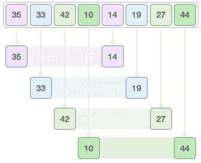
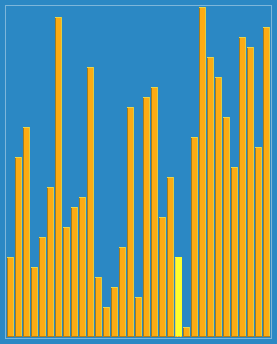
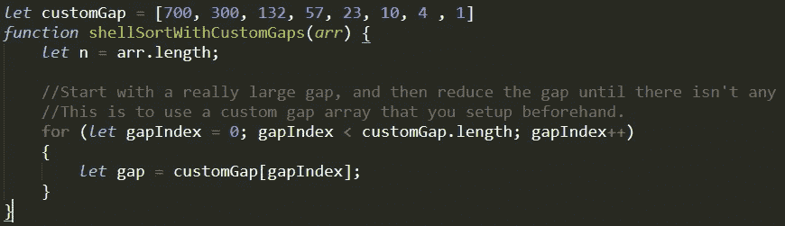
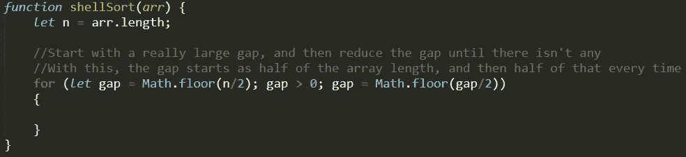
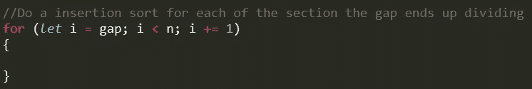
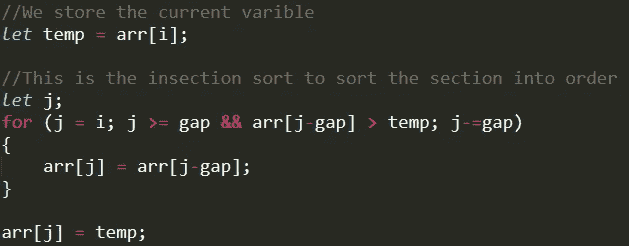
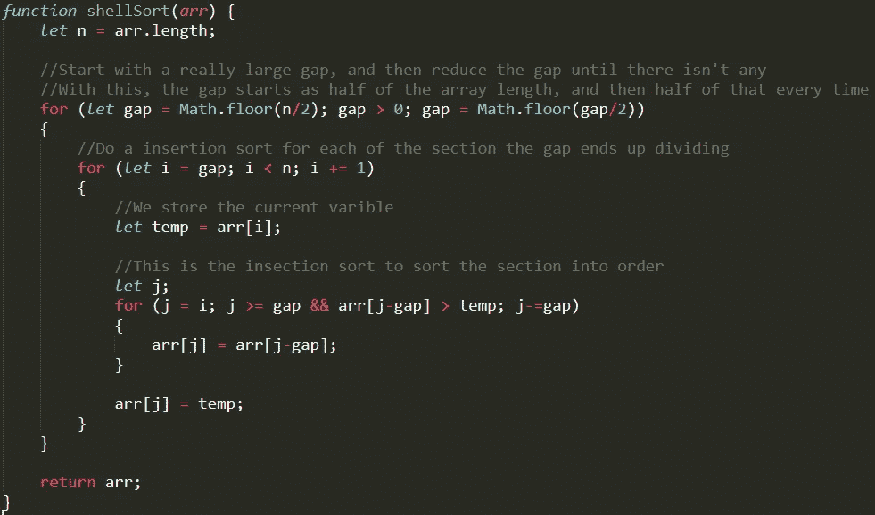

# JavaScript 中的 Shell 排序

> 原文：<https://levelup.gitconnected.com/shell-sort-in-javascript-c8a487041cdb>

只想要密码？向下滚动到代码的三个版本:

1.  不带注释(即插即用)。
2.  带注释的自动间隙。
3.  带注释的自定义间距。

# 什么是壳排序？

Shell 排序是插入排序的优化版本，它基本上允许交换相距较远的项目。

shell sort 的特殊之处在于用于对数组中的项目进行排序的 gap 变量。请注意，如果间距为 1，shell 排序与插入排序一样有效。然而，通常数组会在我们到达 1 in gap 之前被排序。

Shell 排序从获得一个非常大的间隙开始。我们根据间隙的大小将阵列分成更小的部分。然后，我们使用插入排序来对每个较小的部分进行排序。然后我们缩小差距，直到差距达到 1。

图片来自 Tutorialspoint

# 使用 Shell 排序的步骤

1.  找到我们将用来进行插入排序的所有间隙。
2.  我们为每个间隙将阵列分成小的部分。
3.  我们对每个部分进行插入排序，以便按顺序排序。
4.  所有部分排序后，我们缩小差距并重复步骤 2–3。

来自维基百科的 GIF

# JavaScript 中的 Shell 排序

在开始之前，我们需要注意 Shell Sort 是一个破坏性函数，因为它会修改您放入其中的数组。如果您不想修改原始数组，请确保在注入这个排序算法之前使用 spread 操作符创建一个新变量。

我们首先找到一个很大的缺口，将阵列分成几部分。这是定义 Shell 排序如何工作的变量。有两种方法可以做到这一点，创建一个预定义的自定义数组来存储我们将使用的所有间隙。或者创建一种方法来自动填充排序算法将使用的间隙。

我们从 for 循环中的一个自定义间隙数组开始，遍历每个间隙。

第二种方法是创建一个方法来自动填充我们使用的缺口。一个简单的方法是，首先使用数组长度的一半，然后对于之后的每个循环，我们将它减少一半，直到没有剩余长度。由于这是 JavaScript，我们必须使用数学。Floor 来确保我们得到的是一个整数，而不是双精度或浮点数。

这两种方法都可以，挑一个你个人更喜欢的。

接下来，我们想用 gap 来划分数组，将数组分成小部分，以便我们进行排序。

然后，我们希望使用插入排序对该部分进行排序。

这样外壳排序就完成了，在所有循环之外，如果我们认为有必要，我们可以返回数组。

# 就为了密码吗？

## 版本 1:不带注释(即插即用)。

## 版本 2:带注释的自动间隙。

## 版本 3:带注释的自定义间隙。