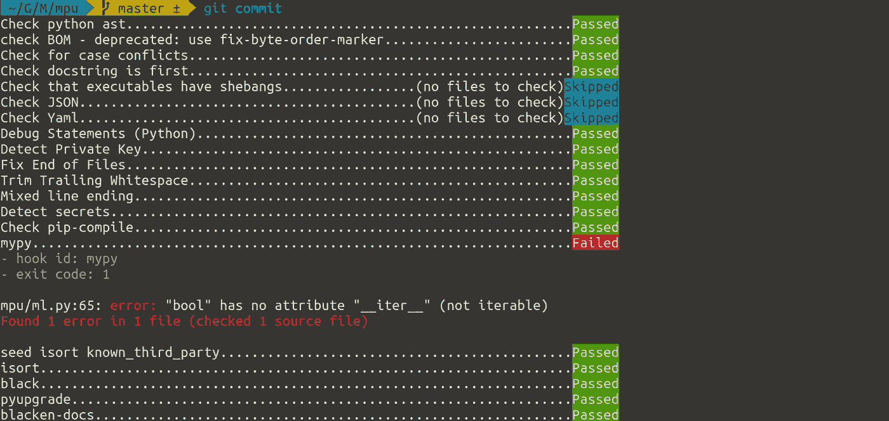

# 左移:7 步失败更快

> 原文：<https://levelup.gitconnected.com/shift-left-7-stages-to-speed-up-application-development-while-improving-quality-498d9a7b9393>

## 让我们以敏捷的方式来做这件事

图片作者:马丁·托马斯

你越快发现错误，就越容易改正。这就是“左移”的全部思想。当你接到老板或支持团队的电话说“它不起作用”时，你知道这甚至需要一段时间来确定问题在哪里。大多数非开发人员很难与开发人员交流问题。我们应该确保他们不必费心去学习这项技能。

在本文中，您将学习在不同的开发阶段捕捉错误的策略。在最后，我还将指出其他人所说的“左移”的典型含义。开始吧！

# 概念阶段:规划和设计

由[凯利·西克玛](https://unsplash.com/@kellysikkema?utm_source=medium&utm_medium=referral)在 [Unsplash](https://unsplash.com?utm_source=medium&utm_medium=referral) 上拍摄的照片

在开发人员开始实现一个困难的特性之前，人们通常需要讨论这个特性。要接触的人可能是产品负责人或产品经理、客户、不同的开发团队(前端、后端、Android、iOS 等等)、运营团队、市场营销等等

为了传达想法，您可以创建两种类型的文档:

*   **产品设计文档**:新功能解决了用户的哪个问题？用户会受到怎样的影响？
*   **工程设计文件**:特性要求什么？需要开发哪些子系统，需要服务多少请求，大量数据存储/处理/发送到哪里？什么是计算开销大的？这个想法的总体规模如何？

在更小的层面上，如果特色不是那么大，你可以把这两个视角放在你的门票/故事里(比如吉拉)。

要在文档或票证中交流想法，您可以使用多种技巧:

*   **线框**:我喜欢线框。Balsamiq 是我在这里选择的工具，但是当然还有更多。它的重点不是有一个完成的设计。重点是给出一个大概的概念，哪些元素是必需的。如果它们看起来很像仿制品，这是一个优势。
*   **用户故事**:为了确保你从用户的角度看问题，你可以创建角色，讲述角色如何使用你正在开发的软件或特性的故事。
*   **序列图**:什么时候发生？谁用哪种方式交流？序列图在某些情况下非常有用。我喜欢 websequencediagrams.com 的[来创造它们。](https://www.websequencediagrams.com/)
*   **架构图**:显示你使用了哪些微服务，哪些数据库或缓存已经到位，哪些类型的设备访问软件，如果你有一个任务队列——所有这些都有助于获得第一手概述。我通常用 [draw.io](https://app.diagrams.net/) 来表示。
*   **数据库模式图**:显示关系数据库的表格告诉了我很多关于系统如何工作的信息。当我创建较小的 web 服务时，我通常用 phpMyAdmin 的“设计器”特性创建一个数据库模式图——即使我不使用 MySQL。我只是喜欢这个设计师😅如果你有更简单的工具，请告诉我。

现在，这如何防止你犯错误？

用“建筑失败”的图片搜索给你一些思路( [1](https://www.pinterest.de/pin/550213279445067754/) 、 [2](https://www.pinterest.de/pin/AU1UDUS-wlPeLaIwDqQdtpWHVSMzk3Tw3_aYUHhiJfHMC4uxjB-MZs4/) 、 [3](https://www.demilked.com/funny-architectural-nightmares/) ):

这些错误现在看起来非常明显，但在此期间没有人注意到它们。因此，要么没有人检查，要么没有好的概念来实际看到有问题。这两个设计文档有助于你发现错误。

# 实施阶段:你的编辑

图片作者:马丁·托马斯

我是一名软件开发人员，现在已经超过 15 年了。我仍然会犯愚蠢的错误，比如忘记现在是`os.path.isfile`而不是`os.isfile`。幸运的是，我们不需要记住所有的基本细节。编辑器和 ide 为我们做了很多。如果我们使用了一个没有在这个范围内声明的变量，它们会警告我们。他们可以告诉我们，我们创建了一个没有使用的变量。他们可以在我们写的时候给我们显示类型检查错误。

我非常喜欢用于 Python 开发的 Visual Studio 代码:

 [## Visual Studio 代码— Python 编辑器回顾

### 我想我坠入爱河了

towardsdatascience.com](https://towardsdatascience.com/visual-studio-code-python-editors-in-review-e5e4f269b4e4) 

但是 Python 还有很多其他优秀的编辑器，比如 [PyCharm](https://medium.com/python-in-plain-english/pycharm-professional-python-editors-in-review-b978f0e5c4ba) 或者 [Sublime Text](https://py.plainenglish.io/python-editors-in-review-sublime-text-b71956c32375) 。有些人对 vim/emacs 也有强烈的看法，他们肯定会以完全相同的方式支持你。

这里的重点不是拿一个具体的编辑器。关键是要确保你有一个适合你的。希望能抓住你经常犯的错误类型。

图片作者:马丁·托马斯

# 实现:提交

我有时在不同的编辑器中提交，有时会错过编辑器警告。幸运的是，还有另一条安全线:预提交挂钩。

预提交挂钩是在提交更改之前执行的脚本。他们可以进行任意更改，也可以中止提交。与 Python 包[预提交](https://pre-commit.com/)相结合，它们非常方便。您可以从大量要执行的工具中进行选择——甚至不一定是 Python。我自己也创造了一些。如果您想了解关于预提交的更多信息，我可以为您提供:

 [## 你必须知道的预提交钩子

### 在 5 分钟内提高您的生产力和代码质量

towardsdatascience.com](https://towardsdatascience.com/pre-commit-hooks-you-must-know-ff247f5feb7e) 

# 实施:CI-管道

持续集成管道(CI 管道)是在您推送变更时自动执行的代码。对于开源项目来说，它们非常有用，可以确保每个合并请求都具有相同的质量水平。您可以执行单元测试来防止回归，您可以执行林挺来确保遵循代码风格规则，代码复杂性检查可能会将开发人员引向难以阅读的部分。类型检查、静态应用程序安全测试(SAST)、检查第三方包的漏洞以及许可证兼容性(SCA)是您可能想要考虑集成的事情。

 [## Python 项目的 CI 管道

### 什么是持续集成管道，我如何使用它？

levelup.gitconnected.com](/ci-pipelines-for-python-projects-9ac2830d2e38) 

# 测试:代码审查

代码评审、同行评审和[两人规则](https://en.wikipedia.org/wiki/Two-man_rule)都遵循同一个想法:一个人可能会错过另一个人看到的东西。有时候你对一个话题太深入了，以至于看不到明显的缺陷。同行评审是一种分享知识的方式，如果一个经验不足的开发人员评审一个资深开发人员的某些东西，它们也能起作用。一个好的合并请求(或拉请求)只做一件事，并包含一些提出它的背景。

在 Github 上，看起来[是这样的](https://github.com/OpenShot/openshot-qt/pull/3738):

图片作者:马丁·托马斯

您可以看到完成了多少提交，与提出变更的人交谈，询问问题，查看 CI 流程的自动检查，检查每一个变更。

# 测试:非生产环境

您的软件变得越复杂，需要相互交流的服务就越多，您就越不想将更改直接部署到您的生产环境中。您希望有一个与生产系统几乎相同的环境，但是如果您破坏了某些东西，没有客户会受到影响。这些环境通常被称为开发或集成或试运行。在这里，当变更通过 CI 管道和评审时，您可以直接部署变更。它们集成了正确测试您的软件可能需要的所有其他服务。

# 测试:生产

不可能测试所有的东西。尤其是在没有将软件发布给真实用户的情况下，用户行为和接受度很难测试，而且测试成本很高。在某些时候，您必须发布变更。但是你可以聪明一点。你可以先把它释放给一个对你没那么重要的群体。也许您首先为自己的员工激活了变更。或者可能有一个完整的国家与你的业务不太相关。我听说脸书首先在巴西部署新功能，以测试它们在美国上线之前是否有效。不过，我可能会搞混一些东西，因为我找不到参考文献。

这一程序被称为“金丝雀释放”或“金丝雀测试”。引用丹尼洛·佐藤的话:

> **Canary release** 是一种降低在生产中引入新软件版本的风险的技术，它通过在向整个基础设施推广并让每个人都可以使用之前，缓慢地向一小部分用户推广更改来实现。

当然，那只有在你有一定规模的情况下才行得通。但是经常发布和发布较小的变更是一个好主意。

# 现在…别人怎么说？

当我读到左移和不同的阶段(从右到左)时，听起来很像瀑布方法。作者可能并没有这个意思，但这是我在只看到“项目阶段”时读到的，比如(1)需求(2)设计(3)代码(4)测试(5)验收(6)生产(7)维护。大多数文档关注错误出现的地方，但是我关注的是如何防止它。大部分文章看起来都是从管理角度出发，但我有一个开发者的角度。

# 你学到了什么

您已经看到了在您出色的新功能交付给最终客户之前的 7 个测试阶段的示例:

1.  内部交流思想的策略
2.  编辑如何防止错别字和其他愚蠢的错误
3.  预提交钩子——可能会阻止你[泄露秘密](/leaking-secrets-240a3484cb80)
4.  使用 CI 管道加强代码质量
5.  重视你的同龄人；通过彻底的回顾来支持他们
6.  如果您有许多交互服务，那么非生产环境是必要的
7.  如果你够大的话，金丝雀放生会很酷

现在写点高质量的牛逼东西吧！