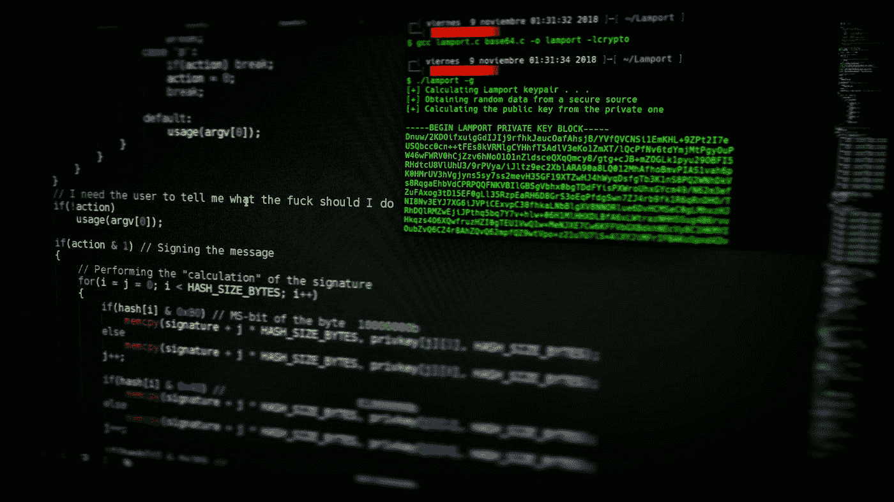

# 转移到 Vim 编辑器

> 原文：<https://levelup.gitconnected.com/shifting-to-vim-editor-77b732c547ca>

[阿吉特](https://unsplash.com/es/@arget?utm_source=medium&utm_medium=referral)在 [Unsplash](https://unsplash.com?utm_source=medium&utm_medium=referral) 上拍摄的照片

# 什么是 Vi / Vim？

Vi 是早期为 Unix 操作系统创建的文本编辑器。它是免费和开源的。Vi 也是使用最广泛的文本编辑器之一，尤其是对于 Linux 用户。Vim(代表 Vi 改进版)是 Vi 的一个强大的可配置版本。

# 为什么我要换？

在我的开发生涯中，我一直使用 Visual Studio Code (VS Code)、Visual Studio 和 Sublime Text，但是最近我在考虑完全切换到 Vim editor。我个人有几个原因:

1.  它在 Mac 和 Linux 上默认可用。

*   我目前用苹果电脑处理我的私人物品，用 Linux 操作我的笔记本电脑。当你刚刚得到你的机器，它已经默认安装。你可以直接开始编辑任何文件，而不需要下载任何其他文件。

2.当你想在终端中快速编辑一些文件时，这非常方便。

*   在很多情况下，当你想在终端中编辑文件时，比如在 git 提交和 rebase 期间。因此，学习使用 Vim 将极大地改善你的工作，而不必搜索“我如何退出 Vim 编辑器”之类的东西(我确实这样做了)。

3.它占用你的机器更少的资源。

*   Vim 是超级轻量级的，但是功能强大。在我加载一个大型代码库的目录之前，VS 代码对我来说一直很有性能，但是即使当我 SSH 到一个远程服务器并搜索一些非常大的日志文件时，Vim 的性能也一直很稳定。

4.几乎完全把你从你的鼠标中解放出来

*   Vim 在使用大量键绑定方面有一点学习曲线。根据大多数 Vim 用户的说法，在您掌握了窍门之后，它会变得非常方便。我仍然在练习，但我愿意努力实现我的梦想，当我试图用我的笔记本电脑编码时，特别是在咖啡馆里(我不想带我的鼠标)。

5.它让你感觉很专业。

*   你知道的。一个软件工程师的虚荣和骄傲。

# 我计划如何开始？

可以这么说，我一直在使用 Vim 的非常基础的版本，并且已经看到了它的许多惊人的定制。

1.  我会开始学习所有基本的按键并练习。
2.  我可能还会探索 Neovim(根据互联网，它比 vim 更具可扩展性，如果你一直在比较使用它们，你可以和我分享你的观点)
3.  用附加插件设置和定制我的 Vim 编辑器，比如自动代码完成。
4.  在我的其他工作站之间移动我的 Vim 配置。

在我完成设置后，我会分享更多关于我的设置的信息，以及帮助学习所有按键绑定的备忘单。敬请期待！

请关注我关于编程、开发人员生产力和更多主题的未来文章！干杯。

 [## 迪伦哦-中等

### 阅读 Dylan Oh 在媒体上的文章。软件工程师@ OpenBet 新加坡。写关于:软件开发…

dylanoh.medium.com](https://dylanoh.medium.com/)