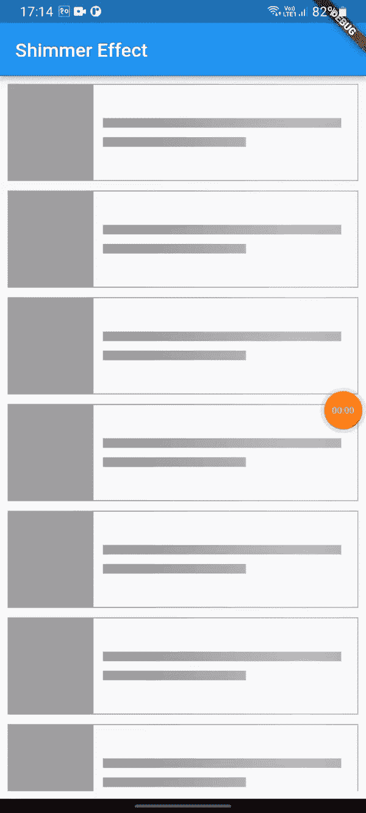

# 在 Flutter 中获取 Api

> 原文：<https://levelup.gitconnected.com/shimmer-loading-with-provider-28173f4267b0>

本文将帮助您在使用[提供者](https://pub.dev/packages/provider)加载状态管理时开始使用[微光](https://pub.dev/packages/shimmer)效果。最终的应用程序如下所示:



最终输出

# 视频教程

# 供应者

提供者由社区构建，用于有效的状态管理。虽然它不是由谷歌开发的，但他们鼓励使用它。它更容易使用和管理，基本上是继承的小部件的包装。

# 微光

Shimmer 是一种加载效果，用于在从服务器加载数据时添加漂亮的动画。简单来说，它是一个类似于 Flutter 框架中可用的循环进度指示器的加载器。

# 让我们开始吃吧

首先，将所有这些依赖项放入您的**public sec . YAML**

```
shimmer: ^2.0.0
provider: ^6.0.3
http: ^0.13.4
```

首先，创建一个新的 Flutter 项目并运行您的示例应用程序。然后在 *lib* 文件夹*中创建一个名为 *response* 的新文件夹。*在response 文件夹中，创建名为 *response_data.dart 的新 dart 文件。*这里我们将为我们的 api 创建模型。我们从这个[链接](https://reqres.in/api/users?page=2)中获取测试 api。

*response_data.dart*

然后我们将创建一个获取 API 的提供者类。

getdata_provider.dart

然后，我们创建小部件，包括我们的微光布局将如何。

*shimmer_layout.dart*

最后，我们将创建主页。

*homepage.dart*

最后我们的 main.dart 文件。

*主镖*

# 结论

希望这篇文章对你有所帮助，让你学到新的东西。我在这篇文章中使用了一些对你们中的一些人来说可能是新的东西。

如果你学到了新的东西或者想提出一些建议，请在评论中告诉我。

如果你喜欢这篇文章，请点击👏图标，它为向大家提供新事物提供了动力。

此外，关注令人兴奋的文章和项目的更新。

通过分享来学习对学习过程有很大的影响，并使社区越来越大。

分享是吸引其他爱好者的磁石。

因此，让我们迈出一小步，让我们的学习社区变得更大。

与你的朋友分享这篇文章，或者如果你喜欢这篇文章，就在推特上发表。

# 让我们连接起来

我们可以成为朋友。在[上找到脸书](https://www.facebook.com/nabin.dhakal.714/)、 [Linkedin](https://www.linkedin.com/in/nabindhakal/) 、 [Github](https://github.com/nbnD) 、 [Youtube](https://www.youtube.com/channel/UCW6oYt_3QSl7J2HSHNqwXWw) 、 [BuyMeACoffee](https://www.buymeacoffee.com/nabindhakal) 、 [Instagram](https://www.instagram.com/nbn_d_/) 。

访问:[颤振连接](https://flutterjunction.com/)

**投稿:** [BuyMeACoffee](https://www.buymeacoffee.com/nabindhakal)

**获取完整代码。**

[](https://github.com/nbnD/shimmer_effect) [## GitHub-nbnD/微光 _ 效果

### 一个新的颤振项目。这个项目是颤振应用的起点。一些帮助您入门的资源…

github.com](https://github.com/nbnD/shimmer_effect) 

请随意评论任何问题。

# 分级编码

感谢您成为我们社区的一员！更多内容请参见[升级编码出版物](https://levelup.gitconnected.com/)。
跟随:[推特](https://twitter.com/gitconnected)，[领英](https://www.linkedin.com/company/gitconnected)，[通迅](https://newsletter.levelup.dev/)
**升一级正在改造理工大招聘➡️** [**加入我们的人才集体**](https://jobs.levelup.dev/talent/welcome?referral=true)