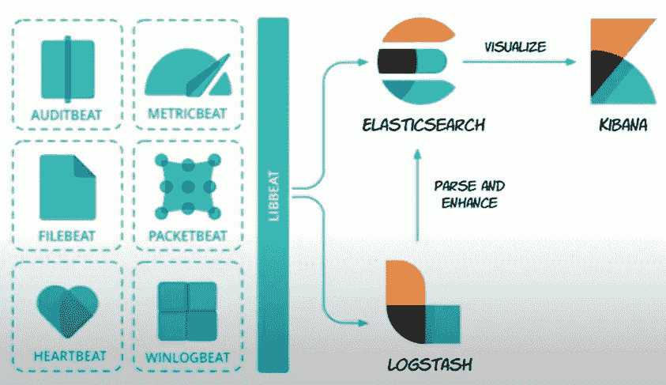
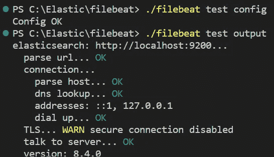

# 使用 Filebeat 将日志传送到本地弹性搜索

> 原文：<https://levelup.gitconnected.com/ship-logs-to-local-elasticsearch-using-filebeat-36e7fe1bff83>

什么是好人😁？今天，我们将使用 Filebeat 将日志发送到本地运行的 Elasticsearch 实例。如第一篇文章所见，Elasticsearch 的结构如下:



什么是节拍？

自从 **Beats** 推出以来，我们已经可以使用不同的代理来收集数据并提供给 Elasticsearch。

**Filebeat** 是一个轻量级代理，它将专门收集数据片段，如日志、指标、审计事件，并发送到 Elasticsearch 或 Logstash 进行索引。

正如您所理解的，Filebeat 的用法类似于 Logstash，但它保留了一个重要的优势。事实上，Logstash 需要 JVM (Java 虚拟机)来运行，这是导致大量内存消耗的一个原因，尤其是当涉及多个管道和一个高级过滤时。因为它是在 [Go](https://go.dev/) 中编写的，Filebeat 可以在给定的操作系统中本地运行，不管它是容器还是 VM，而不需要安装运行时平台。它的轻量级特性允许用户横向扩展日志收集和发送过程，而不必横向扩展目标应用程序。

这里有两个主要概念需要理解，**收割机**和**输入**。这些组件协同工作，将尾文件和事件数据发送到指定的输出。

*   一个**采集器**负责读取单个文件的内容。采集器逐行读取每个文件，然后将素材传输到输出。
*   同样被称为**探勘器**的**输入**负责管理收割机和发现所有要读取的资源。这是设置到配置文件中的第一件事。

在我们开始之前，确保 Elasticsearch 和 Kibana 正在您的机器上运行。如果不是这样，请阅读[这篇文章](https://medium.com/@mhdabdel151/elasticsearch-and-kibana-installation-using-docker-compose-886c4823495e)关于如何使用 Docker Compose 在本地启动 Elasticsearch 和 Kibana。你还需要根据你的发行版从官方网站下载 Filebeat。

一旦我们的环境准备就绪，我们将在`filebeat.yml`文件中配置我们的 prospector。默认情况下，已经提到了输入配置。我们需要通过将 **enabled** 的值设置为 *true* 来启用它，这将检查提到的文件夹并为每个发现的文件创建一个采集器。

接下来，转到*输出部分*并检查指定的主机和连接 Elasticsearch 的端口。您将顺便注意到，我们在禁用安全性的情况下使用 Elasticsearch。它应该是这样的:

```
output.elasticsearch:
# Array of hosts to connect to.
hosts: ["localhost:9200"]
```

如果您的部署启用了安全性，您将需要提供附加信息。

```
output.elasticsearch:
hosts: ["localhost:9200"]
protocol: "https"
username: "elastic"
password: "your-password"
ssl:
  enabled: true
  ca_trusted_fingerprint: "your_fingerprint"
```

就像我们对 [Metricbeat](https://blog.devgenius.io/metricbeat-with-local-elasticsearch-and-kibana-c330c902e473) 所做的一样，我们可以使用以下命令测试一切是否配置良好:

```
./filebeat test config
./filebeat test output
```



一切似乎都很完美，所以让我们通过运行以下命令来运行设置阶段:

```
./filebeat setup
```

在这里，Filebeat 将连接到输出，并开始创建传输数据所需的所有资源和工件。该过程正在创建索引和索引模式，并加载一些仪表板(*该操作可能需要一些时间*)。转到 Kibana 并检查资产是否已创建。

现在，我们通过运行以下命令启动 Filebeat:

```
./filebeat -e
```

注意:`-e`是可选的，将输出发送到标准错误，而不是配置的日志输出。

您可以在日志中看到，已经为找到的每个文件生成了一个*收集器*。我们应该有一些日志运到弹性搜索。在 Kibana 的 *Discover* 部分进行检查。

请随意查看关于此主题的[官方文档](https://www.elastic.co/guide/en/beats/filebeat/current/filebeat-overview.html#filebeat-overview)了解更多详情。今天就到这里，感谢您的阅读，如果您对本文有任何问题或意见，请在下面留下您的评论。

我们下次再见，看更多的帖子🚀。

阿卜杜尔-巴吉