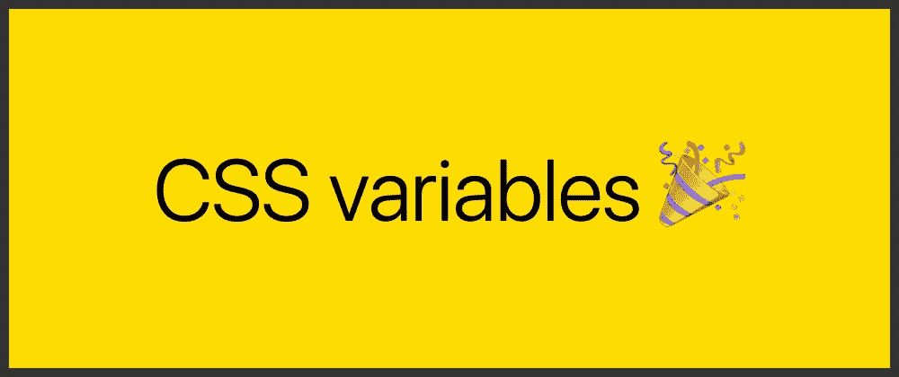
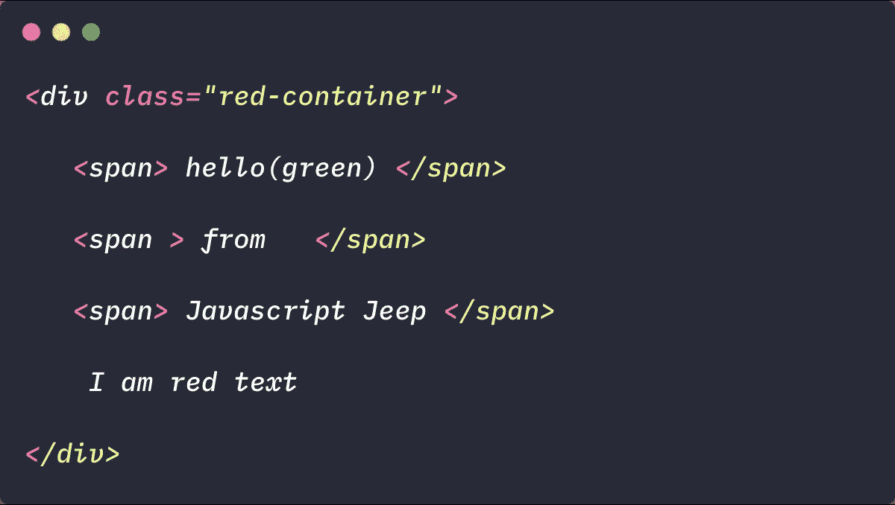
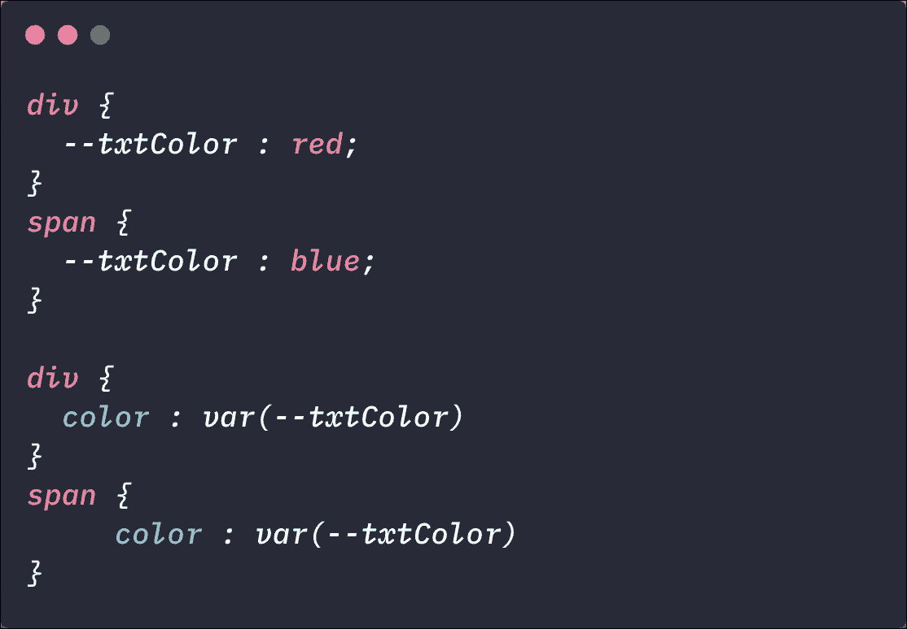
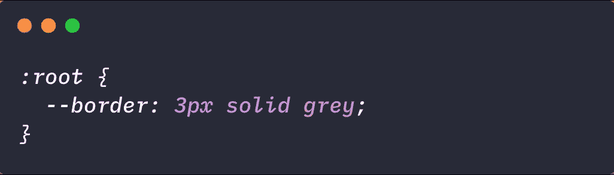
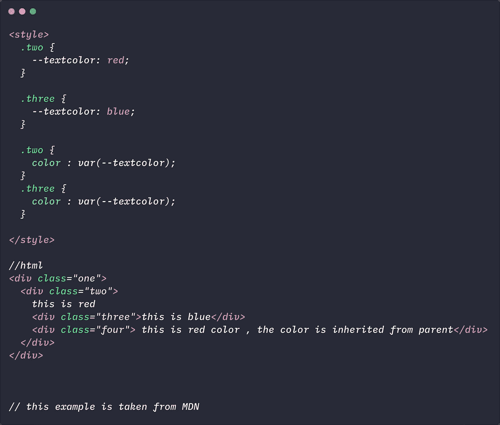

# CSS 变量简介

> 原文：<https://levelup.gitconnected.com/short-intro-to-css-variables-eecd3377d4f2>



使用 CSS 变量，我们可以为属性设置一个值，并在我们的 CSS 代码中重用它。这几乎可以理解为我们在 JavaScript 中使用变量的方式。

## 我们什么时候需要 CSS 变量？

当我们在做一个项目时，我们需要对许多元素使用相同的值(文本颜色、背景、边框等)。在这种情况下，我们可以设置 CSS 变量，然后访问它，而不是重写相同的代码。例如，如果您有一个调色板或标准化的间距，您可以将它们直接存储在 CSS 中以重用它们。

CSS 变量有其他的名字，如“自定义属性”或“级联变量”。

属性名的值以前缀为`--property-name: value`的两个破折号开始。

```
--border: 2px solid #fafafa;
```

使用`var()`评估房产的价值

```
div {
  border: var(--border);
}
```

每当我们需要设置属性时，我们都需要定义属性的范围。



[代码链接](https://gist.github.com/Jagathishrex/d911a701e8662efe3c0f42598052094d)

现在考虑这样一种情况，我们需要将 div 内的文本颜色设置为红色，而 span 内的文本颜色应该为蓝色。对于这种情况，我们需要在两个范围(div 和 span)中定义颜色属性。



[代码链接](https://gist.github.com/Jagathishrex/d911a701e8662efe3c0f42598052094d)

所以结果会是


如果您需要一个在所有范围/元素中都通用的属性，那么您可以在`:root`中定义该属性。



现在考虑代码:



[代码链接](https://gist.github.com/Jagathishrex/d911a701e8662efe3c0f42598052094d)

在上面的代码中，我们没有为带有类`.four`的 div 提供文本颜色属性，但是文本的颜色是红色。这是因为属性的值是默认继承的。因此，如果当前 div 没有特定的值，那么该属性将从父类继承，就像普通的 CSS 一样！

## 后备值

```
.two{ color: var(--color, brown);}
```

在这种情况下，我们没有为`--color`变量定义任何值，所以我们可以提供一个`default value`，它将返回到这个值。

在上面的例子中，如果浏览器找不到变量`--color`，我们告诉浏览器使用`brown`颜色。

我们也可以这样使用它:

```
.two{ color : var**(**--color, var**(**--textcolor, brown**))**;}
```

在上面的代码中，如果浏览器找不到`--color`，那么它将搜索`--textcolor`，如果找不到`--textcolor`，那么它将使用`brown`颜色。

## 处理无效值

考虑一下

```
.four { --size : 16px;}.four { color : var(--size);}
```

`--size`属性不能应用于`color`属性。在这种情况下，浏览器将尝试以下操作:

*   首先尝试从父母那里继承财产
*   如果元素没有父元素，则应用默认值(在我们的例子中，应用黑色)

## 在 Javascript 中使用 CSS 变量

要获取 CSS 变量的值:

```
let element = document.querySelector('.two');getComputedStyle(element).getPropertyValue('--textcolor')
```

要访问内联样式，您需要:

```
element.style.getPropertyValue("--textcolor");
```

要在内联样式上设置变量:

```
element.style.setProperty("--textcolor", yellow );
```

> 如果你发现这个有用的惊喜🎁我[这里](https://www.paypal.me/jagathishSaravanan?source=post_page---------------------------)。
> 
> 开心就分享😃 😆 🙂。
> 
> 跟随 [Javascript 吉普🚙](https://medium.com/u/f9ffc26e7e69?source=post_page---------------------------)如果你觉得值得。

[](https://gitconnected.com/learn/javascript) [## 学习 JavaScript -最佳 JavaScript 教程(2019) | gitconnected

### JavaScript 是世界上最流行的编程语言之一——它随处可见。JavaScript 是一种…

gitconnected.com](https://gitconnected.com/learn/javascript)