# Jupyter 笔记本的快捷方式，用 gif 解释

> 原文：<https://levelup.gitconnected.com/shortcuts-for-jupyter-notebook-explained-with-gifs-822937d70389>

## 掌握这些捷径，提高你的工作效率。


我发现 Jupyter 笔记本对于 Python 开发来说是一个非常强大的工具。但是一开始，当我想插入一个单元格或做其他事情时，我发现我必须将手从键盘移到鼠标上，然后用鼠标点击一些菜单。这既痛苦又无益。

所以我试着为 Jupyter 笔记本找捷径。以下是我认为有用的东西。

注意:Windows 和 Mac 有不同的键，这里是 Windows 和 Mac 之间的键盘映射。

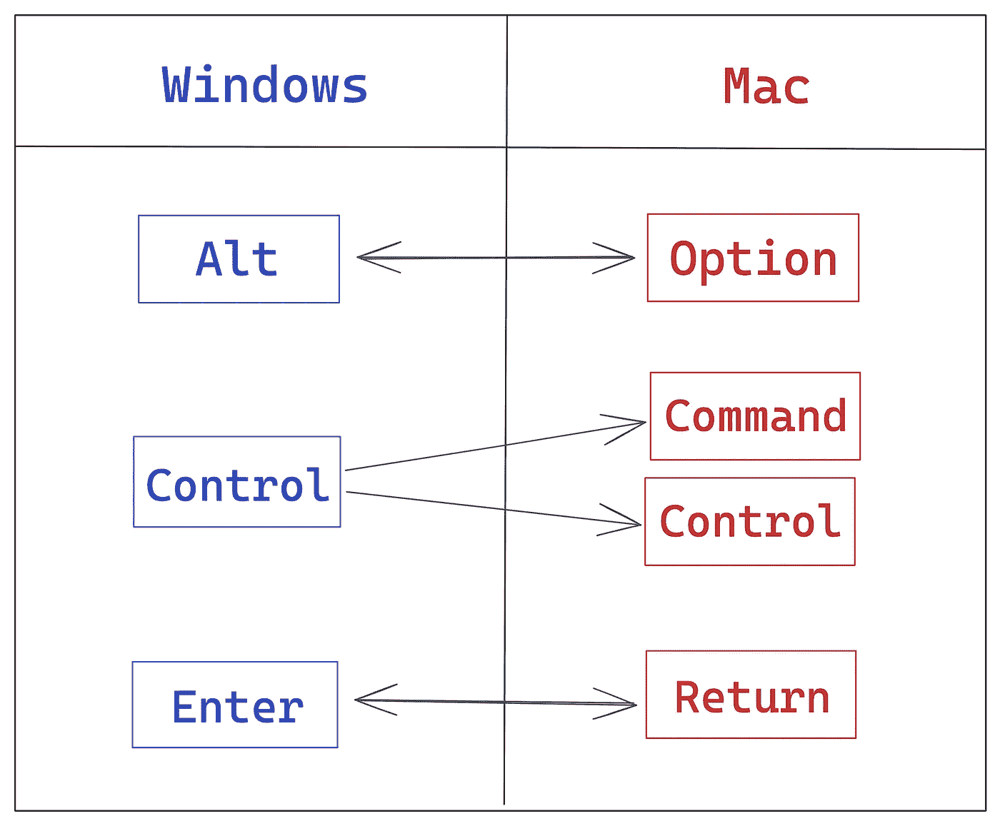 [## 在 Macintosh 上使用 PC 键盘的键盘映射

### 当您在 Macintosh 电脑上使用 Windows (PC)键盘时，您使用的键盘快捷键会映射到不同的…

support.microsoft.com](https://support.microsoft.com/en-us/topic/keyboard-mappings-using-a-pc-keyboard-on-a-macintosh-d4fd87ca-8762-30ee-fcde-08ffe95faea3) 

我是 Mac 用户，以下 gif 是在 Mac 上录制的。但我也会给出相应的 Windows 快捷键。

在我们讨论快捷键之前，你要知道 Jupyter 有两种模式:**命令模式**和**编辑模式。**

*   如果您将光标停留在单元格中，其编辑模式
*   否则就是命令模式

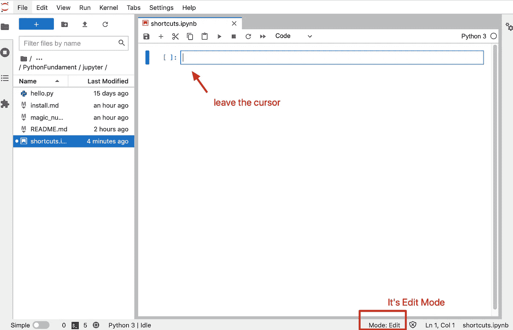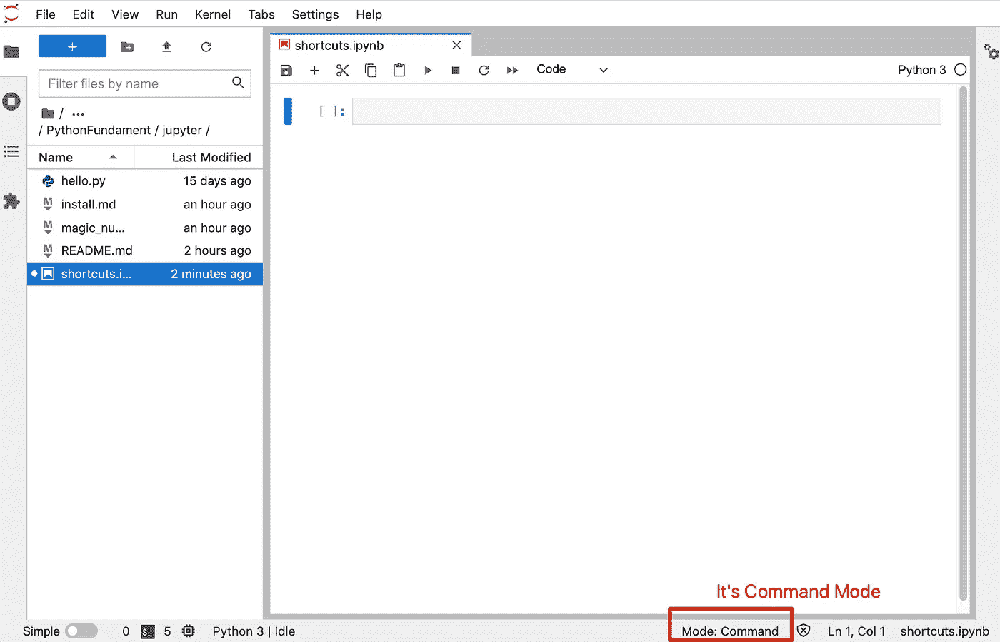

# 编辑模式下的快捷方式

## 1.在当前选定的单元格中运行代码

快捷方式:

*   视窗:`Ctrl` + `Enter`
*   Mac: `control` + `return`


## 2.在当前单元格中运行代码，然后在下面插入一个新单元格

快捷方式:

*   视窗:`Alt` + `Enter`
*   Mac: `option` + `return`


## 3.在当前单元格中运行代码，然后选择下面的现有单元格

如果下面没有单元格，则创建一个新的单元格。

快捷方式:

*   视窗:`Shift` + `Enter`
*   Mac: `shift` + `return`

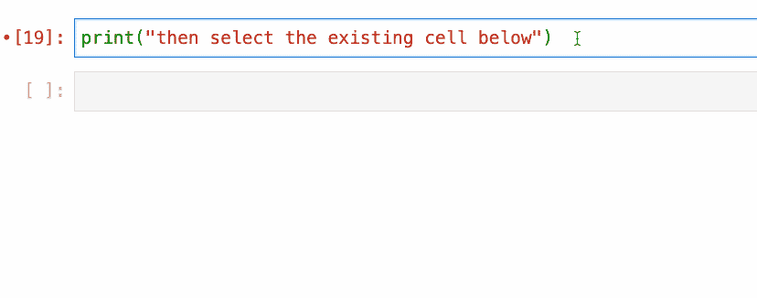

# 命令模式下的快捷键

*   使用`↑`选择上面的单元格
*   使用`↓`选择下面的单元格
*   按`Enter`进入编辑模式，然后按`ESC`退出编辑模式

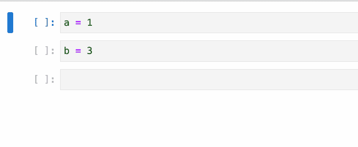

*   按下`A`在上方插入一个单元格
*   按下`B`在下方插入一个单元格

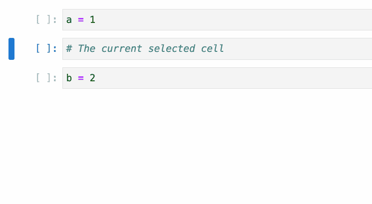

*   按`X`剪切选定的细胞
*   按`C`复制选中的单元格
*   按`V`粘贴下面的单元格


*   按两次`D`删除选中的单元格
*   使用`Z`撤销单元操作

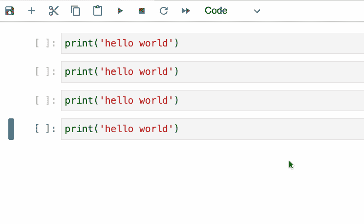

## 选择多个单元格

*   `Shift` + `↑`扩展上面选中的单元格
*   `Shift` + `↓`扩展下面选中的单元格

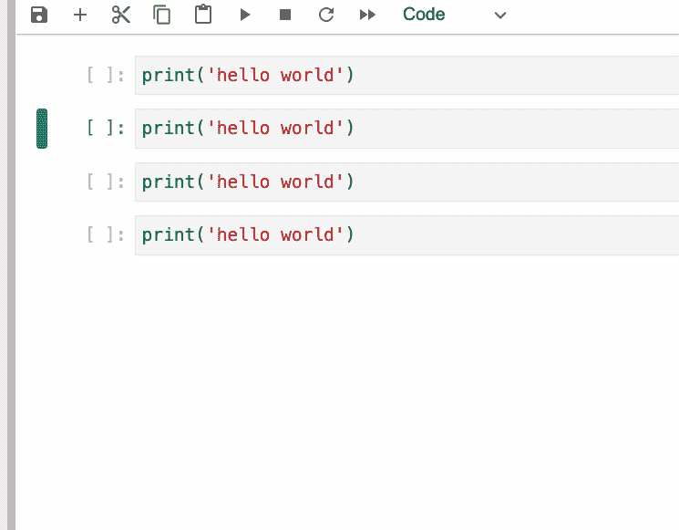

## 合并选定的单元格

选择多个单元格后，我们可以合并它们。

*   `Shift` + `M`

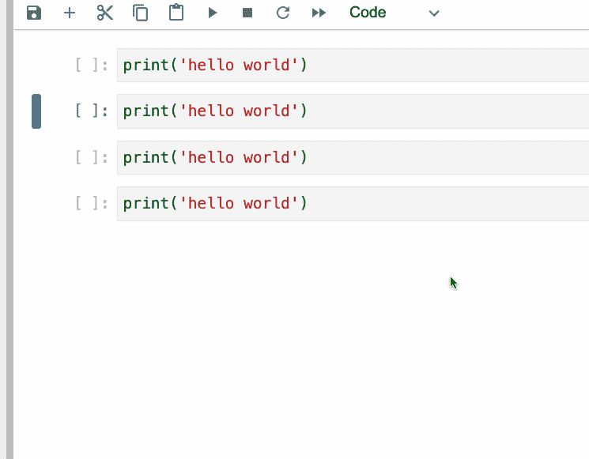

## 合并下面的单元格

*   窗口:`Control` + `Shift` + `M`
*   Mac: `control` + `shift` + `M`

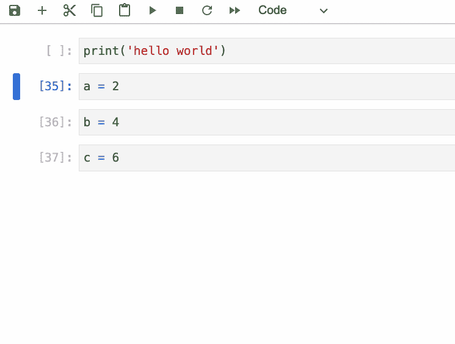

## 合并上面的单元格

*   窗口:`Control` + `Backspace`
*   Mac: `control` + `Backspace`

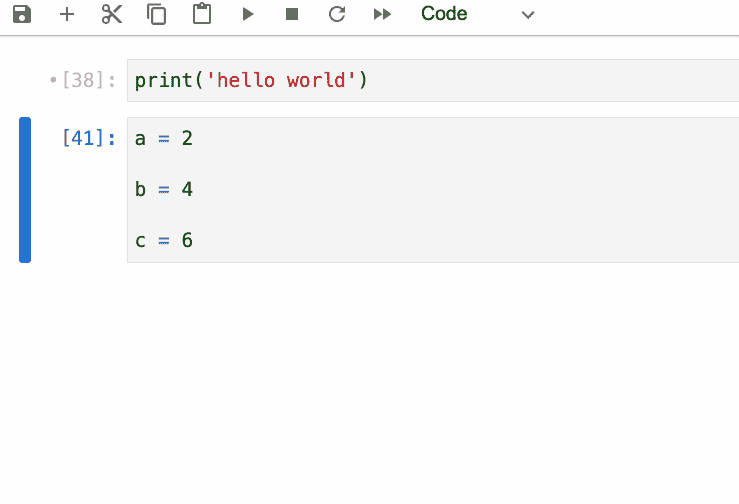

## 在编辑模式下拆分单元格

当然，我们也可以分裂一个细胞。在编辑模式下，我们可以在光标位置拆分单元格。

*   视窗:`Control` + `Shift` + `-`
*   Mac: `control` + `shift` + `-`

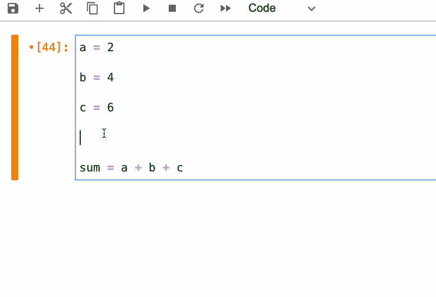

# 智能感知

智能感知和自动完成是任何代码编辑器的重要组成部分。在 Jupyter 笔记本中，我们可以使用`Tab`来显示提示。

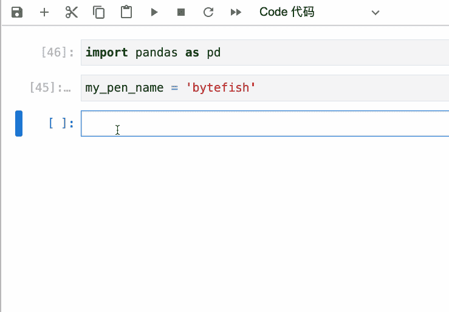

键入`pd`，然后键入 dot 并按 TAB，您将能够看到您可能打算使用的`pandas`的所有属性。

如果它在您的笔记本上不起作用，您可以在笔记本顶部添加这行代码来启用它:

```
%config IPCompleter.greedy=True
```

# 结论

这些是对我有用的快捷方式，我希望它们也能帮助你。