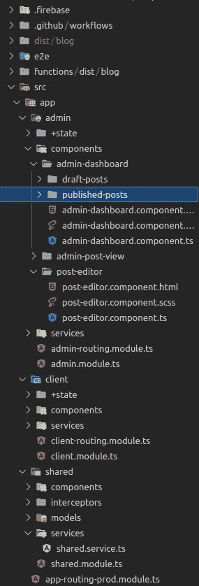

# 角度更短的导入路径

> 原文：<https://levelup.gitconnected.com/shorter-import-paths-in-angular-8141734090e4>


角度应用程序中的导入可能会变得混乱，尤其是在嵌套结构非常多的应用程序中。虽然嵌套的项目目录结构有许多好处，使它比平面结构好得多，但在这种情况下，相对和/或绝对导入路径可能会非常长。例如，考虑下面的项目目录。

# 问题是



很棒，你说呢？现在考虑您希望将从它们`shared.service.ts`中导出的`SharedService`导入并注入到`admin-dashboard.component.ts`中的`AdminDashboardComponent`中。import 语句看起来会像这样:

```
import { SharedService } from ‘../../../shared/services/shared.service’;
```

在一个更大更复杂的应用程序中，这个时间可能会更长。当然，我们健壮的文本编辑器，在我的例子中是 VSCode，主要负责导入，但是即使这样，当包含如此长的相对路径时，代码的可读性也会大大降低。

这就带来了一个问题——有没有一种方法可以让导入路径更优雅，是的，更短？(提示鼓声…)是的。有——甚至不是黑客，而是原生提供的。让我们找出方法。

# 解决方案

`tsconfig.json`是一个存在于项目目录根目录中的文件，对每个 Angular 项目都至关重要。从名称和内容可以看出，如果您已经检查过，这个文件定义了应用程序所需的许多配置。我们将在这里进行设置，以实现更短的导入路径。

我们需要做的是将名为`[paths](https://www.typescriptlang.org/tsconfig#paths)`的键添加到`compilerOptions`数组中。这里，Typescript 允许我们定义在整个项目中使用的路径别名。在幕后，当项目被编译时，无论在`paths`数组中定义的路径别名出现在代码中的什么地方，编译器都会将其替换为实际的路径。`paths`的值将是一个包含实际路径和别名的键值对的对象。让我们用一个例子来看看这些步骤。

考虑我们上面讨论的那个问题。这里有一种方法(是的，这是一种方法，不是方法)来做这件事

1.  在`shared`文件夹的根目录下，添加一个名为`index.ts`的新文件(随便取什么名字，只要是 TS 文件)。
2.  在`index.ts`中，添加下面一行
    `export { SharedService } from ‘./services/shared.service’;`
3.  现在，打开`tsconfig.json`，在`compilerOptions`中，添加下面一行
    `“paths”: { “@blog/shared”: [“src/app/shared”] }`
4.  完成后，转到`admin-dashboard.component.ts`，导入可以更新如下
    `import { SharedService } from ‘@blog/shared’;`

就是这样！那不是看起来好多了吗？显然，您可以命名路径别名(路径对象中的键)可以是任何东西(甚至是中的`@`，这是个人的选择而不是语法)，只要这些值指定了相对于项目根目录的正确的绝对路径。

因为我们在这里利用了 Typescript 特性，所以这可以用于遵循模块化结构的任何 Typescript 项目，包括但不限于 NestJS 项目。

我希望这个故事对你有所帮助。

> 有兴趣和我就这个故事或 Angular、Typescript 和 Javascript 进行一对一的交谈吗？前往[聘请作者](https://www.hiretheauthor.com/ashwinSathian)让我们连线！