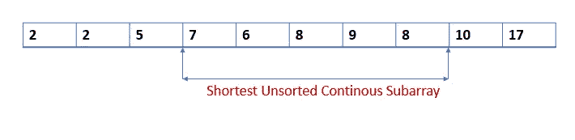
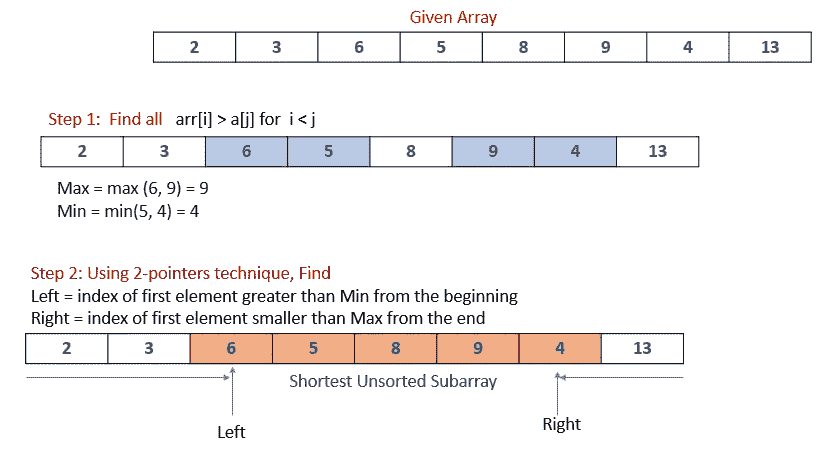

# 最短未排序连续子阵列

> 原文：<https://levelup.gitconnected.com/shortest-unsorted-continuous-subarray-b7401e839b7e>

在这篇文章中，我将解释我对 2021 年 2 月月度挑战中的 [Leetcode 算法问题的解决方案。](https://leetcode.com/explore/challenge/card/february-leetcoding-challenge-2021/587/week-4-february-22nd-february-28th/3652/)

最短未排序连续子阵列

**问题陈述**
给定一个整数数组`nums`，你需要找到一个**连续的子数组**如果你只对这个子数组进行升序排序，那么整个数组都会进行升序排序。返回该子数组中最短的*并输出其长度*。

**解**
从上图可以看出，最短的连续子数组是一个数组中最短的未排序子数组，排序后会使整个数组按该顺序排序。例如，在数组`{1,2,3,4,**6,7,8,10,9,5,**11,15}`中，我们可以排序以保持整个数组升序排序的最短子数组是从索引`4`开始到索引`9`即`{6,7,8,10,9,5}`的子数组，因此解是`6`，这是子数组的长度。你能想出解决这个问题的办法吗？当然，暴力方法。

令人惊讶的是，在这种情况下，即使是被认为简单的蛮力方法也不是很直观。你认为这个问题的强力解决方案是什么？以下步骤解释了我所采用的暴力方法:

**1** 。对于数组中的每个值，比如说**当前值；**
**2** 。如果存在，从数组的**开始**到**当前值**的位置，找到比**当前值**大**的数组中**第一个**值的**索引**。如果索引存在，我们姑且称之为`left_index`。
**3** 。此外，从数组的**末端**开始到**当前值**的位置，查找数组中小于当前值的第一个值的索引(如果存在)。如果指数存在，我们姑且称之为`right_index`。
**4** 。找到与数组中所有条目相关的所有现有的`left_index`和`right_index`。让`min_left`代表所有`left_index` es 的最小值`min_right`代表所有`right_index` es 的最大值。子数组`[min_left, min_right`是原始数组中最短的未排序连续子数组。如果不存在`left_index`和`right_index`，那么数组已经按升序排序。**

例如，考虑数组`{11,12,13,16,15,14,17,19}`。让我们从索引 i=0 到 7 对数组执行上述步骤:
**当 i= 0** 且值为 **11** 时:11 左边没有大于 11 的值，11 右边没有小于 11 的值，因此没有`left_index`也没有`right_index`。
**当 i=1** 值为 **12:** 无`left_index`无`right_index`。
**当 i=2** 值为 **13** 时:无`left_index`和无`right_index`。
**当 i=3** 值为 **16** 时:否`left_index`，但`right_index = 5`(因为从数组开头算起，索引为 5 的 14 是第一个小于 16 的元素。
**当 i=4** 值为 **15** : `left_index = 3`(因为索引为 3 的 16 是数组开头的第一个元素，小于 15)。也是`right_index = 5`。
**当 i=5** 且值 **14** : `left_index = 3`但无`right_index`时。
**当 i=6** 值为 **17** 时:无`left_index`和无`right_index`。
**当 i=7** 值为 **19** 时:无`left_index`和无`right_index`。

所有`left_index` es 的**最小值**为`3`，所有`right_index` es 的**最大值**为`5`，因此**最短未排序连续子阵列**为`[3, 5]`。您可以通过查看示例中给定数组的子数组[3，5]中的值{16，15，14}来确认这一点。注意，这个子数组不是按升序排序的，如果它按升序排序，那么给定的数组也会按升序排序。下面是上述方法在 Java 中的代码实现。

**暴力破解方法分析**
暴力破解方法的时间复杂度为 O(N)。注意，当原始数组已经按升序排序时，这种方法会出现最坏的情况。在这种情况下，对于每个条目，针对`left_index`和`right_index`检查整个数组。没有使用辅助存储器。

**方法 2:预处理和 2 指针技术**
该方法只有 2 个主要步骤；
**1。**给定一个数组，比如说 **arr** ，迭代给定的数组一次，找到这个格式的所有出现:`arr[i] > a[j] for all i < j`，其中 a[j]是较小的值，a[i]是较大的值。记录所有 a[j]的最小值作为最小值**和所有 a[i]的最大值作为最大值**。如果没有出现这种情况，那么给定的数组已经按升序排序。 **2。**利用步骤 1 中得到的 **min** 和 **max** ，采用 2 指针技术从开始处寻找给定数组中第一个元素的索引(比如说`left`)，该索引大于 **min** 的**。同样，找到给定数组中从末尾开始的第一个元素的索引(比如说`right`)，它比 **max** 小**。
子阵列`[left, right]`是给定阵列的**最短未排序连续子阵列**。********

**第二种方法的分析**
第二种方法的时间复杂度为 **O(N)** 其中 N 为给定数组的长度。请注意，我们只对数组进行了两次线性迭代——在排列不匹配的位置找到 min 和 max 元素，然后使用 2 指针技术找到 min 和 max 的正确位置。没有使用辅助空间。下面是第二种方法在 Java 中的代码实现。

**结论性备注:**
感谢你查看这篇帖子。如果你有任何意见或建议，请在评论区告诉我。:-)