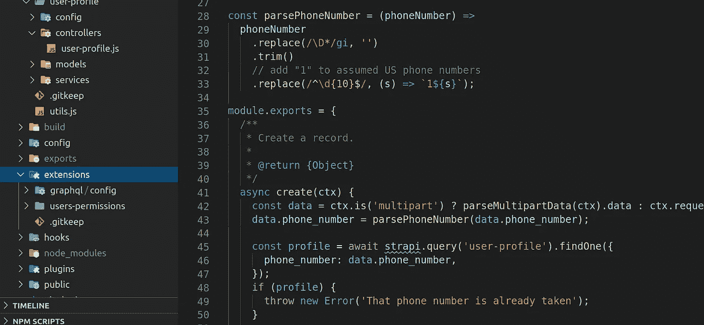

# 对在实际应用程序中使用 Strapi 的深入回顾

> 原文：<https://levelup.gitconnected.com/should-i-use-strapi-on-my-next-project-ec2daa7df11c>

在过去的几个月里，我一直在一个中型项目中使用一种叫做 [Strapi](https://strapi.io/) 的技术来节省大量时间。如果你想跳过“是什么…”的部分，我的经验，和我个人的优点&缺点，有一个 TL；博士在最后。

一段愚蠢的 Strapi 代码——特别是一个创建控制器

# 什么是 Strapi？

如果你不熟悉的话，Strapi 是一个基于 JavaScript 的开源无头 CMS(内容管理系统)。它是一个强大的系统，可以处理应用程序开发人员可能会遇到的许多单调的任务，同时为非开发人员提供了一种创建、编辑和管理内容的方法。

> 这里的“无头”是指你可以使用任何你喜欢的前端技术栈。这与传统的 WordPress 不同，在传统的 WordPress 中，你被绑定到框架的前端堆栈(PHP)。

有几个其他平台提供了与 Strapi 非常相似的功能集，可能最著名的是 [Contentful](https://www.contentful.com) 。我认为一个主要的区别是，Strapi 是开源和免费的——假设你是自主主机——而 Contentful 是闭源和昂贵的。

## 我为什么要用 Strapi？

我认为 Strapi 的一些最显著的特性和属性是

*   现代内容管理界面
*   支持任何数据模型
*   自动生成的 REST 和 GraphQL 端点
*   插件系统增加了电子邮件、用户认证和授权、媒体管理和 API 文档等功能
*   被任何前端消费的能力

就个人而言，我一直使用单一的 Strapi 部署作为面向客户的 React 本地移动应用程序和 React 后端管理应用程序的后端。

# 我和斯特拉皮的经历

开始使用 Strapi 非常容易，我只用了 5 分钟就完成了一些工作。我在最初几周的经历和最初的 5 分钟非常相似。

当我们发现业务需求时，我可以更新内容模型，并在几分钟内对这些新实体的 REST 和 GraphQL 进行 CRUD 操作。与编写迁移、创建服务和控制器以及为每个实体连接公共 API 的单调任务相比，这简直是天赐之物。

一旦项目进展到某一点，我就开始关注一些更复杂或更具挑战性的业务需求。比如支持各种情况下的移动推送通知。其中许多任务非常简单，但是当我开始扩展 Strapi 的设计边界时，事情变得越来越困难。

我不认为这必然令人惊讶。许多平台、技术、架构、范例和其他软件*都遵循这种模式。毕竟，有一句非常流行的话:“让简单的事情变得简单，让困难的事情变得可能”，在某种意义上，这句话或许可以描述这一点。然而，我所经历的许多问题都是我认为 Strapi 可以发展的领域。*

# 什么很棒

总的来说，我和 Strapi 的经历很愉快。在许多领域，我都有高效便捷的开发时间。下面的特性是这些领域中的一些，结合起来，可能减少了我 70%的初始开发时间。这些东西绝对不是 Strapi 提供的每一个特性，但却是我发现最有用的一些特性。

## 自动生成

许多数据库表、控制器、服务、REST 端点和 GraphQL 类型的自动生成非常有用。在过去的项目中，我发现自己经常到处重写相同的一些代码，每个模型似乎都需要创建、更新、一些查找方法，有时还需要删除。通常，我单独编写这些控制器——同时尽可能坚持 DRY 以支持潜在的未来扩展。

Strapi 实际上消除了这种重复性工作，这一事实令人耳目一新。我不需要在我的项目中设计一些巧妙的解决方案来自动生成或提供每个实体的基本操作，Strapi 就是这么做的。Strapi 有所有基本方法的默认实现，如果我想覆盖或禁用它们，我可以这样做。简单。

## 内容管理

如果你打算使用一个无头的**内容管理**系统，那么，管理内容；Strapi 对此没有异议。基于角色的访问控制，一个媒体库，一个很好的用户界面，你懂的。Strapi 几乎完美地满足了我对通用 CMS 的需求。

## 认证和授权

如果您选择 Strapi，您也可以选择安装角色和权限插件。这个插件做的和你期望的差不多，下面有一些警告。

与自动生成代码的模式类似，这只是我不必担心第一万次重写的东西。每个应用程序似乎都需要注册、登录、忘记密码、重置密码、单点登录等。Roles & Permissions 插件提供了所有这些东西的默认实现，以及 RBAC(基于角色的访问控制),就像你从插件名称中所期望的那样。它并非完美无缺(例如，我不得不在移动设备上推出自己的 OAuth 解决方案)，但总体来说还是不错的。

## 电子邮件

像许多其他内容管理系统一样，Strapi 支持各种开箱即用的电子邮件——例如忘记密码。你当然可以为不同的电子邮件服务提供商添加不同的插件，在我们的例子中，我们通过[strapi-provider-email-SendGrid](https://www.npmjs.com/package/strapi-provider-email-sendgrid)包使用 send grid。我在电子邮件方面没有任何问题，我期待着在未来实现更多定制的交易电子邮件。

## 媒体库

媒体库插件是一个强大的插件，允许你管理项目中的各种媒体，照片，视频等等。这对于 CMS 来说并不奇怪，它甚至可能是实际需要的，但是与你自己的，比如说，express 服务器相比，它仍然是一个非常方便的特性。

Strapi 管理员或用户可以上传资产，对于图像，Strapi 将处理生成该内容的几个不同“大小”的版本。像 Strapi 系统中的任何其他内容一样，这些资产可以被更新、删除和管理。在我们的例子中，我们还使用了[strapi-provider-upload-AWS-s3](https://www.npmjs.com/package/strapi-provider-upload-aws-s3)来上传到一个专用的 S3 存储桶，而不是默认的磁盘存储选项。

## 用户化

Strapi 项目的定制有多种表现方式。首先，你可以通过一个叫做`extensions`的东西覆盖大多数*插件文件。这使您能够修复或更改您可能需要的任何功能，而不必获得批准、创建和合并到核心 Strapi 项目中。

> 我在上面的段落中说“大部分”，因为有些文件你**不能**覆盖，我在定制 GraphQL 插件时遇到了这个问题。这当然取决于当前插件的实现细节。

除了定制已有的插件和特性，你还可以自己写！这不仅允许您扩展 Strapi 的功能，还可能允许您以不同的方式组织一些业务逻辑。

最后，您可以定制“管理”界面，供编辑、员工或任何人用来编辑和管理内容。您可以通过插件添加新页面，也可以修改现有页面。

# 有待改进的领域

和任何事情一样，并不是一切都很好。我个人认为 Strapi 可以改进的一些地方如下。

## 类型脚本支持

Strapi 中缺乏类型脚本支持几乎是一个障碍。这些天来，我几乎在我开发的每一个 JavaScript 项目中都在使用 TypeScriptTypeScript 提供的类型安全和自文档化功能是非常宝贵的。

我并不是唯一渴望 TypeScript 支持的人，Strapi 团队也很清楚对它的需求。鉴于 Strapi 的 API surface，我认为这是他们需要改进的主要领域之一。随着 API 类型和自动生成的控制器、模型和服务类型的增加，使用他们的平台将变得更加容易(和安全)。

## 数据库和数据迁移

Strapi 通过使用两个不同的包来支持几个不同的数据库， [Bookshelf.js](https://bookshelfjs.org) (用于 SQL 数据库)和[mongose](https://mongoosejs.com/)(用于 mongodb)。它们还为一般的简单 CRUD 操作提供了这两个包的包装。

> 明确地说，当我提到“简单的 CRUD 操作”时，我指的是下面这些:`create`、`update`、`delete`、`findOne`和`findMany`。有时还有一些像`search`或`count`这样的，但前五个是我通常所说的。

不幸的是，Strapi 目前不支持传统的数据库迁移。每一个内容模型的改变都是在 Strapi 核心的幕后完成的。这意味着，如果您需要进行一些更“有趣”的数据库迁移，比如添加索引或扩展，那么您要么直接在数据库中完成，要么使用自己的迁移解决方案。

Strapi 也没有提供任何在环境之间迁移数据的方法，这在有权限的情况下特别烦人。当您创建一个新实体时，permissions 插件默认您的任何角色都没有访问权限——这是一个合理的选择。然后，您通过每个实体控制器的用户界面分别向每个角色授予访问权限，这些信息存储在数据库中。当您将实体添加或更改部署到新环境时，您还需要 a)进入新环境并手动应用每个控制器的权限，或者 b)编写一些定制的数据迁移解决方案。这也是一个[未解决的问题](https://portal.productboard.com/strapi/1-roadmap/c/12-data-migration-across-environments)。

## GraphQL 插件

对我来说，GraphQL 支持是一个非常需要的特性。从客户端应用程序与 GraphQL API 进行交互比与传统的 REST API 进行交互更令人愉快。虽然总体来说不错，但我认为 GraphQL 插件在成为无缝体验之前还有一段路要走。

GraphQL 插件最烦人的一点是它与认证插件和定制控制器的交互方式。如果您像示例中提供的那样编写控制器——调用一个`context`对象上的方法来返回标准的 HTTP 错误和消息——您会发现这些错误不会通过 GraphQL 自动显示出来。事实上，这些错误完全被掩盖了 GraphQL 类型和控制器返回的内容之间的类型不匹配。问题是，GraphQL 插件期望发生一个`throw`来报告错误，而 REST API 无缝地处理示例控制器的编写方式。您必须确保对于每个支持 GraphQL 的控制器，当它在`context`中遇到任何 HTTP 错误时，您实际上抛出了您的解析器。

除此之外，还有实现定制指令的一般问题，覆盖真正应该通过`strapi.services`全局暴露的东西，以及文档。

## 性能、架构和其他次要细节

下面的事情可能有点吹毛求疵，但我认为它们值得一提。

Strapi 生态系统的表现总体良好。事实上，我对任何 ORM 相关代码或自动生成的控制器几乎没有任何问题，特别是当我添加了缓存时。关于用户权限插件有一些问题，在这里对每个请求进行几个数据库查询——一个针对用户的角色，几个针对该角色拥有的权限。我实现了一个默认策略的扩展来减轻这些担忧，但是我认为它们值得一提。

就个人而言，我发现创建一个定制的`admin`插件有点……笨拙。有很多必需的代码(大部分是自动初始化的！)和不多的文档。如果您试图让您的插件与 Strapi 管理界面的其他部分的一般设计相匹配，您将最终通过挖掘现有的插件来确定使用哪个 React 组件。

最后，我发现 Strapi 系统的架构有点奇怪。几乎所有东西都嵌套在一个**全局** `strapi`对象下。这包括控制器、模型、服务、钩子、数据访问，以及几乎所有你能想到的东西。以我的拙见——可能是不相关的——来看，以一种更可测试的方式来架构会更好一些。例如，我认为在控制器或服务中使用依赖注入来提供对其他服务或模型的访问将是一个很好的补充。

# 我推荐用 Strapi 吗？

## 是的。

我知道我刚刚列出了我对这个系统的一大堆抱怨，但我认为总体来说这是一个有着光明未来的优秀项目。如果您的项目与许多其他项目的模式相匹配——大多数实体的 CRUD 操作、Strapi 插件覆盖的核心特性，以及一些定制的业务逻辑——我认为 Strapi 可以为您节省大量编写代码的时间，并为您提供开箱即用的内容管理解决方案。

如果你没有时间限制(不太可能！)，讨厌 JavaScript，或者正在实现一个与这种基于 CRUD 的模型不太匹配的重要特性集，那么也许您应该去别处看看。为了编写完全独特的东西，额外的定制和学习可能会超过系统节省的时间。这并不是说这是不可能的，但也许你不会从 Strapi 中获益最多。

总的来说，我可能会再次使用 Strapi，我非常感谢团队为我节省的时间。

# TL；速度三角形定位法(dead reckoning)

## 优点:

*   开放源码
*   通过现代化的“管理”用户界面进行内容管理
*   自动生成的 REST / GraphQL 端点
*   用户认证和授权
*   插件系统
*   相对容易修改和扩展
*   有用的默认插件，如角色和权限、GraphQL 和媒体库
*   这是通用的

## 不太好的:

*   缺乏类型脚本支持
*   没有数据库迁移/种子支持
*   GraphQL 插件困境
*   繁重的管理员定制
*   广泛使用全局`strapi`对象
*   特定领域的性能和优化

## 判决结果是:👍