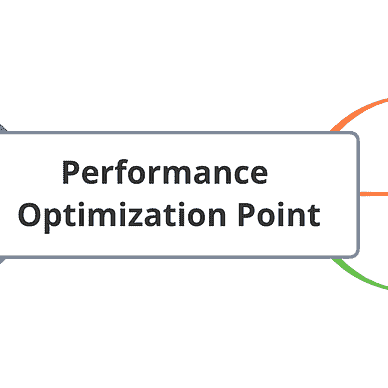
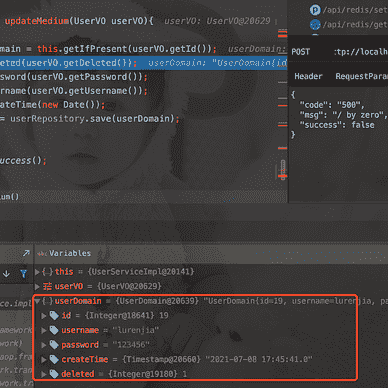

# Java 开发人员应该使用 Lombok 吗

> 原文：<https://levelup.gitconnected.com/should-java-developers-use-lombok-74fd30c4c18d>

在 [Unsplash](https://unsplash.com?utm_source=medium&utm_medium=referral) 上由 [Clément Hélardot](https://unsplash.com/@clemhlrdt?utm_source=medium&utm_medium=referral) 拍摄的照片

关于`Lombok`的使用还有很多争议，有的公司不推荐，有的公司大量使用。

我的想法是:**用它**但是**不要滥用它**。如果你写的是基础工具库，就不要引用了，但是如果你写的是业务系统，那就没什么不能用的了。只要能提高效率，没有安全隐患，就可以用。

# 什么是龙目岛

`Lombok`是一个 Java 实用程序，可用于帮助开发人员消除 Java 的冗长代码，尤其是针对简单 Java 对象(POJOs)的代码。它通过注释做到这一点。通过在开发环境中实现 Lombok，开发人员可以节省大量构建方法的时间，如`hashCode()`和`equals()`，以前用于对各种访问器和赋值器进行分类。

我们都知道在 Java 中定义对象的时候会用到 Getter 和 Setter 的方法。

虽然我们有工具来帮助我们快速生成这些方法，但这有点麻烦。

`Lombok`可以用一行注释实现所有这些方法。

`Lombok`可以做的不止这些，还可以通过标注`@Slf4j`帮你自动定义日志。

我们不必编写冗长的私有静态 final `Logger logger = LoggerFactory.getLogger(ListingProcessor.class)`代码。

而且对于不同的日志类，这句话也是不一样的。

# 如何使用

如果使用 Maven，只需将以下依赖项直接添加到 pom 文件中。

IDEA 的插件是自动安装的，你可以直接启用它。

IDEA 会提示您是否在当前项目中启用`Lombok`，您可以选择是否启用。

然后只需在代码中使用注释。

注意，日志是用来标记日志的。

这样代码就优雅多了，也可以减少很多不必要的代码。

# 龙目语的基本原理和滥用

Java 程序的解析分为运行时解析和编译时解析。

通常我们通过反射获取类、方法、注释、成员变量，这就是运行时解析。但是这种方法效率不是很高，只能在程序运行的时候解析。

此时，编译时解析反映了它的价值。

编译时解析进一步分为注释处理工具和 JSR 269 可插拔注释处理 API。

第一个处理器是在 JDK 1.5 中与 annotation 一起首次引入的，它是一个命令行工具，提供了在编译时根据源代码读取程序结构的能力，并可以运行 Annotation 处理器来生成新的中间文件，从而影响编译过程。

然而，在 JDK 1.8 之后，第一个处理器被淘汰并被第二个处理器取代。

这导致了 Lombok 与 JDK 兼容性的一些问题。

当您更改 JDK 版本时，龙目语版本也需要更改，否则，您会得到一个错误。Java 项目编译错误`java.lang.ExceptionInInitializer,`因为 JDK 的不兼容导致整个项目无法编译。

如果上游系统提供的`fegin`客户端使用`Lombok`，那么下游系统也必须使用`Lombok`，否则会报错，上下游系统构成强依赖关系。

如果你需要在 getter 或者 setter 方法上做一些编码，`Lombok`不是不能用，但是有一个轻微的学习曲线。

基于以上考虑，`Lombok`还是可以用的，但是不要试图到处用 Lombok，以免滥用。

哪怕只是为了用`@Slf4j`，也是值得的。

# 最后

**感谢阅读**。期待您的关注，阅读更多高质量的文章。

[omgzui](https://medium.com/@omgzui?source=post_page-----74fd30c4c18d--------------------------------)

## 更好的编程

[View list](https://medium.com/@omgzui/list/better-programing-9b4c9bb174aa?source=post_page-----74fd30c4c18d--------------------------------)108 stories

[omgzui](https://medium.com/@omgzui?source=post_page-----74fd30c4c18d--------------------------------)

## Java 语言(一种计算机语言，尤用于创建网站)

[View list](https://medium.com/@omgzui/list/java-e7c93884d94b?source=post_page-----74fd30c4c18d--------------------------------)55 stories

[omgzui](https://medium.com/@omgzui?source=post_page-----74fd30c4c18d--------------------------------)

## 新闻

[View list](https://medium.com/@omgzui/list/news-67ec0a972660?source=post_page-----74fd30c4c18d--------------------------------)23 stories