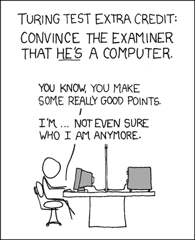

# 智能合约应该是非图灵完全的吗？

> 原文：<https://levelup.gitconnected.com/should-smart-contracts-be-non-turing-complete-fe304203a49e>

每个人都有自己喜欢的编程语言，就像每个人都有自己喜欢的鞋子或者喜欢的食物一样。我希望我们一起踏上编程之旅。我们将讨论图灵完备性，评估它在智能契约方面的有用性，看看替代方案，希望我们最终能一起得出相同的结论。剧透:结论是，让 Solidity 垄断智能合约是一个可怕而愚蠢的想法。

所以让我们直接开始吧。(真正快速:TC =图灵完成，NTC =未图灵完成)

# 图灵完备性，最简短的解释

如果你不知道 TC 是什么，我给你简单解释一下，让你了解最新情况。如果你以前听说过它，但不太记得它到底是什么，这将刷新你的记忆。让我们投入进去吧！

艾伦·图灵是一位数学家(以及其他许多人)，他创造了一种叫做图灵机的理论机器。这个虚构的机器可以访问无限量的 RAM，并使用有限的程序来运行，该程序决定它何时应该在内存中进行写、读和移动。它的编程还规定了在什么条件下应该终止以及下一步应该做什么。符合这些条件的编程语言被称为 TC 语言。

快速分析一下 TC 机器能做什么和不能做什么是合适的，所以让我们看一些例子。

已完成:

*   有能力实现任何可计算的功能。
*   总是包含一个不会自行终止的函数。
*   包括理论上可以使用无限量内存的功能。

不完整:

*   不支持循环、递归或其他不会自行终止的 goto 变体。

根据 [Tiobe Index](https://www.tiobe.com/tiobe-index/) ，几乎所有现代流行的编程语言都默认为 TC(或者在需要时有能力成为 TC)。有目的的 NTC 语言是非常特定于领域的语言，如 BicoinScript 和 Coq(一种机械检查证明的交互式定理程序)。这些语言有意地缺少递归，要么是作为一种安全特性，要么是因为它们可以在没有递归的情况下运行，开发人员认为创建一个 TC 环境是多余的。

基本上，NTC 语言更专业，而 TC 语言是一种多用途工具，可以处理各种情况。起初你可能会想，“嗯，我们应该对所有事情都使用 TC 语言，对吗？”毕竟，它是灵活的，但正如多功能工具是一个很好的随身物品，因为它在许多情况下都很方便，你可能更喜欢在修理像你的汽车这样的东西时有合适的工具。

[http://themeta picture . com/have-you-never-open-chardonnay-under-fire/](http://themetapicture.com/have-you-never-opened-chardonnay-under-fire/)

用上面的类比来滚动，TC 语言可以应用的更广，而 NTC 语言有*特定的*用途。我不知道你怎么想，但我个人认为智能合同是*的一个特定*用例。“但是，”你可能会想，“智能合约有这么多不同的类型，大多数都写得很可靠，没有任何问题。”

说得好，亲爱的读者。我很高兴你提起那件事。

# 智能契约、可靠性和图灵完备性

我发现，对于复杂的问题，向专家寻求帮助总是最好的，这也是我在德国鲁尔西部应用科学大学计算机科学研究所发表论文的原因。这篇论文的题目很恰当，叫做“[智能契约语言需要图灵完备吗？“揭示了许多关于你我共同经历的旅程的非常有趣的统计数据。](https://www.researchgate.net/publication/332072371_Do_Smart_Contract_Languages_Need_to_be_Turing_Complete)

但是在我们深入研究这些统计数据之前，让我们快速检查一下存在的一些常见缺陷，因为 Solidity 是一种 TC 语言。我们有允许 DAO hack 发生的安全缺陷([递归调用利用](https://medium.com/@ogucluturk/the-dao-hack-explained-unfortunate-take-off-of-smart-contracts-2bd8c8db3562))，攻击实现不佳的智能契约的可能性([重入攻击](https://eprint.iacr.org/2016/1007.pdf))，以及由于递归而无法准确预测费用的事实(以及[停止问题](https://en.wikipedia.org/wiki/Halting_problem))。这些东西之所以存在，只是因为 Solidity 是一种 TC 语言，但是我们从 TC 语言中获得了如此多的东西，忍受这些缺陷当然是值得的，对吗？

对吗？！

不幸的是，德国鲁尔西应用科技大学的人告诉我们一个不同的故事。他们下载了 53575 份智能合同，并分析了每份合同中的编码类型。他们在论文中解释说，“执行的分析确定了提取的智能合约所使用的流控制机制，并将每个智能合约分配给相应的可计算性类，以便检查实际需要图灵完整智能合约来实现的智能合约的百分比，并以此回答提出的研究问题。”

结果如下:

*   35.3% —使用“for 循环和原始递归函数以及与此类函数相关的暂停问题。”
*   这 35.3%中的进一步细分包括:
*   24.8%“验证合同使用 for-loops”
*   3.6%是“使用递归的契约”
*   所有分析过的智能合同中，有 6.9%使用了控制流机制，这种机制通常需要一种完整的编程语言。

我们可以从两个方面来看待这些数据。严格来说，最后的 6.9%(大约 53，575 人中的 3，697 人)是技术上唯一需要 TC 语言才能发挥作用的类别。即使我们非常自由地进行归纳，并假设全部 35%的人都需要一门 TC 语言，那会更好吗？见鬼，我甚至可以说，即使他们中有一半人需要 TC，这也不值得。那么坚固性为什么是 TC 呢？

Solidity 的创建深受 JS、C++、Python 和 PowerShell 的影响，这些都是 TC 语言本身。说 Solidity 是通过 100%的意图被创造出来的 TC 语言可能有点夸张。毕竟，为什么你会故意在你的编程语言中引入缺陷，而好处却没有被利用呢？在 DAO 被黑后，康乃尔大学的博士生菲利普·黛安在一篇相当有趣的博客文章中写道:“这实际上不仅仅是 DAO 契约本身的一个缺陷或漏洞:从技术上讲，EVM 是按照预期运行的，但是 Solidity 将安全缺陷引入了契约中，这不仅被社区忽略了，而且也被语言的设计者自己忽略了。”

# 我们还有其他选择…对吗？

垄断是不好的，会扼杀增长。句号。我们反对、支持政府解散它们的行动，但出于某种原因，当涉及到智能合同时，我们愿意接受它们？考虑到这一点，我认为有两种可能的未来展现在我们面前。

未来的一个，我们用我们的经验来巩固并从中成长。我们在 Solidity 上进行扩展，用其他语言进行扩展，比如 Vyper(一种旨在紧挨着 Solidity 使用的 NTC 语言)，并继续忽略 TC 语言给智能合约世界带来的明显缺陷。

未来二，我们多样化我们的投资组合。听着，我之前说过我不会告诉任何人放弃他们最喜欢的编程语言，我撒谎了。现在智能合约社区的问题是每个人都坚持使用 Solidity，我只是希望这是出于必要而不是欲望。

让我们来谈谈智能合约世界中编程语言的重要竞争者。让我们来谈谈海浪的行程。

我认为 Waves 是这场斗争中的一个重要竞争者有几个原因，其中一个主要原因是 Waves 出现了，建立了一个系统，并自 2016 年以来一直在运行它。你经常会看到关于“这家新公司”的推测性文章，它将“彻底改变这个领域”。当波浪进入赛场时，它们摇摆着进来，它们有一个展示产品的橱窗来展示。

他们有自己的区块链、钱包和安全浏览器扩展来管理 dApp 连接，DEX，现在还有 RIDE，他们自己专门设计的编程语言来构建 dApp。我提出这一点的原因是因为 Waves 是一家做严肃事情的强大公司，这使得他们的 Solidity 替代品成为 dApp 开发者的重要竞争者。老实说，我对这家公司的主要问题是他们网站的登陆页面令人作呕，它只是…不停地移动。

RIDE 是一种有目的的非图灵完整语言，它是为开发人员设计的，用于在一个严肃的环境中构建智能契约。RIDE 对此采取了双管齐下的方法:首先，他们的语言提供了创建 dApps 所需的基本脚本功能(同时减少了与安全相关的错误)。其次，因为这种语言不支持任何递归或复杂的循环，所以可以很容易地测试它的安全缺陷。

但是递归的缺乏不仅仅有利于安全测试，在计算执行 Waves 区块链智能合同的天然气费用时也会考虑到这一点。因为有可能计算程序应该运行多长时间以及它将有多复杂，所以可以估计价格，并且在不执行 dApp 的情况下从不收取费用(我在看着你，以太坊)。

你可能会想，因为 RIDE 是 NTC，所以它不能处理大多数为 EVM 编写的智能合同。还记得之前德国计算机科学家的研究吗？不到 7%的测试智能合约使用了循环并需要 TC 来运行。

真正的问题(这次旅程的全部目的)是:当不到 7%的用 Solidity 编写的 dApps 在使用它的 TC 特性时，我们为什么还要使用 Solidity 这种 TC 语言？

根据论文“[自我复制硬币作为通用图灵机](https://arxiv.org/abs/1806.10116)”，理论上，7%需要 TC 智能合约的 dApps 可以通过在许多不同的交易中实现 TC 功能来服务。在他们的研究中，他们能够通过使用利用 UTXO(未用事务输出)模型的一组小型特定语言功能来构建一个简单的 TC 机器。为了安全起见，这些事务受到输入和输出事务状态的严格限制，在这种情况下，无界循环和无限循环都是有意不可能触发的。同样，RIDE 作为一种 NTC 编程语言，可以用来编写 TC 智能合约，而没有底层 TC 编程语言可能带来的问题。

我们在以太坊中看到的问题只会变得更糟，除非他们改变一些重大的东西，因为我们可以看到他们未来几年的路线图，我们知道这些关键的变化都没有在工作中。他们将*最终*转移到 POS 而不是 power，而且他们有 Vyper，如果你想增加安全性，你可以选择写入。但底线是 TC 是一个卖点。见鬼，Vitalik Buterin 甚至在以太坊白皮书中承认:

“图灵不完全性甚至不是一个很大的限制；在我们内部构思的所有契约示例中，到目前为止，只有一个需要循环，甚至可以通过重复 26 次一行代码来消除该循环。考虑到图灵完全性的严重影响和有限的好处，为什么不简单地拥有一个图灵不完全语言呢？然而，实际上，图灵不完全性远不是解决问题的好办法。

【https://xkcd.com/329/ 

当我们一起到达旅程的终点时，我问你，“作为开发人员，什么对你来说更重要:编写清晰、简洁的代码，自动抵御黑客攻击和恶意意图的能力，还是用更“简洁”的 TC 语言编写代码的能力？

以太坊和稳固性不可否认地打开了智能合约和 dApps 新世界的大门，但我们早就应该多样化我们的编程技能，并在它变得太强大之前打破这种垄断。对于开发人员来说，转换到 NTC 替代品并不是一个很大的飞跃。为了让你更容易理解，我打算在我的下一篇文章中向你展示整个过程，并向你展示具体的代码示例。留下来，因为转变正在发生，你在前排有座位！