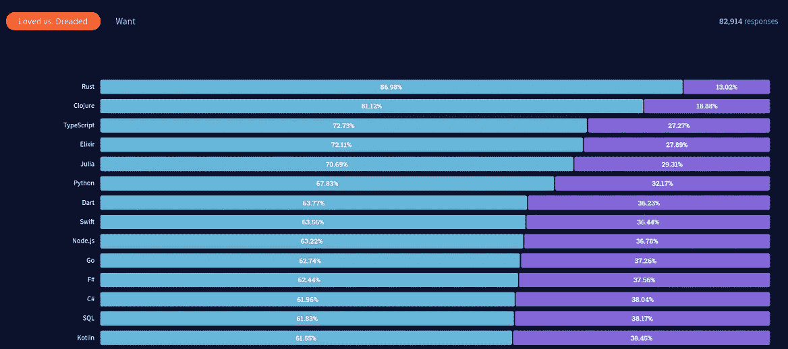
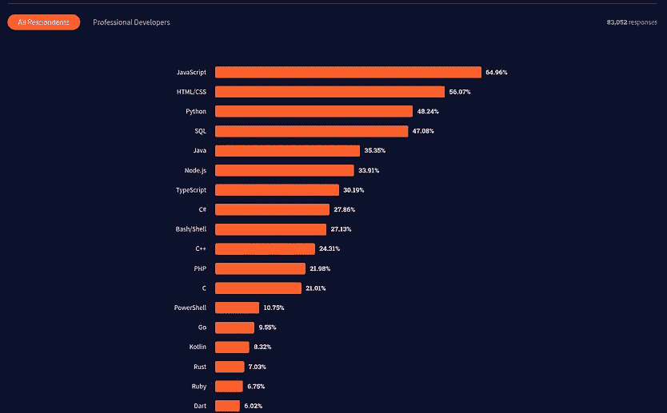

# 为什么你应该在 2022 年学习 Golang

> 原文：<https://levelup.gitconnected.com/should-you-be-learning-go-in-2022-55ea75170cf9>

## 是的，你应该，有很多原因

由 [Flikr](https://www.flickr.com/) 上的 [dotConferences](https://www.flickr.com/photos/dotconferences/) 拍摄的照片

很明显，在编程领域，每年都有突破。程序员总是在寻找新的、更好的、更有效的解决问题的方法。

Golang 就是这样一个突破，由 Google 于 2007 年开发，用于提高多核架构上的编程效率，对于大型代码库非常有用。

自从围棋问世以来，它的受欢迎程度持续上升。

Go 是一种很好的语言，可以增加你的编程技能。以下是它应该成为你技能的一部分的几个原因。

# 强大的核心能力

创建 Go 是为了解决大型可伸缩服务器和大型软件系统的编程问题。Golang 提供了以下功能。

*   快速编译和执行
*   可读性
*   通用语言
*   静态打字
*   不强加面向对象的设计
*   并发
*   伟大的垃圾收集

# 受到开发者的喜爱

使用 Golang 编写代码或希望使用 Golang 编写代码的开发人员数量有了显著增加。

堆栈溢出的快照 [2021 年开发者调查](https://insights.stackoverflow.com/survey/2021#overview)

根据 Stack Overflow 的 [2021 年开发者调查](https://insights.stackoverflow.com/survey/2021#overview)，Go 是开发者使用最多的第 14 种语言，62.74%的受访者喜欢用 Golang 编码。

许多开发人员在面临其他语言的可伸缩性问题时会转向 Golang。它是一种通用语言，可用于软件行业的各个领域。

最近，它在构建 web 应用程序/服务方面的使用有了大幅增长。Go 中有很棒的 web 开发框架: [Gin Gonic](https://gin-gonic.com/) ， [Revel](https://revel.github.io/) ， [Beego](https://beego.vip/) 等等。

# 简单

Go 是一种非常简单的语言。它的语法简单易学。

当你来自面向对象语言如 Java 时，Go 的简单性会让你大吃一惊。Go 没有**类**，因此它**没有强加面向对象的概念**，因此**没有继承**。

Go 的简单性是一个视角的问题，它完全取决于你的编程背景。

如果你来自于 **C** 、 **C++** 或 **Java** 的世界，你会发现 Go 是一种福气，它会带走你所有复杂的概念。

另一方面，如果你一直在用动态类型的语言编写代码，比如 **Python** 、 **Ruby** 或 **Javascript** ，你可能需要一些时间来适应静态类型。

# 多线程和并发

大家都说 **Go 内置并发**。那是什么意思？

计算机硬件比以往发展得更快，越来越多的内核被添加到微处理器中。这些多核系统需要一种编程语言，能够支持并发性，并且能够提升性能。

Go 是多线程的，可以在多个内核上执行并发执行，真正做到并行运行。

# 巨大的机会

尽管 Golang 是一种年轻的语言，但它已经被许多大公司使用，如谷歌、优步、阿里巴巴、Paypal、Soundcloud、Twitch、Medium 等。

由于 Go 的高效性、多线程架构和易用性，它在软件社区中的受欢迎程度越来越高。

# 报酬丰厚

根据 [2020 年黑客等级开发者技能报告](https://research.hackerrank.com/developer-skills/2020)，Golang 开发者的工资比行业平均水平高出 33%。

这是否意味着，如果你知道围棋，你会得到很好的报酬？绝对不行。这可能会让你很容易找到一份很好的工作，也许薪水会更高。

# 自由职业的机会(更高的薪水)

如今，许多开发人员在业余时间兼职做自由职业者。如果你想并行运行一个自由职业者的 side hustle，Go 是一个很好的语言。

根据 Upwork 的统计数据，Golang 开发者的工资是每小时 64 美元。

这对于 Go 开发者来说是一个绝好的机会。这种高速度表明，市场有需求，但没有足够的围棋开发者。如果你学会了 Golang，这将对你有利可图。

# 最后的话

许多未来的程序员倾向于问这样一个问题——“我应该学习哪种语言？”。这篇文章不适合新手。

我已经向新的和有经验的程序员表达了我的观点。我在过去的 12-15 个月里学习了 Golang，并编写了数千行代码。

这种语言很漂亮，容易学习，非常高效，并且易于部署。我肯定会向其他程序员推荐它。

 [## 通过我的推荐链接加入 Medium-Amrit Pal Singh

### 作为一个媒体会员，你的会员费的一部分会给你阅读的作家，你可以完全接触到每一个故事…

singhamrit.medium.com](https://singhamrit.medium.com/membership)