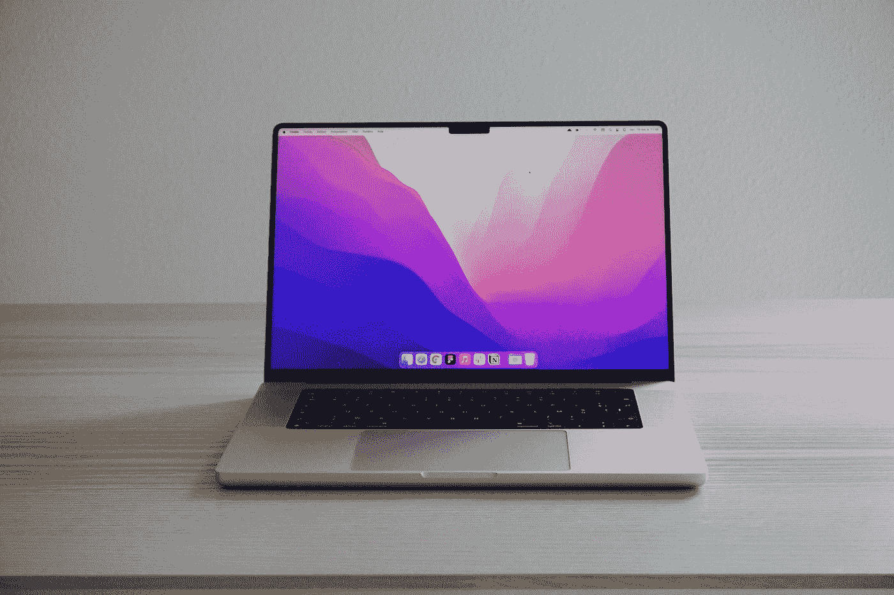
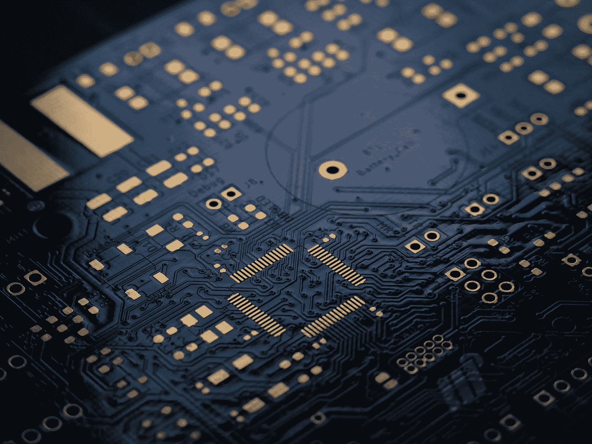
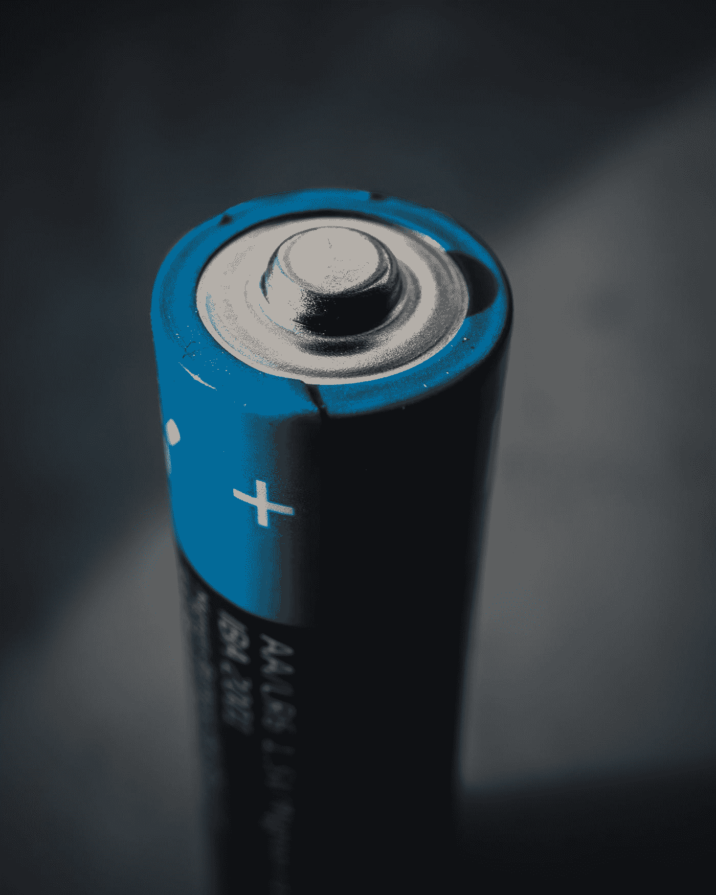
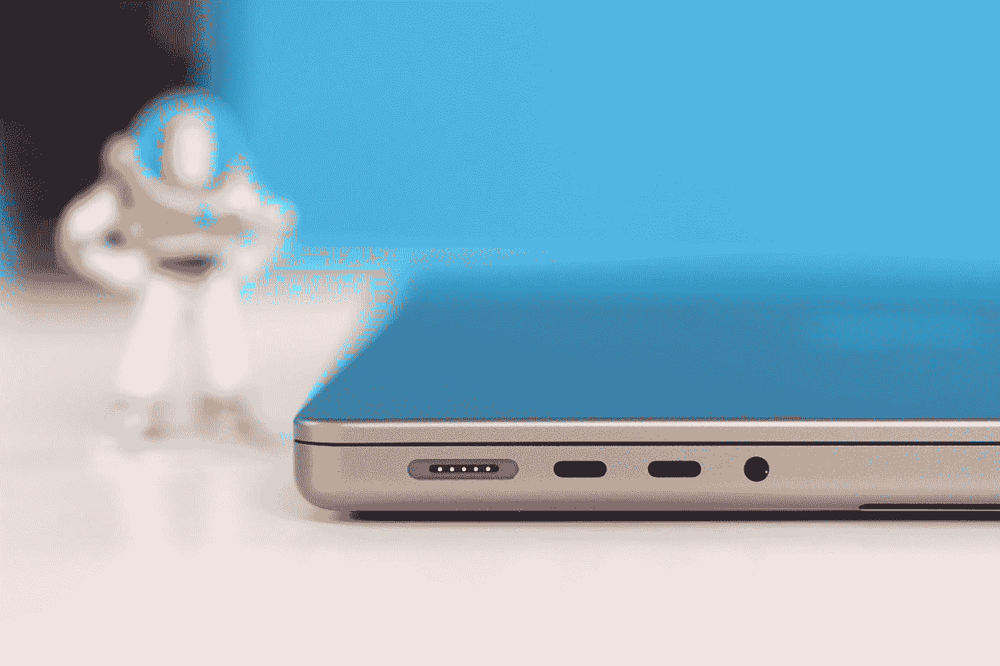
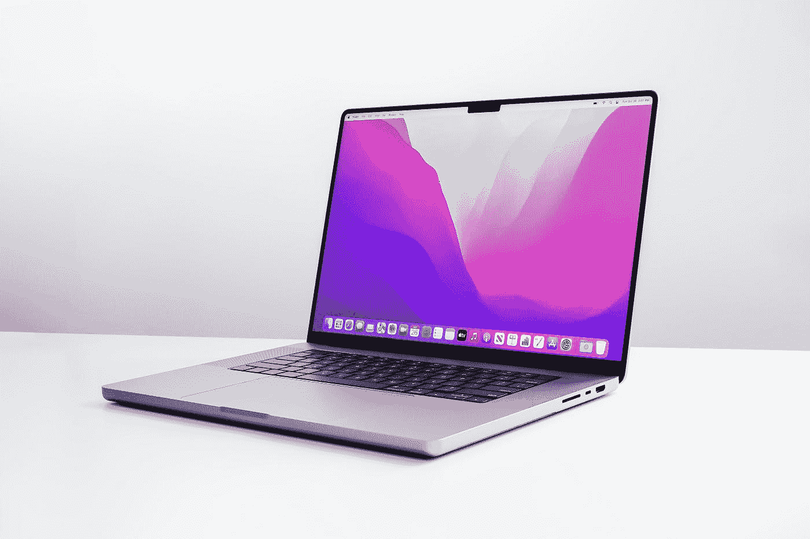

# 购买用于软件开发的 16 英寸 M1 Macbook Pro

> 原文：<https://levelup.gitconnected.com/should-you-buy-the-16-inch-m1-macbook-pro-for-software-development-5ea55ff879ff>

安东尼·乔伦在 [Unsplash](https://unsplash.com?utm_source=medium&utm_medium=referral) 上的照片

## 是的，你应该买基本型的。

我们都知道，作为软件开发人员，在将应用程序部署到云时，Linux 是首选的服务器操作系统。

UNIX 是 MAC 电脑成为软件开发杰出工具的原因。他们的终端使用许多与 Linux 相同的命令，这只是你应该考虑将任何 mac 作为你的下一台开发机器的原因之一。

以下是另外五个原因。

# 苹果电脑经久耐用

MAC 电脑即使在发布多年后仍保持着很高的转售价值。这是有原因的。MAC 电脑将会永远存在，而有了新的 M1 芯片，你将拥有至少五年的足够电力。

照片由[马修·施瓦茨](https://unsplash.com/@cadop?utm_source=medium&utm_medium=referral)在 [Unsplash](https://unsplash.com?utm_source=medium&utm_medium=referral) 拍摄

# M1 芯片是一个野兽。

尽管我目前正在摇动 M1 Pro 芯片，基本模型，**我还没有听到风扇旋转起来。一如既往！**

它运行着一个 web 服务器、一个 react dev 服务器和四个 docker 容器，包括 MySQL 和 Redis 数据库。

这绝对是原始的力量！

Vishnu Mohanan 在 [Unsplash](https://unsplash.com?utm_source=medium&utm_medium=referral) 上拍摄的照片

# 集成内存速度很快

同样，虽然我的 mac 只有 16 GBs 的内存，因为 SSD 非常快，内存与 CPU 无缝集成，但我还没有因为内存问题而变慢。

**交换内存？**当实际内存不足时，操作系统使用 SSD 内存来保持一切顺利运行。

你可以看到，MacOs 正在使用大约 1.58GBs。即使有 swap，内存集成也很快，我没有注意到任何滞后或变慢。

不相信我？如果你问我的 50 多个 Chrome 标签、4 个以上 Docker 容器和开发服务器，它们都同时运行，毫不费力，那就最好了。

照片由[米卡·鲍梅斯特](https://unsplash.com/@mbaumi?utm_source=medium&utm_medium=referral)在 [Unsplash](https://unsplash.com?utm_source=medium&utm_medium=referral) 上拍摄

# 电池寿命惊人

由于 mac 的额外尺寸和我之前谈到的大多数功能，这是迄今为止最高效的 mac，而且由于它几乎不用为开发工作流流汗，电池可以永远使用。

我甚至不在乎忘记带充电器，因为我知道我的 mac 可以用一整天。

在 [Unsplash](https://unsplash.com?utm_source=medium&utm_medium=referral) 上[注册](https://unsplash.com/@theregisti?utm_source=medium&utm_medium=referral)的照片

# 麦格赛弗就是麦格赛弗

你只需要知道这些。

照片由[杰瑞米·贝赞格](https://unsplash.com/@unarchive?utm_source=medium&utm_medium=referral)在 [Unsplash](https://unsplash.com?utm_source=medium&utm_medium=referral) 上拍摄

# 您只需要 16 英寸的显示屏

我可能为选择显示器尺寸苦恼了很长时间。14 对 16？有什么比较便携的？我以后会后悔吗？

我最终选择了 16 英寸的。我在亚马逊团队中的一位睿智的资深 SWE 曾经告诉我，分心的事情越少越好。

他还使用 vim 作为 Java IDE，但我们不会走那么远！

相信我，16 英寸的显示屏非常棒，我以前从来没有这么舒服地编码过。

正因为如此，我还没有感觉到需要连接一个外部显示器。就是那么好。

# 你呢？

无论如何，我希望我使用这台 mac 的经历能帮助你减轻一些关于买什么型号，什么屏幕尺寸，什么 M1 芯片类型的担忧。

如果你有新的 M1 苹果电脑，请在评论中分享你的体验！

敬请关注我对新 Mac Studio 的体验！