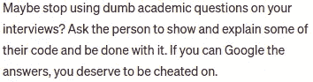

# 你应该在面试中用谷歌搜索吗？

> 原文：<https://levelup.gitconnected.com/should-you-google-in-an-interview-a9a33dfccc49>

## 答案不是二进制！

克里斯蒂娜@ wocintechchat.com 在 [Unsplash](https://unsplash.com?utm_source=medium&utm_medium=referral) 上的照片

疫情改变了整个企业界的工作场所和运作方式。同事之间以及与外界的互动方式受到了影响。

人们已经适应了新的世界，并找到了自己解决问题的方法。物理界限已经消失，互动通过电话和/或视频进行。

像许多公司一样，我们在家工作。说到招聘，我们用视频电话来面试候选人。我从未见过几个在病毒爆发后被聘用的同事。

最近，在一次面试中，我注意到一名候选人有一个隐藏的屏幕，可能是另一台笔记本电脑，他用它来寻找我们提出的问题/难题的答案/解决方案。我猜他的一个朋友在帮他。

我写了下面的故事来描述这一事件:

 [## 我震惊地发现一名候选人在网上面试中作弊

### 我以前听说过这个，但是我第一次经历了

levelup.gitconnected.com](/i-was-shocked-to-catch-a-candidate-cheating-in-an-online-interview-2441fef0ab4) 

# 我收到的关于这篇报道的一些恶评

这个故事是我看得最多的故事之一，有相当多的粉丝，收到了一堆好的和不好的评论。有几个是这样的:

我收到的一些评论

起初，我被这些评论激怒了。然后这些评论让我质疑我的过程。尽管我认为我的方法不是世界上最好的。当然，它并不像一些读者说的那么糟糕。

# 面试是为了评估候选人的能力

面试的主要目的是评估候选人的能力。候选人应该被允许谷歌吗？这完全取决于你在评估什么。

大多数对我的故事发表评论的人说“*谷歌搜索是工作的一部分，如果候选人给你一个解决方案，他就是一个问题解决者*”。我部分同意这一点。

我知道谷歌可以解决很多问题。但是如果候选人只是在网上找到解决方案，然后给你同样的答案，你将如何评估他/她。

在面试中，谷歌一下手头问题中的语法或一些无关紧要的东西是可以的。我发现一名候选人有另一台笔记本电脑，他在上面搜索并复制了他向我们展示的屏幕上的代码。如果有人要这样做，你怎么能评估他/她，这是完全不道德的。

# 在互联网上寻找无法解决的问题

我的一些读者告诉我，我的招聘过程很糟糕，他们也给了我很多好的建议。我已经在这个过程中加入了一些。

其中一些人说，*如果我在网上问一个有解决方法的问题，我活该被骗*。

我不同意这一点。网络上有成千上万的问题有解决方案。即使你自己提出了一个问题，在几次采访中你也会在网上找到解决办法。

我从一个简单的问题开始，然后慢慢地处理那些困难的问题。如果候选人不能解决简单的问题，那就没有必要进入下一阶段。

在这种情况下，候选人正在复制一个非常简单的问题的解决方案，所以我不得不就此打住。

# 这些概念有多重要？

它们非常重要。它们改善你的思维，帮助你更好地编码。

你也可以谷歌一下这些。但是，当你正在解决手头的一项任务时，如果你不知道 OS 和 CS 的基本概念，你将会编写出只能工作的代码，但可能工作效率不高。

因此，如果有人在面试中用谷歌搜索这些概念，这意味着他/她对基础和基本原理的了解非常有限。

# 态度——最重要的品质之一

正确的态度是一个好队友最重要的品质之一。

> *一次错误的雇佣会改变团队动态，让所有人都变得低效。*

你想雇佣一个与团队融合得很好，并且在技能方面与团队互补的人。

如果候选人不诚实，你肯定无法正确评估他/她。如果答案是从网上复制的，我将不得不放弃它。

# 结论

每个人都有权发表自己的意见。我在这篇文章中提出了我的观点，关于什么该谷歌，什么不该谷歌。

下面是另一篇关于招聘和程序员的文章:

 [## 当我雇用开发人员时，我寻找的 5 个最重要的品质

### 我对招聘过程的看法

levelup.gitconnected.com](/5-most-important-traits-i-look-for-when-i-hire-a-developer-7aa557bc4410) 

你觉得面试的时候可以谷歌一下什么？请在评论中分享你的观点。

 [## 通过我的推荐链接加入 Medium-Amrit Pal Singh

### 作为一个媒体会员，你的会员费的一部分会给你阅读的作家，你可以完全接触到每一个故事…

singhamrit.medium.com](https://singhamrit.medium.com/membership) 

感谢阅读！