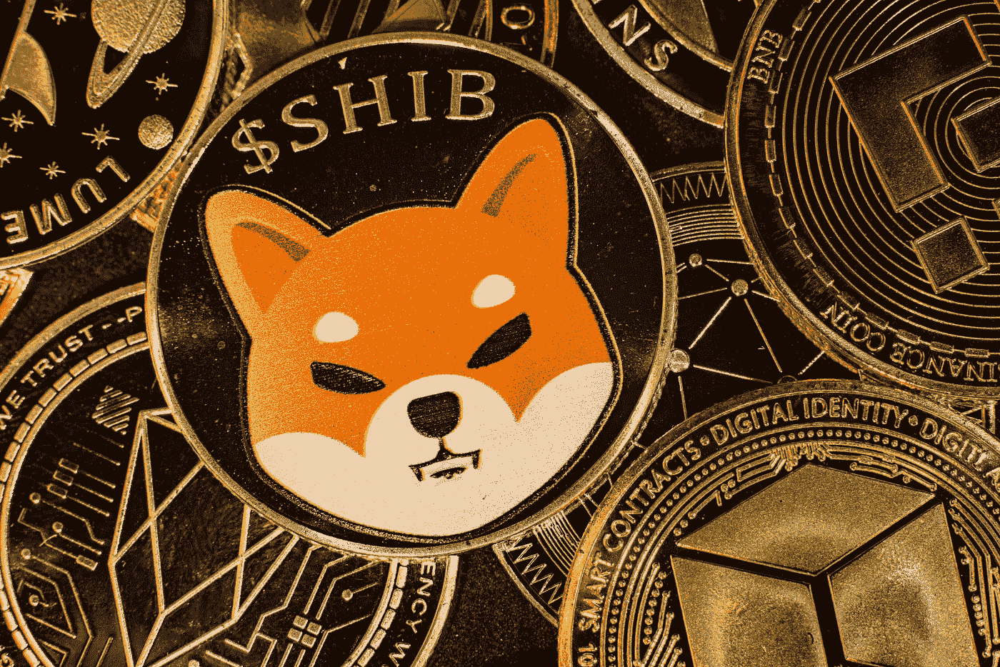
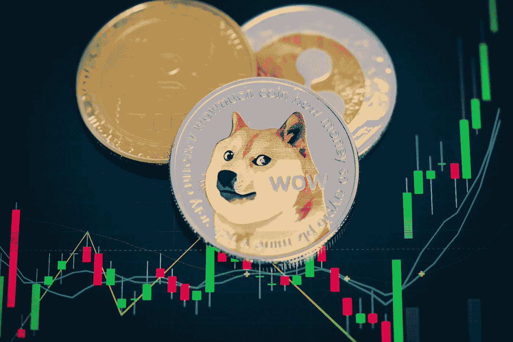

# 你应该投机 SHIB 吗？最新的密码迷因硬币

> 原文：<https://levelup.gitconnected.com/should-you-speculate-on-shib-the-latest-crypto-meme-coin-dc1acf3f6564>

## 又到了扔硬币的愚蠢季节了

图片来自 [Shutterstock](https://www.shutterstock.com/image-photo/horizontal-view-cryptocurrency-tokens-including-bitcoin-2048886704)

我最后一次买彩票，头奖是 1.76 亿这样疯狂的东西。它已经达到了令人头晕目眩的金额，因为几个星期以来没有人赢得头奖，可能是因为匹配所有 7 个号码的荒谬几率。

随着票价一周比一周涨得更大，越来越多的人决定买一张更快更高的票。

当它达到 1000 万甚至 1 亿时，这似乎还不足以改变生活。然而，一旦超过 1.7 亿，大多数人都不能冒险让*没有*的票——以防万一。

同样的心理似乎也适用于另类硬币和迷因硬币——加密货币最具投机性和幻想性的一面。大多数购买另类硬币的人害怕错过，不是因为他们对项目的基本面有很大的信心或信念。

这可能有助于解释今年早些时候的 Dogecoin，以及柴犬(SHIB)和弗洛基犬(弗洛基)等另类硬币的现状。这些迷因币的持有者正经历着与今年早些时候 DOGE 类似的令人兴奋的每周增值。

这是一种以前见过的模式。加密货币日历上的一个常规特征是 1 月份的抛售，以筹集税款。

一旦这些加密产品形成了一点势头，吸引了一批投资者(投机者)，它们的价值就开始飙升。其他人听说了最新的迷因，也许一些 Twitter 影响者对此感兴趣。

埃隆甚至可能会顺便提及这枚硬币——他的暗示往往足以让旁观者相信他拥有几十亿美元，并进一步推高价格。

在某些日子里，价格会上涨 10 倍，有时还会暴跌。但是更多的人加入进来，害怕在他们的投资组合中没有一点点资产。价格还会上涨。

硬币的持有者最终会陷入某种投资者的墨西哥僵局——没有人想成为最后一个站着(或持有)的人。但是什么时候卖呢？

许多人认为*所有的*加密货币都是泡沫。至少在另类硬币的情况下，这似乎是正确的。

但这真的是一件坏事吗？

# 碰碰运气有什么坏处？

如果有人给你一个赛马的热门提示——一个局外人不知何故被给予 200 比 1 的胜算，你会愿意为了轻松的一千美元而拿 5 美元冒险吗？

如果你的彩票为一张 2 美元的彩票提供了上亿的机会，你会冒险吗？

同样的心理也适用于另类硬币。这当然是我采取的方法。完全公开——我最近做了几笔这样的投机性投资。

*这不是我投资策略的主要部分
我不相信 SHIB 会成为下一个比特币
我不相信它有长远的未来
我还没有投资超过我能承受的损失*

但我无法忍受在未来，当它的价格上涨时，我知道我就在附近，并且想到无论发生什么，我都不会在至少 50 美元上下注。我怀疑还有很多人和我一样。

随你怎么说——机会主义、贪婪或天真。这是由 FOMO 推动的投资——但是，大多数投资不都是这样吗？

图片来自 [Shutterstock](https://www.shutterstock.com/image-photo/focus-select-blur-dogecoin-cryptocurrency-silver-1965542140)

# 秘密精英讨厌另类硬币

有很多人对另类硬币不屑一顾，不仅是加密货币世界以外的人，还有加密货币世界里的人。许多人认为他们给可信的加密技术如比特币和以太坊带来了坏名声。他们认为，替代硬币引起了监管机构不受欢迎的关注，监管机构认为它们对喜欢快速致富计划的易受骗公众构成了威胁。他们认为，在那些已经愤世嫉俗的人眼中，另类硬币淡化了加密货币的优点。

这些反对意见在某种程度上都是有道理的。

但在我看来，另类硬币也有其优点——不是作为比特币真正可信的替代品(名不副实)，而是作为一个概念上的入口，将人们引入加密生态系统，并介绍他们进入区块链世界。作为一种投机性和高风险的投资，它们也是有效的——即使它们背后没有什么实质内容。

让我们面对现实吧——许多传统公司的估值被炒作和投机夸大了。也不全是基本面做后盾。随着特斯拉超过 1 万亿美元的公司估值，这一价值的很大一部分是由公司*可能* *做*的事情以及它*未来可能成为*的事情所驱动的。毫无疑问，这一估价是基于某种东西——持续的创新和令人满意的电动汽车的制造。但这不仅仅是已经完成的销售、已经存入银行的资金和已经发生的创新的反映。

Alt-Coins(也称为 Sh*t-Coins)可能会在白皮书和宣传材料中陈述其目的，但很少有人会质疑其主要目的是作为投资工具创造价值和利润。创造出来后，投资者把它们卖给其他投资者，其他投资者也这样做。每个人都希望价格逐渐上涨，每个人都能获利。

# 热恋 SHIB

我每天都听 Coindesk 的“The Breakdown”播客——它主要关注比特币和宏观经济，但最近——也许是反映了时代——他们做了一集关于 SHIB 的节目，并总结了 14 个热门话题。如果你想更全面地了解 SHIB 和另类硬币，这本书值得一听。

这有助于解释另类投机者的心态——至少在我自己的案例中是这样的:

## “你本可以成为亿万富翁，如果……”

这是我经常对比特币的感受。当然，我第一次投资的时候，价格还不到现在的一半，我持有的股票正在盈利。但在过去，我考虑过购买比特币，但后来就不再考虑了，因为我懒得去想如何购买。那是在一枚比特币价值几美元的时候。今天，我本可以比现在过得更好(T2)

我迫切希望不要再犯同样的错误。

我不相信成为亿万富翁甚至百万富翁是生活中所有问题的答案。但是，如果能以不到 100 美元的价格买到几百万个 SHIB、弗洛基或其他什么东西，并有机会登上月球，我为什么不呢？

如果它变为零，那也没关系——我是睁着眼睛投资的，除了我自己，我不能责怪任何人。但如果成功的话，我可能会赚一大笔。考虑一下早期采用者，他一开始在 SHIB 投资了几千美元，现在已经是亿万富翁了:

来源:[推特](https://twitter.com/MorningBrew/status/1453445533754855433?s=20)

## “如果它只值一美元…”

最近几周，我一直在为自己的这种想法感到内疚。

每买一枚备用硬币，我都确信自己有一百万枚或更多。对于备用硬币来说，一切都是零。

许多像 SHIB 这样的替代硬币定价为 0.00001 美元或更少。像我这样的投机者梦想着有一天他们的价值会以某种方式增加 10 倍。有一天，它们可能会变成 1 便士、10 美分甚至 1 美元。

这在现实中似乎是一个幻想，但当你看着它们的价值每天翻倍，有时甚至超过这一数字时，这似乎也是可行的。同样的情况再持续几个月，也许大部分前导零可能会消失！

我们人类不擅长思考庞大的数字。

许多另类硬币项目发行了千万亿枚代币，这显示了将它们的价格提高到每单位一美元所需的价值增长。就 SHIB 而言，这一价格将使其市值超过全球其它所有资产。每枚硬币一美元似乎不太可能。

但事情是这样的——对于像我这样的普通人来说，数十亿或数百万的回报是不错的，但在这一点上我们会满足于少得多的回报。

从 100 美元的投机投资中获得的几百美元可以支付我家的圣诞节费用。几千块就能付清我的车款。
几万美元可能意味着我可以提前还清抵押贷款。

据我所知，这样的回报不太可能来自任何其他短期投资——当然也不可能来自传统金融体系愿意为储蓄提供的 0.01%的利息。

在你提醒我复利和逐步投资的长期力量之前，我在我的养老金和市场跟踪基金中都这么做了——我在这里说的是投资和投机的短期可能性。

## 市场虚无主义

这最后一个让我产生共鸣的热门话题是最重要的。

另类硬币和迷因硬币仅仅是现代情感的体现吗？许多人是否越来越怀疑努力工作 40 年，逐渐攒钱，享受漫长而幸福的退休生活，享受我们的劳动成果的可能性？我想是的。

很明显，全球经济陷入了各种各样的困境。

美国正在不断提高其债务上限，每次高达数万亿美元——它的国债永远也不会*得到偿还。英国等其他发达国家的情况也一样糟糕。*

发展中国家欠美国和其他类似国家的债——他们的债务也不会流向任何地方。

与此同时，政府继续通过印更多的钱来刺激经济，并把钱送给那些被认为“太大而不能倒”的企业和经营这些企业的亿万富翁(并对他们的天文数字收入少缴税)。富人越来越富，而通货紧缩会照顾我们其余的人。

与此同时，随着最富有的人拿着他们的刺激支票投资于市场以变得越来越富有，股票市场正在飙升。与此同时，最贫穷的人为残羹剩饭而战，希望或许能留出几百美元以备不时之需，因为他们知道，即使是一场阵雨，他们也几乎没有生还的机会，更不用说一场暴风雨了。

那些投资或投机另类硬币的人可能纯粹是出于对缺乏其他可信选择的绝望。也许他们已经对提供给他们任何现实选择的传统体系失去了希望。

也许人们只是厌倦了虚伪和一个只允许富人致富的制度。另类硬币可能只是对这一点的反叛。

# 幻想和奇思妙想

长期以来，彩票一直被描述为对穷人的征税，因为似乎最贫穷的人最有必要购买彩票，以期赢得改变人生的大奖。这是他们实现美国梦(或英国梦，或任何其他梦想般的财务自由状态)的唯一真正希望。像, [r/WallStreetBets 和 GameStop](https://themakingofamillionaire.com/the-gamestop-and-wallstreetbets-episode-has-helped-normalise-bitcoin-133bbcc00192) 这样的运动，就像 Alt-Coins 和 Meme-Coins 一样，可能代表了那些想要分享财富但对传统投资没有信心的人的一线希望。

那些愿意为潜在的改变人生的收益而冒几美元风险的人(比如我)可能出于希望和绝望而购买比特币，希望获得巨大的收益。

这可能就像购买一家境况不佳的电脑游戏零售商的股票，并寄希望于一群网上投资者能够推高股价，并执行卖空操作一样不切实际。

这可能就像寄希望于一张赔率为 139，838，160 分之一的彩票一样异想天开——这是我前面提到的赢得英国欧洲百万彩票头奖的机会。

见鬼，购买哪怕一股特斯拉股票，希望其价格继续升值，这可能也是一种空想。

我会继续投机另类硬币，不管它值不值得。我在赌我能承受的损失，这当然不是我投资策略的主要部分。

但这是我计划中唯一一部分(也许除了我对比特币的持续投资，以长期持有它)提供了改变生活收益的最微小可能性。

嗯，还有买彩票。

*如果你喜欢阅读这样的故事，并且愿意支持 Medium 上的作家，考虑注册成为 Medium 会员。一个月 5 美元，给你无限的故事。如果你注册使用我的链接，我会赚一小笔佣金。*

 [## 通过我的推荐链接加入灵媒——托比·黑兹伍德

### 作为一个媒体会员，你的会员费的一部分会给你阅读的作家，你可以完全接触到每一个故事…

tobyhazlewood.medium.com](https://tobyhazlewood.medium.com/membership) 

注:*本文仅供参考。不应将其视为财务或法律建议。在做任何重大财务决定之前，先咨询财务专家。*

## 如果你喜欢这篇文章，我希望你能加入我的电子邮件列表。