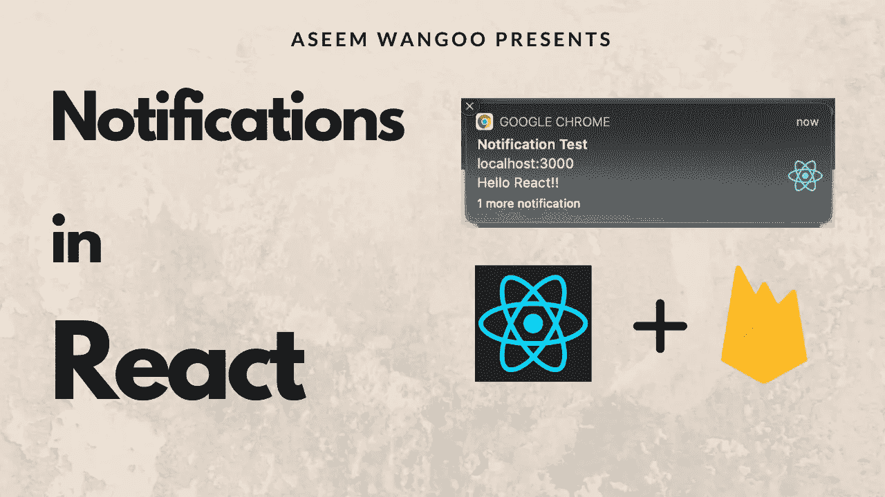
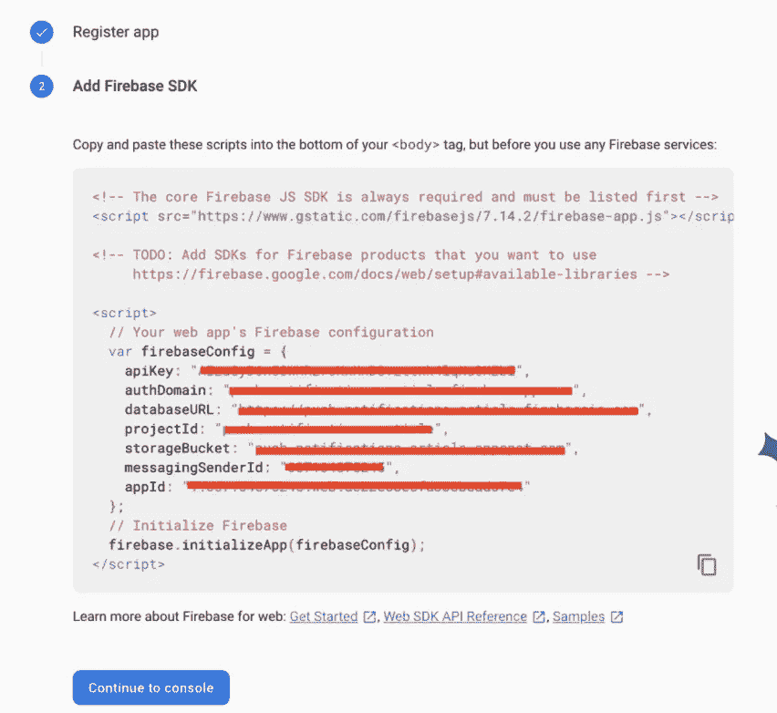
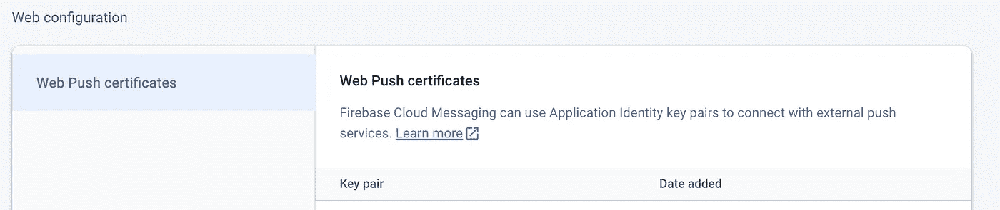
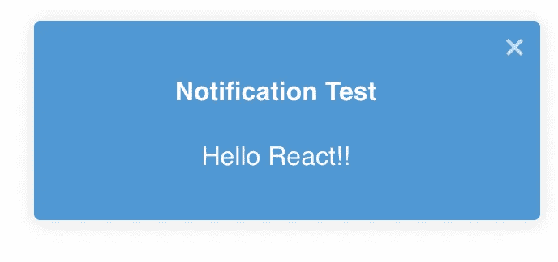
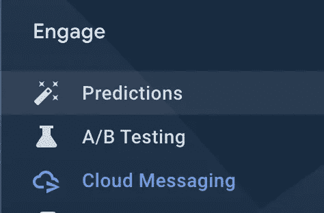
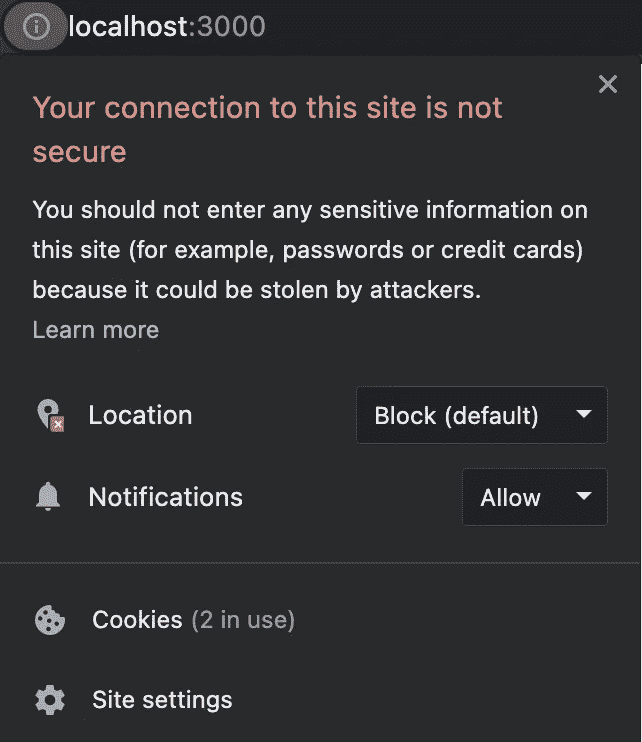
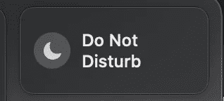
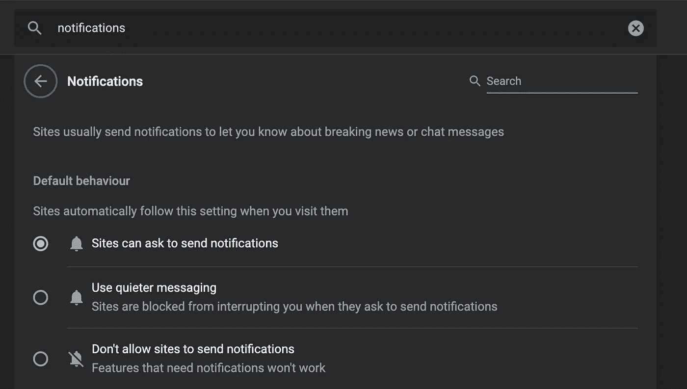
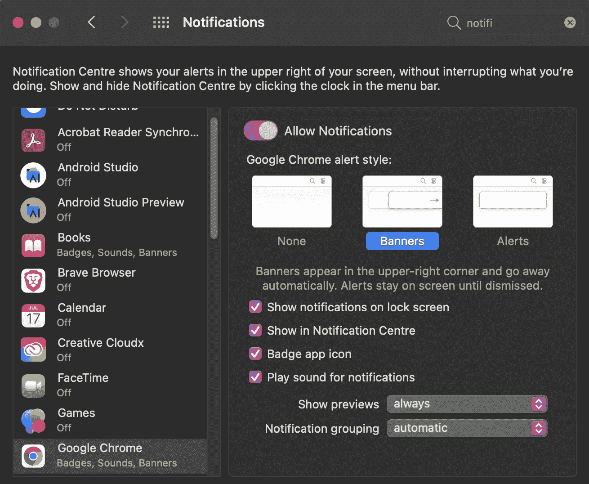

# 在 React 中显示推送通知

> 原文：<https://levelup.gitconnected.com/show-push-notifications-in-react-449949e98e01>

*在 React 中显示推送通知*

*文章在此:*[*https://flatteredwithfutter . com/show-push-notifications-in-react/*](https://flatteredwithflutter.com/show-push-notifications-in-react/)

> **先决条件**:这篇文章假设读者了解 Firebase

在 React 中显示推送通知

我们将经历以下步骤

1.  在 Firebase 中注册 web 应用程序
2.  在 React 中设置 Firebase 配置
3.  集成到用户界面
4.  测试通知
5.  (**可选**)如果通知没有出现



在 React 中显示推送通知

# 在 Firebase 中注册 web 应用程序

登录 Firebase [控制台](https://console.firebase.google.com/u/0/)，点击**添加项目**。按照步骤添加项目。


向 Firebase 注册应用程序

注册应用程序后，您会看到以下页面。



配置页面

我们将在下一步中需要这种配置。

# 在 React 中设置 Firebase 配置

**该步骤分为以下子步骤。**

1.  使用以下命令在项目中安装 firebase 依赖项

```
npm install firebase
```

2.在我们的项目中，我们将配置 firebase。创建一个名为 **firebaseInit.js 的文件(**名称可以是您想要的任何名称)。

在该文件中，添加以下几行

```
import firebase from 'firebase/app';
import 'firebase/messaging';// For Firebase JS SDK v7.20.0 and later, measurementId is optional
const firebaseConfig = {
  apiKey: "YOUR_API_KEY",
  authDomain: "YOUR_AUTH_DOMAIN",
  projectId: "YOUR_PROJECT_ID",
  storageBucket: "YOUR_STORAGE_BUCKET",
  messagingSenderId: "YOUR_MESSAGING_SENDER_ID",
  appId: "YOUR_APP_ID",
  measurementId: "YOUR MEASUREMENT ID"
};firebase.initializeApp(firebaseConfig);
```

> 注意:上述配置可以在你的 firebase 项目中找到(在**项目设置**下或者从**步骤 1** 中)

3.在这个文件中，我们将集成云消息传递。但是在开始之前，我们需要一个名为**的乏味的键**

## 乏味的钥匙

根据文件记载

> FCM Web 界面使用名为“自愿应用服务器识别”或“VAPID”密钥的 Web 凭证来授权向支持的 Web 推送服务发送请求。

这个密钥可以通过 Firebase 控制台从现有的密钥对中生成或导入。

1.  打开 Firebase 控制台**设置**窗格的[云消息](https://console.firebase.google.com/project/_/settings/cloudmessaging/)选项卡，滚动到 **Web 配置**部分。
2.  在 **Web 推送证书**选项卡中，复制**密钥对**(下面截图中的 LHS 值)



乏味的钥匙

> 有关密钥格式以及如何生成密钥的更多信息，请参见[应用服务器密钥](https://developers.google.com/web/fundamentals/push-notifications/web-push-protocol#application_server_keys)。

回到我们的 **firebaseInit.js，**添加这些行

```
const messaging = firebase.messaging();const { REACT_APP_VAPID_KEY } = process.env
const publicKey = REACT_APP_VAPID_KEY;
```

## 通知权限

在向浏览器发送推送通知之前，我们首先需要获得用户的许可。这由 firebase 提供的`getToken`方法来处理。

```
export const getToken = async (setTokenFound) => {
  let currentToken = ''; try {
    currentToken = await messaging.getToken({vapidKey: publicKey}); if (currentToken) {
      setTokenFound(true);
    } else {
      setTokenFound(false);
    }
  } catch (error) {
    console.log('An error occurred while retrieving token.', error);
  } return currentToken;
};
```

*   如果用户没有被授予通知权限，方法`[getToken](https://firebase.google.com/docs/reference/js/firebase.messaging.Messaging#getToken)` 将向用户请求通知权限。否则，它会返回一个令牌或由于错误而拒绝承诺。
*   我们把上一步的无趣的密钥传给`getToken`

> 获得令牌后，使用您喜欢的方法存储它，在我们的例子中，**我们只需登录控制台**。

## 设置监听器(前台和后台)

当应用程序在**前台**处于活动状态时，我们需要将这段代码添加到`firebaseInit.js`文件中，这样我们就知道通知已经收到

```
export const onMessageListener = () =>
  new Promise((resolve) => {
    messaging.onMessage((payload) => {
      resolve(payload);
    });
  });
```

## 后台监听器

在页面在背景中或者隐藏在其他标签后面的场景中，我们需要处理`[onBackgroundMessage](https://firebase.google.com/docs/reference/js/firebase.messaging.Messaging#onbackgroundmessage).`

*   我们通过在 react 应用程序的公共文件夹中添加一个`firebase-messaging-sw.js` **服务人员**文件来实现这一点。添加以下几行

```
importScripts("[https://www.gstatic.com/firebasejs/8.2.0/firebase-app.js](https://www.gstatic.com/firebasejs/8.2.0/firebase-app.js)");
importScripts("[https://www.gstatic.com/firebasejs/8.2.0/firebase-messaging.js](https://www.gstatic.com/firebasejs/8.2.0/firebase-messaging.js)");const firebaseConfig = {
  apiKey: "YOUR_API_KEY",
  authDomain: "YOUR_AUTH_DOMAIN",
  projectId: "YOUR_PROJECT_ID",
  storageBucket: "YOUR_STORAGE_BUCKET",
  messagingSenderId: "YOUR_MESSAGING_SENDER_ID",
  appId: "YOUR_APP_ID",
  measurementId: "YOUR MEASUREMENT ID"
};firebase.initializeApp(firebaseConfig);
```

*   前两条 import 语句基本上下载了服务人员所需的 firebase 库。
*   接下来，我们使用 firebase config 配置我们的 firebase 应用程序(参见上面的步骤或您的 firebase 项目)
*   最后，我们处理服务工作者文件中的`onBackgroundMessage`

```
const messaging = firebase.messaging();messaging.onBackgroundMessage(function (payload) {
  console.log("Received background message ", payload); const notificationTitle = payload.notification.title;
    const notificationOptions = {
      body: payload.notification.body,
      icon: "/logo192.png",
  };return self.registration.showNotification(
    notificationTitle,
    notificationOptions
  );
});
```

# 集成到用户界面中

到目前为止，我们设法在 react 应用程序中配置了 firebase。现在，我们将看到如何在我们的 UI 中集成消息传递。

*   在我们的`App.js`中，我们导入文件`firebaseInit.js`并实现`onMessageListener`

```
const [show, setShow] = useState(false);
const [notification, setNotification]=useState({title:"",body:""});onMessageListener()
   .then((payload) => {
      setShow(true);
      setNotification({
        title: payload.notification.title,
        body: payload.notification.body,
      });
      console.log(payload);
   })
.catch((err) => console.log("failed: ", err));
```

> 注意:我们使用 [useState](https://reactjs.org/docs/hooks-state.html) 钩子，它决定何时显示通知。

*   接下来，我们创建一个名为`Notifications.`的组件，这个组件主要负责从浏览器获取令牌。

```
const Notifications = (props) => {
  const [isTokenFound, setTokenFound] = useState(false);                  console.log("Token found", isTokenFound); useEffect(() => {
    let data; async function tokenFunc() {
      data = await getToken(setTokenFound);
      if (data) {
        console.log("Token is", data);
      }
      return data;
    } tokenFunc();
  }, [setTokenFound]); return <></>;
 };export default Notifications;
```

在这里，我们调用`getToken`函数，它是在`firebaseInit.js`中定义的。一旦我们获得令牌，我们就将它记录在控制台中。

> 注意:我们使用 [useEffect](https://reactjs.org/docs/hooks-effect.html) 钩子，因为我们不想重复调用 getToken。

*   最后，我们创建另一个名为`ReactNotificationComponent`的组件，当应用程序在前台时，它基本上显示通知。

```
import { ToastContainer, toast } from "react-toastify";
import "react-toastify/dist/ReactToastify.css";const ReactNotificationComponent = ({ title, body }) => {
  toast.info(<Display />); function Display() {
    return (
      <div>
        <h4>{title}</h4>
        <p>{body}</p>
      </div>
    );
  } return (
    <ToastContainer />
  );
};
```

这基本上显示了使用库[**react-toastify**](https://www.npmjs.com/package/react-toastify)**的通知。**我们从`App.js`传入参数、标题和正文



前台通知显示

# 测试通知

通过以下方式开始您的 react 项目

```
npm run start
```

在你的 firebase 控制台中，进入应用程序的**云消息**部分



云消息传递

1.  点击按钮**发送第一条消息**。
2.  输入通知标题和文本。
3.  选择**发送测试信息**。
4.  在标记为**Add a FCM registration token**的字段中，输入您从上一步获得的注册令牌。
5.  点击**测试**

在你点击**测试**之后，你的应用应该会在浏览器中收到通知。

# 如果通知没有出现


有些时候，事情不工作，因此这部分存在。如果通知对您不起作用，您可以检查以下几点(**对于 macOS** ):

*   检查浏览器中的通知权限。通知应设置为**允许**



浏览器通知权限

*   您的**请勿打扰**应该关闭



请勿打扰

*   转到 chrome 设置，搜索通知，验证是否选择了选项**站点可以要求发送通知**。



Chrome 设置

*   打开 Spotlight 搜索，进入**系统首选项- >通知中心设置。**检查 Chrome 的通知是否打开



通知中心设置

*   通知显示两次，为此我们需要从我们的`index.js`中移除 React.strictMode。参考[连杆](https://stackoverflow.com/questions/66263996/react-app-my-alert-window-is-showing-up-twice)。

> 如果有其他选择，请在评论区告诉我，我会更新这一部分。:)

其他文章:

[](/i-tried-react-in-2021-here-are-my-thoughts-51256e6f595d) [## 我在 2021 年试过 React。以下是我的想法

### 以下是我从 React 中学到的 5 个要点。

levelup.gitconnected.com](/i-tried-react-in-2021-here-are-my-thoughts-51256e6f595d) [](/fade-in-out-text-in-react-fa8fc7a2a0b1) [## React 中的淡入淡出文本

### 如何在 react 中淡入淡出文本

levelup.gitconnected.com](/fade-in-out-text-in-react-fa8fc7a2a0b1) [](/deploy-react-and-aws-amplify-1db36c625d73) [## 部署 React 和 AWS Amplify

### 部署 React 和 AWS Amplify

部署 React 和 AWS Amplifylevelup.gitconnected.com](/deploy-react-and-aws-amplify-1db36c625d73) 

```
*Hosted URL:* [*https://funwithreact.web.app/*](https://funwithreact.web.app/)[*Source code*](https://github.com/AseemWangoo/expriments_with_react)
```