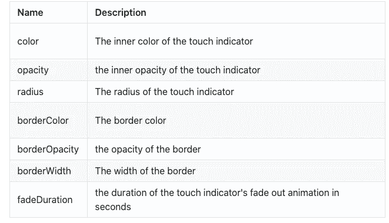
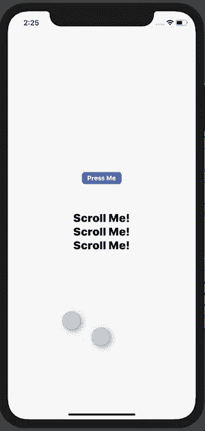
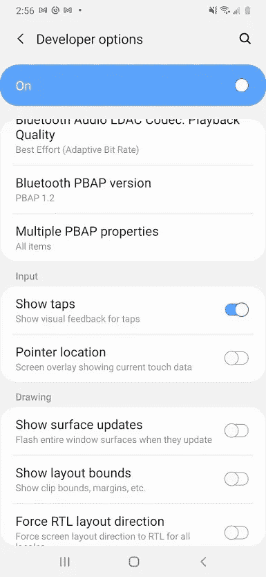

# 在 React Native 中显示触摸

> 原文：<https://levelup.gitconnected.com/show-touches-in-react-native-201bfc3e50c1>


克劳迪奥·施瓦茨在 [Unsplash](https://unsplash.com?utm_source=medium&utm_medium=referral) 上拍摄的照片

## 添加下一个 React 原生应用演示所需的触摸指示器的所有选项

到了展示你努力构建的应用程序的时候，你的演示材料要尽可能的清晰和精美，这一点很重要。这就是触摸指示器的用武之地，它允许用户在屏幕记录中轻松跟踪应用程序的交互，就像这样:


带触摸指示器的屏幕录制(使用 react-native-show-touches-ios)

您有多种选择来将此功能添加到 React 本机应用程序，从可定制的库到设备设置。让我们看看每种方法以及如何实现它们！

## 选项 1:反应-原生-显示-触摸-ios

*完全可定制，但仅限于 iOS 设备和模拟器*

这个 npm 包允许你在真实的 iOS 设备和 iOS 模拟器上显示可定制的触摸指示器。为了使用它，你首先需要使用`yarn add react-native-show-touches-ios`或`npm install react-native-show-touches-ios --save`安装包，并在你的 iOS 目录中运行一个`pod install`。安装后，您将可以访问一个`<ShowTouches>`组件，您可以导入并使用它来包装您的根组件:

```
import ShowTouches from "react-native-show-touches-ios";

// Wrap your root component to show default touch indicators
const App = () => {
  return (
    <ShowTouches>
      <SafeAreaView style={styles.container}>
        {/* Your app... */}
      </SafeAreaView>
    </ShowTouches>
  );
};
```

开箱即用，这将为 iOS 设备上的所有触摸显示以下蓝色触摸指示器，同时您的 UI 继续按预期运行:


react-native-show-touches-ios 使用的默认指示器

您还可以使用`<ShowTouches>`组件上的以下道具定制指示器的颜色、不透明度、大小和动画:



<showtouches>道具</showtouches>


使用 color="red "，borderColor="orange "和 radius={20}进行自定义

需要注意的是，当在使用 *react-navigation* 的应用中使用 react-native-show-touches-ios 时，你必须遵循 react-navigation 关于使用[react-native-gesture-handler](https://docs.swmansion.com/react-native-gesture-handler/docs/)的[说明，以便你的 UI 继续按预期运行。您可以像往常一样将根组件包装在一个`<ShowTouches>`组件中；如果你使用`<ShowTouches>`后，你的按钮似乎不再能够在使用 react-navigation 的应用程序中接收触摸，最常见的原因是未能正确使用 react-native-gesture-handler。](https://reactnavigation.org/docs/getting-started/)

你可以在这里的软件包文档中找到关于[react-native-show-touches-IOs](https://github.com/michael-kiley-verified/react-native-show-touches-ios)的完整说明。

这个包为演示中显示触摸的问题提供了一个灵活易用的解决方案；然而，它的局限性在于，它只能在 iOS 设备上显示触摸指示器。接下来，我们将看看您显示这些指标的其他选项，包括一个将涵盖 Android 用例的选项。

*完全披露:我写了 react-native-show-touches-ios，所以如果对你有用，请随意鼓掌，或者如果你有任何问题，请留下评论！*

## 选项 2: iOS 模拟器设置

*允许你在没有外部依赖的情况下在 iOS 模拟器上显示触摸；但是只能在 iOS 模拟器上工作，不可定制*

您可以通过打开终端并运行`defaults write com.apple.iphonesimulator ShowSingleTouches 1`在 iOS 模拟器中显示触摸指示器。

运行此命令后，重新启动模拟器并运行应用程序，将会显示如下触摸指示器:



使用 iOS 模拟器显示的指示器

您可以通过从终端运行`defaults write com.apple.iphonesimulator ShowSingleTouches 0`并重启模拟器来再次关闭此设置。

这种方法很好，因为它不涉及代码更改或外部依赖，但非常有限，因为它只能在模拟器上运行，并且不可定制。

## 选项 3: Android 设备设置

*显示无外部依赖的 Android 设备和仿真器上的触摸指示器，但不包括 iOS 用例，并且不可定制*

Android 为开发人员提供了一个设备设置，允许他们在 Android 模拟器和真实设备上显示触摸指示器。要打开它，您必须首先激活开发人员模式。要激活开发者模式，打开 Android 设备或模拟器上的**设置**，向下滚动到**关于手机；对我来说，这是最差的。**在“关于手机”中，再次滚动到底部——您应该会在那里看到一个**内部版本号**部分。重复点击此内部版本号(7+)次将为您的设备激活开发者模式；成功激活后，您将会看到一个警报。

一旦开发者模式被启用，你将在主设置页面上有一个名为**开发者选项**的新部分。“开发人员选项”包含各种控制和自定义开发人员体验的设置，按类别分组。在**输入**类别中，你会发现一个开关来切换**显示点击:**



为 Android 设备打开显示水龙头

启用此设置将导致所有触摸都以小灰色指示器显示，如下所示:


Android 上显示的触摸指示器

如果你在手机或模拟器上找不到你需要的特定设置，我发现最简单的方法是使用设置搜索栏——首先我搜索 **Build Number** 来打开开发者模式，然后我搜索 **Show Taps** 来找到特定的设置切换。

这就包含了在 React 原生应用中显示触摸指示器的三个选项！如果使用 react-native-show-touches-ios，您可以自定义您的指示器的外观，并在真实的 iOS 设备上运行；iOS 和 Android 也提供了允许触摸指示器的系统设置，尽管这些选项在灵活性上更受限制。

如果我错过了什么好的选择，一定要让我知道！

## 资源

[react-native-show-touches-IOs](https://github.com/michael-kiley-verified/react-native-show-touches-ios)