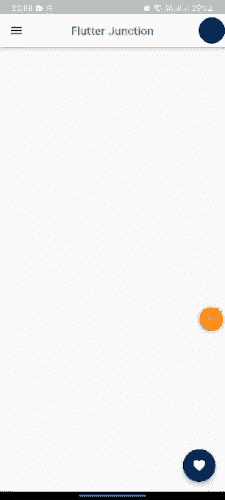
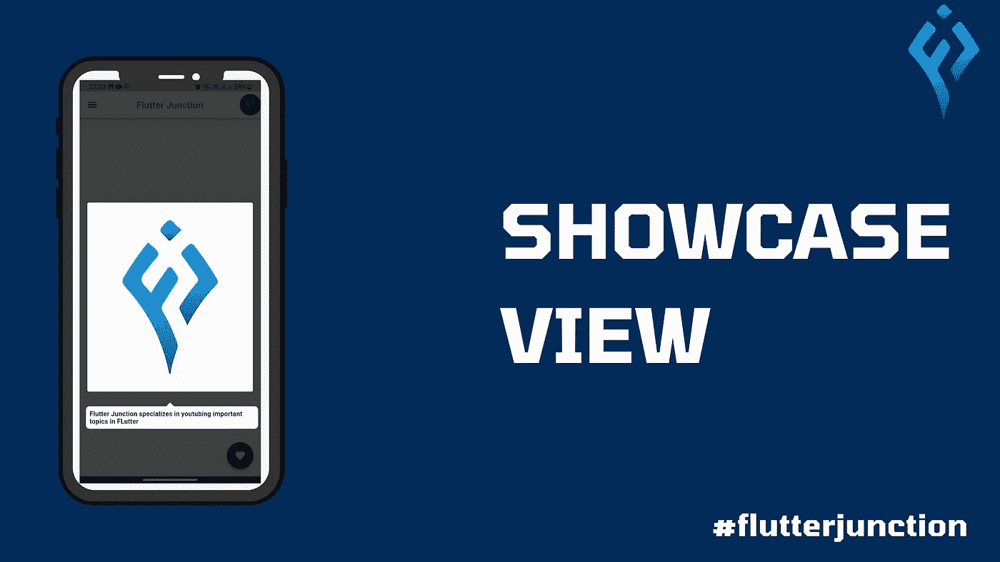

# 飘动中的橱窗

> 原文：<https://levelup.gitconnected.com/showcase-in-flutter-ce13f82ffbe7>

当用户可以轻松导航和浏览应用程序的功能而没有任何问题时，应用程序的 UI 就非常棒。减少摩擦，让用户体验更好的最好方法之一就是突出和展示你的应用程序中必不可少的部分。当用户第一次启动你的应用或者有重要的更新和新功能时，这特别有用。

[Showcaseview](https://pub.dev/packages/showcaseview) 是一个可定制且易于实现的包，你可以用它向你的用户展示你的 Flutter 应用程序最重要的特性。在 Showcase 和 ShowCaseWidget 的帮助下，我们可以在 Flutter 应用程序中展示这个特性。

# 最终应用



飘动中的橱窗

从演示中可以看到，当您在主页上运行应用程序时，showcase 会立即实现。然后当用户按下屏幕时在不同的橱窗中导航。

颤振中的展示视图

## 让我们开始吧

**第一步:添加依赖关系**

首先，将依赖项添加到**publibsec . YAML**文件中

```
dependencies:
  flutter:
    sdk: flutter
  showcaseview: ^2.0.0+1
```

**第二步:将资产添加到 pubsec.yaml 文件**

```
assets:
  - assets/
```

**第三步**:运行**颤振包获取根目录下的**

在 YAML 文件的所有配置之后。您需要在代码中相应地实现它。

在为单个小部件实现展示之前，您需要用一个 **ShowCaseWidget 包装展示展示展示的页面。**由必需的`builder`参数组成，包含返回我们**主页**的构建器小部件。

```
 @override
  Widget build(BuildContext context) {
    return MaterialApp(
        title: 'Flutter ShowCase',
        theme: ThemeData(
          primaryColor: const Color.fromRGBO(4, 43, 89, 1),
        ),
        debugShowCheckedModeBanner: false,
        home: ShowCaseWidget(
            builder: Builder(builder: (context) => const HomePage())));
  }
```

现在，在 lib 文件夹中创建`homepage.dart`。

展示窗口需要知道要展示哪些窗口小部件。因此，您需要为所有要展示的小部件定义键。我们的应用程序由五个小部件组成，当用户到达**主页**时，我们需要将它们呈现给用户。

```
final GlobalKey<ScaffoldState> _scaffoldKey = GlobalKey<ScaffoldState>();
final GlobalKey _first = GlobalKey(); //you can define GlobalKey
final _second = GlobalKey(); //or keep it as final
final _third = GlobalKey();
final _fourth = GlobalKey();
final _fifth = GlobalKey();
```

为了在页面启动时实现并启动 showcase，我们在`initState`主页中显示调用 **startShowCase** 方法。

```
@override
void initState() {
  super.initState();
  WidgetsBinding.instance.addPostFrameCallback(
    (_) => ShowCaseWidget.of(context)
        .startShowCase([_first, _second, _third, _fourth, _fifth]),
  );
}
```

`WidgetsBinding.instance.addPostFrameCallback()`这个回调函数保证在构建过程中一切都被准确执行。

现在，如果您运行该应用程序，我们愉快的展示将在页面构建时开始。轻敲它，直到展示完成。

来到我们的主页，在 build 方法中，我们返回 Scaffold 并添加了 **_scaffoldKey。**

```
@override
Widget build(BuildContext context) {
  return Scaffold(
    key: _scaffoldKey,
    ......
)}
```

我们的第一次展示将在 AppBar 上以汉堡图标的形式出现。我们需要添加一个关键字、描述和展示窗口的子窗口。

```
leading: Showcase(
          key: _first,
          description: 'Press here to open drawer',
          child: IconButton(
            onPressed: () {
              _scaffoldKey.currentState!.openDrawer();
            },
            icon: Icon(
              Icons.menu,
              color: Theme.of(context).primaryColor,
            ),
          ),
        ),
```

然后我们将**第二个展示**应用到**应用栏**的**标题**中。

```
 title: Showcase(
            key: _second,
            description: 'Subscribe for more videos',
            child: const Text(
              'Flutter Junction',
              style: TextStyle(color: Colors.blue),
            )),
```

类似地，第三个展示是在 action 小部件上。

```
 actions: [
          Showcase(
            key: _third,
            description: 'Press to view Profile',
            child: Container(
              padding: const EdgeInsets.all(5),
              width: 45,
              height: 45,
              decoration: BoxDecoration(
                shape: BoxShape.circle,
                color: Theme.of(context).primaryColor,
              ),
              child: Image.asset('assets/flutterjunction.png'),
            ),
          )
     ],
```

第四，展示将在身体上。

```
Showcase(
                key: _fourth,
                description:
                    'Flutter Junction specializes in youtubing important topics in FLutter ',
                child: Image.asset(
                  "assets/flutterjunction.png",
                  height: 400,
                  width: 350,
                )),
```

最后，在浮动操作按钮上:

```
floatingActionButton: Showcase(
        key: _fifth,
        title: 'Favorite',
        description: 'Click here to add wishlist',
        targetShapeBorder: const CircleBorder(),
        child: FloatingActionButton(
          backgroundColor: Theme.of(context).primaryColor,
          onPressed: () {},
          child: const Icon(
            Icons.favorite,
          ),
        ),
      ),
```

# 结论

在这篇文章中，我解释了在颤振展示的基本结构。您可以根据自己的需要和选择来摆弄代码。尝试创建新页面，并在其上应用一些展示。这是展示用户交互特性的一个小介绍。

我希望这篇博文能够为您提供足够重要的基本信息，帮助您在 flutter 项目中创建和实现 showcase。希望你将在未来即将到来的颤振项目实施展示。

❤ ❤感谢你阅读这篇文章，❤❤

如果你喜欢这篇文章鼓掌👏。

此外，关注令人兴奋的文章和项目的更新。

如果我做错了什么？请在评论中告诉我。我很想进步。

# 让我们连接起来

我们可以成为朋友。在[脸书](https://www.facebook.com/nabin.dhakal.714/)、 [Linkedin](https://www.linkedin.com/in/nabindhakal/) 、 [Github](https://github.com/nbnD) 、 [Youtube](https://www.youtube.com/channel/UCW6oYt_3QSl7J2HSHNqwXWw) 、 [BuyMeACoffee](https://www.buymeacoffee.com/nabindhakal) 和 [Instagram](https://www.instagram.com/nbn_d_/) 上查找。

访问:[颤振连接](https://flutterjunction.com/)

**投稿:**BuyMeACoffee

**完整代码:**

[](https://github.com/nbnD/showcase_flutter) [## GitHub - nbnD/showcase_flutter

### 一个新的颤振项目。这个项目是颤振应用的起点。一些帮助您入门的资源…

github.com](https://github.com/nbnD/showcase_flutter) 

在颤动中实现展示

# 分级编码

感谢您成为我们社区的一员！在你离开之前:

*   👏为故事鼓掌，跟着作者走👉
*   📰查看[升级编码出版物](https://levelup.gitconnected.com/?utm_source=pub&utm_medium=post)中的更多内容
*   🔔关注我们:[Twitter](https://twitter.com/gitconnected)|[LinkedIn](https://www.linkedin.com/company/gitconnected)|[时事通讯](https://newsletter.levelup.dev)

🚀👉 [**加入升级人才集体，找到一份神奇的工作**](https://jobs.levelup.dev/talent/welcome?referral=true)