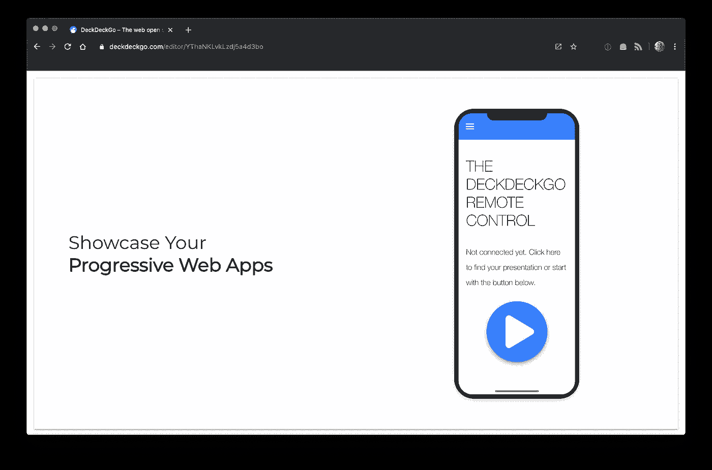
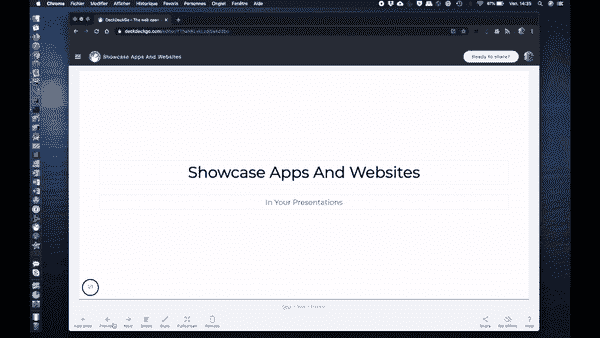

# 在你的网站上展示你的 PWA

> 原文：<https://levelup.gitconnected.com/showcase-your-pwa-in-your-website-1413592642f0>

## 引入新的 Web 组件，通过时尚移动设备的 iframes 在网站中嵌入应用程序。



两周前， [Matt Netkow](https://twitter.com/dotNetkow) 在 Ionic Zürich Meetup 的在线演示中介绍了 [Ionic React](https://ionicframework.com/docs/react) 。

几分钟后，他[展示了](https://youtu.be/g1FRjVALfak?t=524)一个我以前从未想过的功能:他在演示中展示了一个交互式嵌入式应用🤯。

这简直让我无语。如果任何人都能够在任何幻灯片中轻松嵌入任何交互式应用程序和网站，那会怎样？

他的想法一出现，我就被说服了，这就是为什么我很高兴与你分享我们的演示文稿 web 编辑器 [DeckDeckGo](https://deckdeckgo.com) 的新功能，以及我们正在开源的新 Web 组件！



# 信用

这并不是马特第一次给我带来灵感。如果说我们项目的登陆页本身也是一个演示文稿，那也是因为有一次他说他觉得这个创意很有意思。当然是马特，谢谢你的启发！

如果你熟悉 [Ionic](https://ionicframework.com/) 生态系统，你可能已经注意到，在上面的例子中展示和使用的设备框架看起来很像他们的文档中使用的那个。对此我无可争辩，你是完全正确的。我们没有重新发明轮子，而是使用了他们在 MIT 许可下发布的[风格代码](https://github.com/ionic-team/ionic-docs/tree/c5a624ac35d5285b871e7d8513d3849bdea63271/src/components/demo)。感谢爱奥尼亚为网络所做的一切🙏。

# 装置

我们在我们的[文档](https://docs.deckdeckgo.com/components/demo)中提供了一些指导，Stencil 也展示了如何在任何[框架](https://stenciljs.com/docs/overview)中安装任何组件。

# 从 CDN 安装

要从 CDN 中获取组件，例如 [Unpkg](https://unpkg.com/) ，将以下内容添加到 HTML 的头部。

```
<script type="module" src="https://unpkg.com/@deckdeckgo/demo@latest/dist/deckdeckgo-demo/deckdeckgo-demo.esm.js"></script><script nomodule="" src="https://unpkg.com/@deckdeckgo/demo@latest/dist/deckdeckgo-demo/deckdeckgo-demo.js"></script>
```

# 从 NPM 安装

要从 [npm](https://www.npmjs.com/) 安装项目，请在您的终端中运行以下命令:

```
npm install @deckdeckgo/demo
```

根据您的需要，可以导入它:

```
import '@deckdeckgo/demo';
```

或者使用自定义加载程序:

```
import { defineCustomElements as deckDeckGoElement } from '@deckdeckgo/demo/dist/loader';deckDeckGoElement();
```

# 展示您的应用

要使用该组件并展示您的应用程序，请按如下方式使用它，其中属性`src`是您的渐进式 Web 应用程序或网站的 URI。

注意，我们还将属性`instant`设置为`true`来即时呈现内容，因为组件的默认行为被设置为延迟加载。在 [DeckDeckGo](https://deckdeckgo.com) 的情况下，为了最大化加载性能，只有当前和下一个幻灯片的资产，因此`iframe`也被迭代加载。

```
<deckgo-demo 
        src="https://deckdeckgo.app"
        instant="true">
</deckgo-demo>
```

就这样，你在展示你的应用🎉。

# 胶料

该组件将根据主机的可用大小自动计算其内容的大小。

```
private async initSize() {
  const style: CSSStyleDeclaration | undefined = 
        window? window.getComputedStyle(this.el) : undefined;

  const width: number = style && parseInt(style.width) > 0 ? 
               parseInt(style.width) : this.el.offsetWidth;
  const height: number = style && parseInt(style.height) > 0 ? 
                parseInt(style.height) : this.el.offsetHeight;

  const deviceHeight: number = (width * 704) / 304;

  this.width = deviceHeight > height ? (height * 304) / 704 : width;
  this.height = deviceHeight > height ? height : deviceHeight;
}
```

这就是为什么您可以将它封装在一个容器中并使它具有响应性，或者使用样式为它指定一个大小。

```
<deckgo-demo 
        src="https://deckdeckgo.app"
        instant="true"
        style="width: 40vw; height: 90vh;">
</deckgo-demo>
```

还要注意，组件将监听浏览器的大小调整。因此，每次它的大小改变时，它会自动调整自己的大小。

```
window.removeEventListener('resize', 
       debounce(this.onResizeContent, 500));private onResizeContent = async () => {
  await this.initSize();
  await this.updateIFrameSizeReload();
};
```

值得注意的是，为了确保你的集成应用程序的内容正确匹配，在每次调整浏览器大小时，它也会被重新加载。这是通过以下丑陋美丽的黑客加载跨域`iframe`实现的。

```
iframe.src = iframe.src;
```

# 摘要

不仅仅是在幻灯片中，我肯定看到了这种组件的用例，因为我已经期待着在我的个人演讲中使用它，我认为它也可能对在您的网站上展示您的实现有用。

我也希望它能让你渴望为你的下一次演讲做一次尝试😊。

到无限和更远的地方！

大卫