# AWS Lambda+Go-->如何在我的个人网站上显示中等帖子

> 原文：<https://levelup.gitconnected.com/showing-medium-posts-on-my-personal-site-c8795ac5abcb>

照片由 [Clément H](https://unsplash.com/@clemhlrdt?utm_source=medium&utm_medium=referral) 在 [Unsplash](https://unsplash.com?utm_source=medium&utm_medium=referral) 上拍摄

# **什么？**

使用 Golang 和 AWS API Gateway 构建的 AWS Lambda 函数在静态网站上显示我的中型文章列表。

# **为什么？**

我正在使用 GitHub pages 构建一个虚拟主页，并希望显示我在 medium 上写的文章列表。在官方的 Medium API 中没有这样的方法，但是这个 URL([https://medium.com/@username/latest?format=json](https://medium.com/@username/latest?format=json))确实以 JSON 格式为用户返回了一个文章列表。

这为检索数据提供了一种便捷的方式，但是 CORS 阻止了数据在浏览器的前端应用程序中的加载。我可以通过服务器代理这些信息，但我不想为此创建和管理一个服务器，这也是我最初使用 GitHub 页面的原因。

为此，AWS Lambda 前来救援！有了 AWS Lambda，你可以用他们支持的任何语言编写一个函数。然后，您可以通过 CLI 或 AWS 浏览器控制台将其上传到 Lambda 服务。不需要配置或管理服务器。也很便宜。

# **如何？**

首先，我们将在本地文件中编写函数，然后我们将创建一个新的 Lambda 函数，并将本地文件上传到该函数中。为了访问 Lambda 函数，我们将创建一个易于从前端调用的 AWS API 网关。我使用的完整文件如下，后面是解释。

我们创建一个名为`main.go`的文件，并导入`github.com/aws-lambda-go/events`和`github.com/aws-lambda-go/lambda`。我们定义了两个结构，`Response`和`Postdata`，来解析来自 API 调用的 JSON 响应的数据。

接下来我们定义一个函数`handler`，它有两个参数:`context`(运行时信息)和`request`(关于来自 AWS API 网关的 API 调用的信息)。我们返回一个`response`来发送回 API 网关调用者和一个`error`。

在该函数中，我们使用`net/http`库向媒体 URL(第 33 行)发出 GET 请求，并将其转换为字符串(第 40 行)。然后我们通过在第 45 行使用 `(Medium adds th` ese 来避免 JSON 劫持，从响应中删除一些不需要的文本。然后我们对 JSON 进行解码(第 49 行)，并再次只将我们需要的部分编码回 JSON(第 51 行)。最后，我们返回响应。

`main`函数是入口点，我们从`lambda`包中调用`Start`函数来运行我们的`handler`函数。

接下来，我们将为 linux 机器构建一个可执行的二进制文件`GOOS=linux go build -o main main.go`并压缩文件`zip main.zip main`。

现在，让我们从 AWS 浏览器控制台创建 Lambda 函数。登录后，导航到 Lambda 部分。

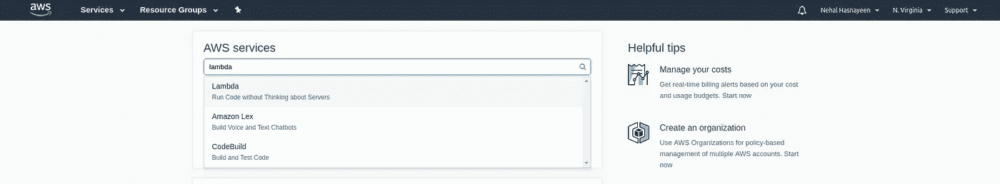

点击“创建功能”按钮。

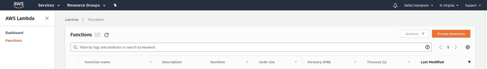

选择“从头开始创作”并输入函数名，选择“Go 1.x”作为运行时。如果没有现有角色，请创建一个新角色，并为角色命名。在“策略模板”中赋予角色“简单微服务权限”，然后单击“创建功能”

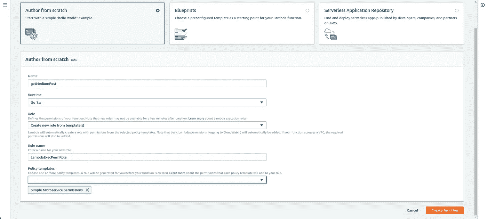

您的功能将被创建并移至“配置”页面。在“配置”页面中，转到“功能代码”部分并上传 zip 文件。在处理器输入框中也提供名称`main`。

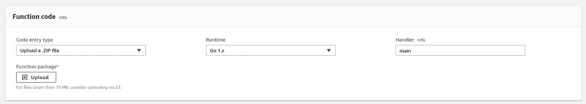

在同一页面的“基本设置”部分，为您的功能执行提供一个超时时间，一分钟似乎足够了。最后，保存它。

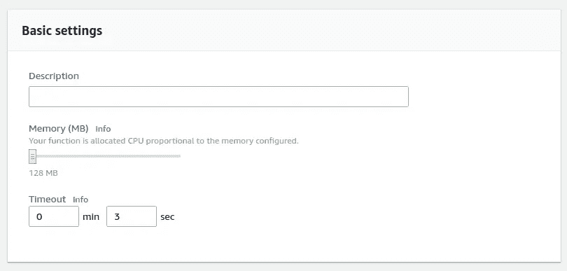

现在让我们创建一个 API 来调用 Lambda 函数。转到“API 网关”部分，然后单击“创建 API”

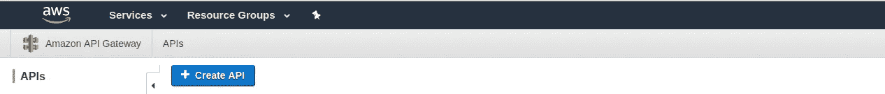

给 API 命名，然后点按“创建 API”

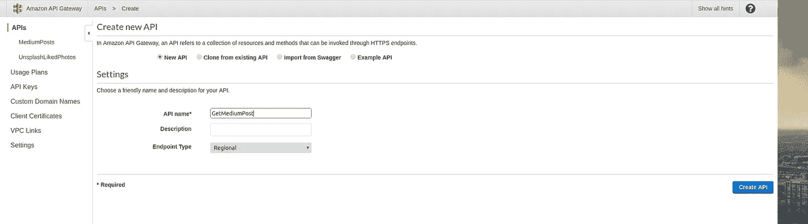

在下一页中，从“操作”下拉列表中选择“创建资源”。

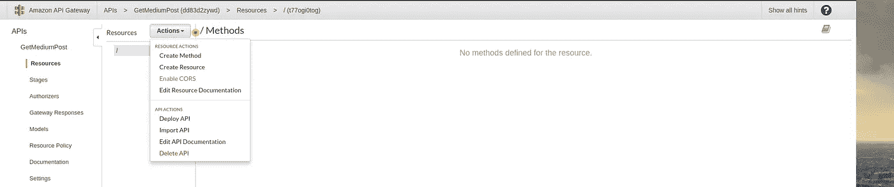

为资源命名，选中“**启用 API 网关 CORS”**复选框，并创建资源。

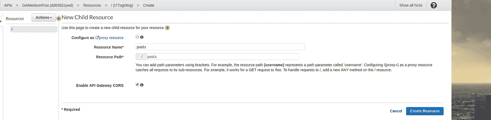

现在，从“Actions”下拉列表中创建一个 GET 请求。

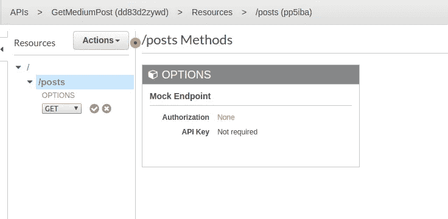

在下一页上，选择“Lambda Function”作为集成类型，并选择 Lambda 函数的 Lambda 区域。提供已经创建的 Lambda 函数名，然后单击“保存”

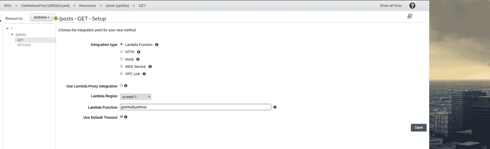

在权限模式中选择确定。

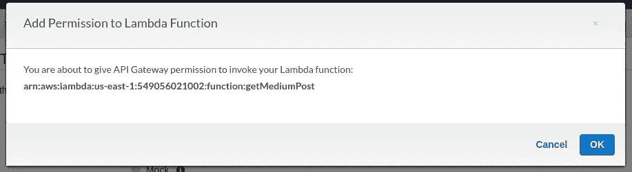

现在，从“Actions”下拉列表中选择“Deploy API ”,并创建一个新的部署阶段。为其命名，然后单击“部署”

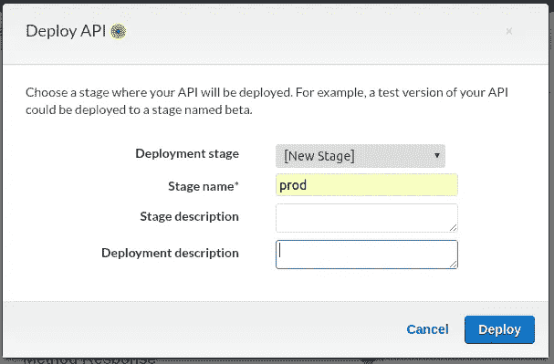

导航到“Stages”菜单并检查 GET 方法，在这里您会看到一个“Invoke URL”这是我们将用来调用 Lambda 函数的 URL。让我们试着在浏览器中调用它。我们应该看到一个 JSON 响应，其中包含 Medium 的帖子列表。

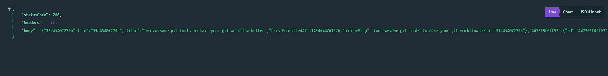

从我的前端应用程序中，我可以调用这个 url，解析对 JSON 的响应，并将帖子显示为列表。你可以在这里查看代码。

您还可以通过各种方式将身份验证应用于这个 API([API Gateway Lambda authorizer](https://docs.aws.amazon.com/apigateway/latest/developerguide/apigateway-use-lambda-authorizer.html)、 [Amazon Cognito 用户池](https://docs.aws.amazon.com/apigateway/latest/developerguide/apigateway-integrate-with-cognito.html)等)。)，你可以通过 [AWS SAM](https://docs.aws.amazon.com/lambda/latest/dg/test-sam-local.html) 在本地测试你的 Lambda 函数。

我希望这篇文章是有帮助的。如果您发现任何错误，请提供反馈或意见。订阅我的时事通讯以获得新帖子的通知。