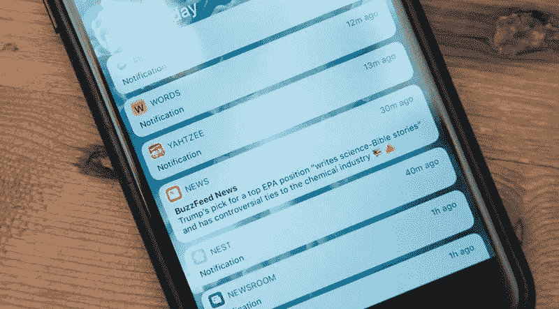
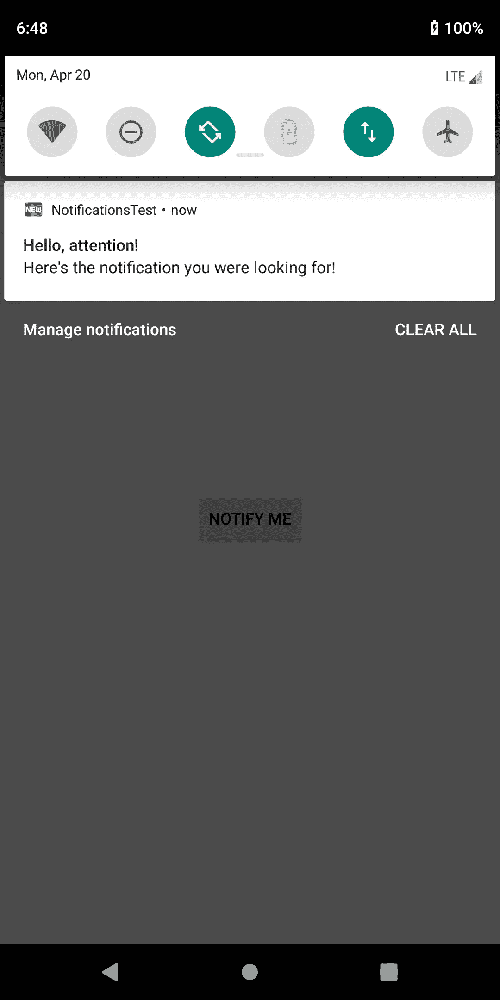

# Android O 及以上版本中的通知服务

> 原文：<https://levelup.gitconnected.com/showing-notifications-is-one-of-the-very-crucial-feature-to-add-in-an-android-app-4b7ada5bdba7>

显示通知是添加到 android 应用程序中的非常重要的功能之一。作为开发人员，我们有责任及时向用户提供相关信息。我们也要记住，我们的用户不会对通知感到厌烦。系统 UI 上的一位 Android 工程师给出了如下引用:

> “不要惹恼用户。尊重他们。赋予他们力量。取悦他们。
> 
> 把他们和他们关心的人联系起来。"
> 
> ~克里斯托弗·雷恩博士



我们的目标是 Android O 和更高版本，为了做到这一点，我们需要知道以下三件事来发送通知。

1.  [通知渠道](https://developer.android.com/reference/android/app/NotificationChannel)
2.  通知生成器
3.  通知管理器

# 通知渠道

通知通道需要一个 id、名称和描述，我们将把它们定义为“私有静态最终字符串”。

```
public static final String *CHANNEL_ID* = "channel123";
public static final String *CHANNEL_NAME* = "my notification";
public static final String *CHANNEL_DESCRIPTION* = "Test";
```

现在，为了创建我们的通道，我们将使用 NotificationChannel 类创建一个新的 NotificationChannel 对象(channel)，并将通道 id、名称和重要性传递给构造函数。然后，我们将在通道对象上调用 setDescription 方法来设置通道描述。

```
NotificationChannel **channel** = new NotificationChannel(
                ***CHANNEL_ID***,
                ***CHANNEL_NAME***,
                NotificationManager.*IMPORTANCE_DEFAULT* );
**channel**.setDescription(*CHANNEL_DESCRIPTION*);
```

# 通知生成器

我们将使用 NotificationCompat。生成器类来创建我们的通知生成器对象(mBuilder)。现在，我们将把上下文和通道 id 传递给构造函数。然后，我们还将几个方法链接到我们的构造函数上，以添加更多信息，如 setSmallIcon 以添加图标(很可能是一个[矢量 drawable](https://medium.com/@pypriyank/vector-assets-powerful-way-to-create-icons-and-menu-items-in-android-c28b469a7c9b) 资产)，setContentTitle 以添加通知的标题，setContentText 以给出通知的正文，最重要的是，我们必须添加 setPriority 方法来分配我们要传递给用户的通知的优先级。设置优先级允许 android 设置给用户的警告类型。

```
NotificationCompat.Builder **mBuilder** =
        new NotificationCompat.Builder(this, ***CHANNEL_ID***)
            .**setSmallIcon**(R.drawable.*ic_fiber_new_black_24dp*)
            .**setContentTitle**("Hello, attention!")
            .**setContentText**("Here's the notification you were looking for!")
            .**setPriority**(NotificationCompat.*PRIORITY_DEFAULT*);
```

# 通知管理器

通知管理器对象用于创建通道并通知用户。它分两部分完成，首先是创建我们的通知通道对象，为此我们使用 NotificationManager 对象和用户 setSystemService(notification Manager . class)来创建对象(比如 manager)。然后，我们将在 manager 对象上调用 createNotificationChannel 方法，并将 Channel 对象传递给它。

```
NotificationManager **manager** = getSystemService(NotificationManager.class);
**manager**.createNotificationChannel(**channel**);
```

其次，我们通过使用 NotifyManagerCompat 类来通知用户，并通过调用 NotifyManagerCompat 类( **mNotificationManager** )上的"方法来创建**对象**。对于 mNotificationManager 对象，我们使用 id 为**的**和作为参数的 **mBuilder.build()** 调用 notify 方法来发送通知。

```
NotificationManagerCompat **mNotificationManager** = NotificationManagerCompat.***from***(this);
mNotificationManager.**notify**(1, **mBuilder**.build());
```

# 点击按钮时发送通知

为简单起见，我们将从点击按钮时显示通知开始。因此，在我们的布局中，我们将向 activity_main.xml 添加一个按钮。

```
<?xml version="1.0" encoding="utf-8"?>
<androidx.constraintlayout.widget.ConstraintLayout xmlns:android="http://schemas.android.com/apk/res/android"
    xmlns:app="http://schemas.android.com/apk/res-auto"
    xmlns:tools="http://schemas.android.com/tools"
    android:layout_width="match_parent"
    android:layout_height="match_parent"
    tools:context=".MainActivity">

    <Button
        android:id="@+id/btn_notify"
        android:layout_width="wrap_content"
        android:layout_height="wrap_content"
        android:text="@string/notify_me"
        app:layout_constraintBottom_toBottomOf="parent"
        app:layout_constraintEnd_toEndOf="parent"
        app:layout_constraintStart_toStartOf="parent"
        app:layout_constraintTop_toTopOf="parent" />

</androidx.constraintlayout.widget.ConstraintLayout>
```

您可以看到，我们已经为按钮添加了一个 id，这样我们就可以调用 java 代码并在其上设置 OnClickListener。

下面是我们的代码在实现了所有关于概念之后的样子:

现在我们的小程序已经准备好测试了。因此，当我们运行我们的应用程序并点击我们放置的按钮时，您将听到一个警告音和一个通知弹出。



现在，在用户点击按钮后立即显示通知并不是一个非常实际的用例，所以接下来我们将看到如何设置一个剩余部分，以便在一定时间后显示通知，并且即使我们的应用程序关闭也必须通知。

# 显示剩余器械包的通知

在一定时间后显示通知和即使我们的应用程序关闭也显示通知是我们将要添加的两个附加功能。首先，让我们看看如何显示通知，即使我们的应用程序是关闭的。因此，我们将使用**广播接收器**来接收。我们将创建一个扩展 BroadcastReciever 的单独的类，并将在该类中构建我们的通知。

然后，在我们的 android manifest 中，我们将广播接收器添加到 ReminderBroadcast 类中。

在 AndroidManifest.xml 文件的<application>中添加以下内容:</application>

```
<receiver android:name=".ReminderBroadcast" />
```

现在，要在按钮单击一定时间后发送通知，我们将首先创建意向对象和待定内容:

```
Intent intent = 
          new Intent(MainActivity.this, ReminderBroadcast.class);
PendingIntent pendingIntent = PendingIntent
          .*getBroadcast*(MainActivity.this, 0, intent, 0);
```

然后，我们将使用 AlarmManager 类来设置通知的触发器，在我们的示例中，我们花费了 10 毫秒，但是当然，您可以根据需要任意取值，或者您可以很容易地从 user 中获取值。

```
AlarmManager alarmManager = (AlarmManager) getSystemService(*ALARM_SERVICE*);

long currentTime = System.*currentTimeMillis*();
long timeInterval = 1000 * 10;        // = 10 seconds //

alarmManager.set(AlarmManager.*RTC_WAKEUP*, currentTime + timeInterval, pendingIntent);
```

现在我们的应用程序可以运行了，这是我们的 MainActivity.java 的样子:

现在每当用户点击按钮，通知将在十秒钟后弹出。使用这个概念，你可以为你自己的 android 应用程序创建通知。但是一定要明智地使用这些特性。