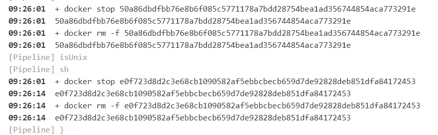
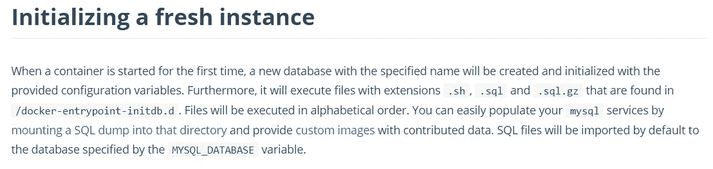

# 詹金斯的边车 BDD

> 原文：<https://levelup.gitconnected.com/side-car-bdd-in-jenkins-6b25c413777f>


奥地利国家图书馆在 [Unsplash](https://unsplash.com?utm_source=medium&utm_medium=referral) 上拍摄的

有时 BDD 测试需要一个数据库，因为它需要某种形式的数据输入来形成特定行为的情况。许多 BDD 工具，如 CakePHP 或 [Ruby on Rails](https://guides.rubyonrails.org/testing.html#the-low-down-on-fixtures) 允许程序员将 fixture 测试数据注入数据库并运行您的测试。

我有一个情况，我不仅需要 mysql，还需要 redis 来运行 BDD，我需要在 Jenkins 管道中自动化它，以便每次有 PR 时，它在被允许合并到 master/main 分支之前得到质量测试。

因此，我写了这个阶段来满足这个用例:

```
stage('BDD Test') {
  when { changeRequest target: 'master' }
  steps {
    script {
      withEnv([
        "MYSQL_HOST=127.0.0.1",
        "MYSQL_USER=root",
        "MYSQL_ROOT_PASSWORD=<ur-passwd>",
        "MYSQL_PORT=<10000 - 60000>",
        "MYSQL_DATABASE=<urDB>",
        "REDIS_HOST=127.0.0.1",
        "REDIS_PORT=<10000 - 60000>",
      ]){
        docker.image('mysql:5.7')
          .withRun(" \
          -e MYSQL_ROOT_PASSWORD=${MYSQL_ROOT_PASSWORD} \
          -p ${MYSQL_PORT}:3306") { d ->
            // ensure that the container is up and running
            sh 'while ! nc -z 127.0.0.1 ${MYSQL_PORT}; do sleep 1 ; done'
            docker.image('redis').withRun("-p ${REDIS_PORT}:6379") { r ->
              sh 'while ! nc -z 127.0.0.1 ${REDIS_PORT}; do sleep 1 ; done'
              sh '<run-bdd-command>'
            }
        }
      }
    }
  }
}
```

请允许我强调这一阶段的一些独特之处:

MYSQL 和 REDIS 的端口号都需要随机化，以便在两个或更多构建同时运行的情况下，它们不会争夺同一个端口。确保您的单元测试具有从 env 获取端口号的机制。

`withRun`:使用`withRun`非常重要，因为该功能将帮助您干净地关闭相关容器，不会留下正在运行或停止的容器。当您不能完全访问 jenkins master 或 nodes 来清理容器时，这尤其有用



withRun 帮助您在单元测试运行后移除容器

`nc`:这是 [netcat](https://linuxize.com/post/netcat-nc-command-with-examples) 命令，它帮助您再次确认实例已经启动并正在运行，端口已经占用。这样，您就知道 MySQL 和 Redis 容器已经可以使用了。当数据库服务器没有准备好接受固定设备时，您不会冒运行测试的风险。不幸的是，netcat 并不检查您的数据库是否完全恢复，所以这是一个我将进入的绝对不可能的情况。



不要在詹金斯管道内这样做

***不要*** 恢复一个完整的数据库来运行 BDD。BDD 并不意味着在一个完整的数据库上运行，除非你在谈论像 Drupal 这样的大型 CMS BDD，其中大部分设置都在数据库中。您应该根据正在运行的测试添加夹具数据，并且应该为新的测试清除这些数据。不恢复完整数据库的原因有很多，但我强调两个主要原因。1)您不知道完全恢复数据库需要多长时间。如果它太长，它会减慢您的部署，这违背了 DevOps 的目的。2)如果必须更改数据结构，运行永久数据库来运行 BDD 会很困难。您必须重新创建。sql 文件并签入 SCM，这不是一个好的做法。因此，在你走这条路之前，请仔细考虑。