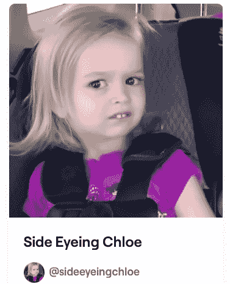

# 侧目的克洛伊现在是一个 NFT——一个网络迷因卖 7.5 万美元

> 原文：<https://levelup.gitconnected.com/side-eyeing-chloe-is-now-an-nft-an-internet-meme-sells-for-75-000-65b820ef1eed>

## 现在，就连 BBC 也对不可替代的代币感兴趣

作者截图:[Foundation.app/@sideeyeingchloe](https://foundation.app/@SideEyeingChloe)

9 月 24 日，一张取自知名网络迷因视频的数字图像——被称为“侧目克洛伊”——以大约 75000 美元的价格售出，成为不可替代的象征(NFT)。

这个迷因基于 2013 年拍摄的一段家庭视频。在照片中，犹他州的女学生克洛伊·克莱姆(现在 10 岁)在听到她的家人要去迪斯尼乐园进行惊喜旅行的消息后，斜着眼睛看着镜头。这是[互联网文化中最新的一块](/everything-has-its-price-an-nft-representing-the-internets-source-code-has-sold-for-5-4-million-21b24d3caabd)已经被永生为 NFT，让它的创造者在这个过程中赚了一大笔钱。

也许更重要的是媒体对这次销售的深度报道——它出现在 BBC 主页上，使 NFTs 在英国的[和世界各地的](https://www.bbc.co.uk/news/world-us-canada-58687070)[的公众意识中更进一步。](https://eu.usatoday.com/story/tech/news/2021/09/27/side-eyeing-toddler-meme-nft-76-k/5881072001/)

今年早些时候，另一个众所周知的网络迷因“灾难女孩”卖了大约 50 万美元，让其中的女孩(佐伊·罗斯，现在 21 岁)变得非常富有——有些人可能会说这是合理的，因为她不太可能选择成名和不出名的道路。

来源:[推特](https://twitter.com/rex_woodbury/status/1440097450178482179?s=20)

# 艺术的进化？

8 年前，克洛伊·克莱姆对着镜头做了一个斜眼造型，现在她的视频点击率已经超过了 2000 万，这让她成为了“网络名人”。她在 Instagram 上积累了超过 50 万的粉丝，她的照片出现在巴西的谷歌广告中。

她的父母似乎已经决定，是时候为女儿的未来赚些钱了——也许甚至可以带她再次去迪斯尼乐园，并利用现在 NFT 周围存在的兴趣浪潮。

从完整视频中截取的数字图像截图已经作为以太坊区块链上的 NFT 而被永久保存，而[在基金会应用](https://foundation.app/@SideEyeingChloe/side-eyeing-chloe-59244)上以 25 ETH(以太坊上的加密货币)的价格出售，按今天的汇率计算，价值约为 75，000 美元。它已被一家总部位于迪拜的音乐制作公司收购。这是完整的原始视频——克洛伊在 2:05 左右给了她一个眼神！

来源: [YouTube](https://youtu.be/NGhuLkjl4iI)

# 什么是 NFT？

许多人想知道什么是 NFT，是什么使它们具有收藏价值，以及它们怎么会值这么多钱。这是一个复杂的话题，有许多[综合指南](http://tzh.gumroad.com/l/xsINJ)对它们进行了深入的解释。

但本质上，NFT 是一种独特的数字令牌，可以使用区块链技术创建，它表示原始项目的所有权——无论是数字图像、视频、计算机应用程序还是任何其他数字物品。现在有一个[巨大的 NFTs](/nft-mania-is-real-heres-how-you-can-get-involved-today-f3ffec8cc439) 在线交易市场——有点像棒球卡的数字交易。路透社[报道](https://www.reuters.com/technology/nft-sales-volume-surges-25-bln-2021-first-half-2021-07-05/)仅在 2021 年上半年，就有超过 25 亿美元的 NFT 被交易。

NFTs 为内容创作者——摄影师、摄像师、作家和任何其他类型的艺术家——提供了一种新的分配和从他们的作品中赚钱的方式。那些从有需求的艺术家那里购买并出售 NFT 的人也证明了巨大的利润也是可以获得的。

# 泡沫还是机会？

像大多数与区块链和加密货币相关的事物一样，许多人对 NFT 持怀疑态度，或者认为它们可能是一个泡沫，被投机主义投资者的炒作和过度兴奋吹大了。

像“侧目克洛伊”和“灾难女孩”这样的例子表明，即使 NFT 是短命的(理解它们的人很少相信是这样)，作为交易者或创造者，短期内肯定有赚大钱的前景。

如果你有兴趣参与其中，也许你会考虑[拿起一本指南](https://tzh.gumroad.com/l/xsINJ)来了解更多关于它们是什么以及你如何从中受益？

注意:*本文仅供参考。不应将其视为财务或法律建议。在做任何重大财务决定之前，先咨询财务专家。*

 [## 通过我的推荐链接加入灵媒——托比·黑兹伍德

### 作为一个媒体会员，你的会员费的一部分会给你阅读的作家，你可以完全接触到每一个故事…

tobyhazlewood.medium.com](https://tobyhazlewood.medium.com/membership) 

## 如果你喜欢这篇文章，我希望你能加入我的电子邮件列表。