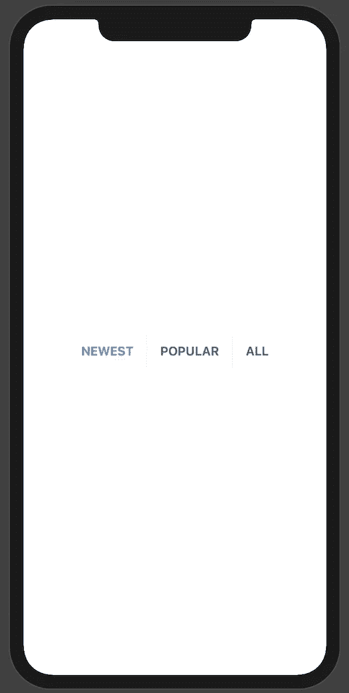
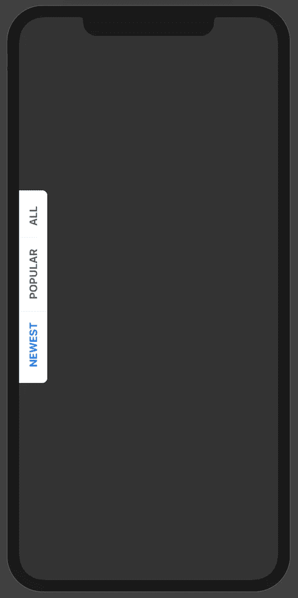
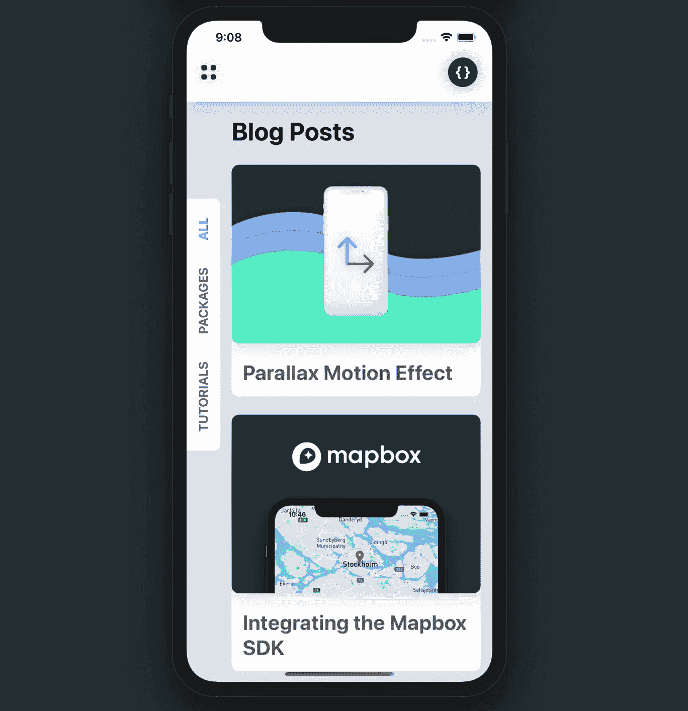

# SwiftUI —侧边栏菜单教程

> 原文：<https://levelup.gitconnected.com/sidebar-menu-tutorial-b7488d2469af>

## 让-马克·布里安内

本周的 SwiftUI 教程涵盖了一个组件，我最近看到它出现在社区中的设计中。我将简要地向你展示如何在 SwiftUI 中创建你自己的边栏菜单。这种组件与今年在 iOS 14 下发布的新`[LazyVStack](https://developer.apple.com/documentation/swiftui/lazyvstack)`和`[LazyHStack](https://developer.apple.com/documentation/swiftui/lazyhstack)`很好地配对。让我们开始吧。

*在开始之前，请考虑使用此* [*链接*](https://trailingclosure.com/signup/) *进行订阅，如果您没有在 TrailingClosure.com***上阅读此文章，请随时来看看我们吧！**

## *入门指南*

*创建一个新的 SwiftUI 文件名`SideMenu.swift`并为 struct 定义两个属性。*

*`selected`表示在菜单上选择了哪个选项卡，`options`保存将要显示的字符串值。现在是时候构建视图了。*

## *定义"`body”`*

*形象化我们将如何构造侧菜单的一个方法是想象我们将如何构造一个普通的水平菜单。我们将使用通过`options`传递的字符串值创建一个`Button`组件的水平堆栈(`HStack`)。然后当用户点击按钮时，我们将修改作为绑定传入的`selected`变量。这让父母知道在菜单上做了新的选择。*

*让我们开始吧，以此作为我们菜单的基础。*

*基本水平菜单的起始代码*

*正如你在上面看到的，为了创建按钮，我们循环了`options`中的值。当用户做出选择时，`selected`绑定会更新，父绑定也会相应地更新。*

*除了创建按钮之外，我还在视图中添加了一些基本的样式。像分隔线和改变当前选择的文本颜色这样的事情，有助于提示用户如何导航和使用你的菜单。*

**

*侧边菜单不要太斜。我们接下来会解决这个问题！*

## *将“侧面”放入“侧面菜单”*

*现在最酷的部分来了。我们将对我们的视图应用旋转效果和偏移，以便将其推到屏幕的左侧。请密切注意下面代码的最后几行。这就是奇迹发生的地方。*

*你可以看到我已经将我们之前的视图包装在一个`GeometryReader`中。这给了我们一个`GeometryProxy`变量，我们用它来抓取框架，并将菜单偏移到屏幕的一侧。*

## *在项目中使用`SideMenu`*

*为了在我们的项目中使用`SideMenu`，您可以轻松地将它包装在`ZStack`中，并将您的内容放入其中。*

**

*当使用画布预览时，上面的代码看起来像什么*

***让我们看看你做了什么！***

*我们想看看你用这个教程做了什么！给我们发照片！在推特 [@TrailingClosure](http://twitter.com/TrailingClosure) 、Instagram 上找到我们，或者发邮件到 howdy@TrailingClosure.com[联系我们](mailto:howdy@TrailingClosure.com)*

*** [## 编写面试问题

### 掌握编码面试的过程

技术开发](https://skilled.dev)*