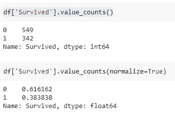

# 侧表:总结熊猫数据框架的有效工具

> 原文：<https://levelup.gitconnected.com/sidetable-an-efficient-tool-to-summarize-pandas-dataframe-330958528a82>

## 侧钻包装基本指南


图片来自 [Pixabay](https://pixabay.com/?utm_source=link-attribution&amp;utm_medium=referral&amp;utm_campaign=image&amp;utm_content=2037545) 的[咖啡豆](https://pixabay.com/users/coffeebeanworks-558718/?utm_source=link-attribution&amp;utm_medium=referral&amp;utm_campaign=image&amp;utm_content=2037545)

Pandas 是数据科学社区中流行的 Python 包，它提供了许多函数和方法来分析和总结数据集。为了更好地理解数据，数据分析是数据科学模型开发生命周期的重要组成部分。

Pandas 提出了大量可用于执行数据分析和探索的 API。虽然 Pandas 的功能对于数据分析来说足够高效，但定制的库为 Pandas 增加了更多价值。

Sidetable 就是这样一个库，它是 pandas `**value_counts**` 加上`**crosstab**` 功能的组合。在本文中，我们将更多地讨论 sidetable 包并探索它的功能。

# 侧表:

Sidetable 是一个开源的 Python 库，它为您的熊猫数据帧构建了简单而有用的汇总表。它是熊猫`**value_counts**` 加`**crosstab**` 功能的组合，也可以给你的数据框添加小计。Sidetable 是一个对数据分析和探索有用的工具。

## 安装:

Sidetable 可以从 PyPI 使用

```
pip install sidetable
```

一旦使用`import sidetable`安装和导入，侧表的功能可以使用`.stb`访问器作为数据帧的访问器。

# 用法:

> 我们将使用从 Kaggle 下载的 [Titanic 数据集来实现这个库。](https://www.kaggle.com/c/titanic/data)

sidetable 的想法是减少数据分析所需的代码行数，并加快工作流程。对于任何数据集，都需要执行一些数据分析任务，包括可视化要素分布、频率计数、小计计数和缺失记录计数。

我们将使用 Titanic 数据集详细讨论 sidetable 库的特性。

## (1.)频率:

熊猫想出了计算特征的频率计数的`value_counts()`函数。熊猫可以计算分布计数和概率分布，但你可能会希望如果它更容易结合的价值。



(图片由作者提供)，使用熊猫的“幸存”特征的分布

分布计数和概率分布可以结合，但是需要大量的代码输入和记忆。

有了 sidetable，使用`freq()`函数用 1 行 Python 代码实现它就更简单了。您可以获得累计总数、百分比以及更多的灵活性。


(图片由作者提供)，使用侧表分发“幸存”特征

除此之外，您还可以对多个列进行分组，以可视化分组后的要素的分布。


(图片由作者提供)，使用侧表分布多个特征

您可以根据需要对列进行分组。默认情况下，sidetable 计算数据的计数。您还可以使用参数`value`指定一个特性列，以指示数据的分组“总和”应该基于特定的列。


(图片由作者提供)，根据特征值的“Pclass”特征分布

为了更好地进行数据分析，还可以根据特定的阈值过滤侧表。这可以通过在`**thresh**` 参数中提供阈值来实现，并将剩余的特征值归入其他类别。

```
**df.stb.freq(['class', 'who'], value='fare', thresh=80, other_label='All others')**
```

## (2.)计数:

侧表中的`**counts()**`函数可以生成一个汇总表，该表可用于确定您需要视为分类或数值的要素，以便进一步分析和建模。`**counts()**`该函数显示特性的唯一值的数量以及最频繁和最不频繁的值。


(图片由作者提供)，使用 Sidetable 统计所有特征

可以使用 exclude 和 include 参数从数据集中排除或包含特定的数据类型。

## (3.)缺失:

`**missing()**`side table 实现中的函数生成一个汇总表，该表按每列缺失值总数和百分比显示缺失记录。


(图片由作者提供)，使用侧表分布所有要素的缺失值

## (4.)小计:

【Sidetable 中的函数最好与 Pandas 中的 group by 函数一起使用。它可用于计算数据框分组的一个或多个级别的小计。


(图片由作者提供)，整个数据框的小计实施

`**subtotal()**`功能可以将其添加到一个或多个级别的分组数据中。您需要首先使用`**groupby()**`函数对数据框进行分组，然后在每一层添加一个小计。


(图片由作者提供)，Groupby 函数的小计实现

# 结论:

Sidetable 是一款高效便捷的工具，结合了熊猫的`**value_counts**` 加上`**crosstab**` 的功能。它生成一个可解释且易于理解的汇总表，也可用于提供分析结果。语法的简单性使它成为一个更好的数据分析和探索库。

# 参考资料:

[1]侧钻 GitHub:[https://github.com/chris1610/sidetable](https://github.com/chris1610/sidetable)

> 感谢您的阅读